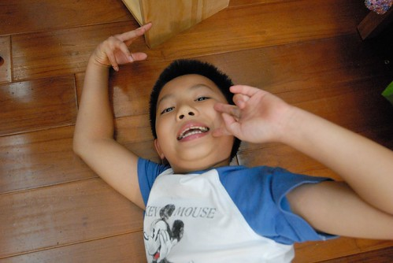

話說我們家的阿徹從小就很膽小 帶他到兩歲多的舅公嬸婆從阿徹0歲起就常笑我們”沒做膽給你們阿徹喔” 有阿! 阿徹滿月時 外婆很慎重其事的帶著剃頭大嬸到家裡給阿徹剃頭 還用石頭在身上比劃了一番 說是做膽阿 怎知這麼多年過去了 當初有做膽的阿徹還是這麼膽小 甚至比那個滿月時沒開運沒做膽的妹妹還要小 而且小很多… 對於阿徹的膽小事蹟 我們常是好笑又好氣 徹爸還說”膽小點也好 以後比較不敢做壞事” 只是可憐的阿徹遇到大膽愛妹妹 就常被徹底的踩在腳底下 毫無反駁之力阿! 真的很慘!!! 昨天晚上當我跟徹爸說著兄妹倆最近的陪睡對招過程時 我們兩人笑到不行 徹爸交代說”明天把這寫下來 以後才會記得” 所以我今日只好再來出賣我們家阿徹了

 阿徹是很標準的日有所思夜有所夢型的人 (這點跟徹爸很像 徹爸常會一早醒來後跟我說 他跑了一整晚的程式 他做了一整晚的.. 好累) 小時候常半夜驚醒 閉著眼睛嚎啕大哭 這時後我跟徹爸總得想辦法叫醒他 因為只要眼睛張開就不會哭了 長大後 很少再半夜驚醒大哭了 但是卻常驚醒喃念,大叫(伴隨點哭)或是更慘點就是一開始就難以入眠 因為躺在床上後 一幕幕恐怖的電影畫面或漫畫情節會在他腦中停不下來… 不過阿徹的恐怖定義真的很令人啞然失笑 連海底總共動員 怪獸電力公司都有令他害怕的地方 這小子哪看的了那些”大人”電影阿 之前校慶補假 安親班安排了小朋友一起去看復仇者聯盟(聲勢頗大)  那天我們在太平山上我跟阿徹說”我救了你 帶你出來玩 因為你肯定不敢看這種電影” 阿徹對我投予無限感激的笑容… 像這樣的恐懼是可以預防的 但很多的時候 甚至說有太多的機會 恐懼不經意的就住進阿徹的心上 就像前一陣子 老師犒賞班上好表現而讓他們可以邊吃飯邊看影片 結果班上播放的某一個兒童探險類的卡通讓他睡不好一兩個禮拜 有一天我實在被他每天晚上的上床前一條龍 上床後一條蟲嚕到不行 上床時會吵著要跟妹妹睡 要不就半夜突然大喊”媽媽~” 或是突然站在媽媽的床邊垂著淚喊怕 我逼問到底最近在學校發生什麼事 他才囁囁的說起.. 於是我只好派出愛愛陪睡 讓妹妹保護哥哥 說也奇怪 每次阿徹躺到愛愛身旁後真的馬上就睡著了 而且安穩到天亮… (講真的也夠累了) 雖然我們一直告訴阿徹”自己要堅強” 但因為我很不喜歡看到人因為睡眠不足 精神不好的死樣(這樣講實在很不搭徹媽的氣質 但我想不出更貼切的詞) 所以現在每當我明顯感受到阿徹心中跑進小鬼時 我會跟著阿徹一起拜託妹妹讓哥哥跟他一起睡(明明本來就也同房間 只是上下鋪) 只是愛妹妹果然是個女人 女人心阿海底針 常說變就變 所以阿徹常被妹妹的不守信氣的大哭 但偏偏又對妹妹莫可奈何 畢竟有求於她…

前幾週帶兄妹倆去圖書館看書借書時 阿徹不知哪來的心血來潮借了本福爾摩斯回家看 兒童版再加上漫畫版 感覺多麼的可愛 多麼的讓人毫無防備阿 可是阿徹那晚嚴重的失眠 而且還接連好幾晚 (徹爸笑漫畫版反而有畫面可以想) 有一晚實在不忍心 於是讓阿徹偷偷躺到睡著了的妹妹身旁睡 結果半夜被妹妹踢下床 後來窩到我跟徹爸中間睡 讓我跟徹爸也跟著睡不好 隔天愛愛很清楚的說明她的立場 要睡她的床絕對要經過她的同意 就算她睡著了也要問.. 幸好嚕著愛愛陪睡幾天後 阿徹有自立自強的復原如故 結果阿知書都提早還了一週後 這幾天阿徹又想起了那個福爾摩斯 第一天 阿徹捱到很晚 媽媽看不下去只好問著睡夢中 眼睛完全張不開的妹妹”哥哥跟你睡喔” 看到妹妹點了頭 阿徹快速的躺到妹妹身旁然後睡著了 結果一大早六點多還是被妹妹踢醒趕下床 妹妹堅持我們沒有問她 第二天 跟前一天一樣 但幸好妹妹一覺到天亮 所以哥哥沒被被踢下床 第三天睡前 阿徹苦苦哀求妹妹 我跟徹爸也一起加入勸說 阿徹說”我拿我的生日禮物跟你換” 我說一個晚上換一年只有一次的生日禮物 搏很大 可是物慾很低的愛愛拒絕了 阿徹說”你要我做任何事情都可以” 這時候爸爸慫恿愛愛”以後你要被打屁股的時後 可以要哥哥代替你被打” 嘖嘖嘖~ 多麼血腥阿 可是阿徹面顯疑色三秒鐘後竟然說”好! 一晚換三下屁股” 愛愛還是搖頭 阿徹又加碼說”那一晚換十下” 我笑說愛愛一年也打不到十下屁股 而愛愛當然還是笑著搖頭 阿徹突然靈機一動用媽媽的說故事跟妹妹換一晚 也就是原本晚上媽媽各講一個他們挑選的故事 阿徹拿他的選擇權跟妹妹換 這竟然讓妹妹心動了… 所以今晚阿徹開開心心的跟妹妹一起睡 但妹妹再次強調”只有今天晚上” 第四天 阿徹用了兩個故事又跟妹妹交易成功 但是愛愛說”今天最後一次了” 第五天也就是昨天講故事時妹妹很”精明”的拿著一張紙紀錄下 哥哥欠了她幾次 還了幾次了 甚至偷偷開心今天又可以進帳三個(其實這累加計算是我教愛愛的 哈) 可是當哥哥要再用著三個故事跟妹妹交易 妹妹卻突然又態度堅硬了起來 阿徹說”你要什麼東西我都給你” 妹妹偏頭努力的想然後說”我要小波” 哇! 那是哥哥的寶貝 哥哥的心肝哩(還曾經在學校作文裡 歌頌過一番哩) 明顯露出難色的阿徹 分明裝傻的把小波拿給愛愛說”今天小波跟你睡” 妹妹說”不是只有今天 我要每一天” 阿徹很苦的臉說”你想要的時候我就給你” 妹妹說”我要小波是我的” …..  (這小女子真的不能小看) 我聽了大笑 還解釋了一下這彼此之間的差異 真的只能說可憐的阿徹哥哥 精明的愛愛妹妹

陪睡在我們家 在阿徹身上真的是件大事  也因此能引發這麼多事 因為沒有對錯問題 所以我們只會循循善誘但尊重徹愛各自的決定 我想這也是手足間才會有的甜蜜爭吵與回憶阿!

後記: 我昨天巡完小孩房後 我問徹爸”你小時後會不會看了什麼後睡不著” 徹爸急撇”你是不是又要說阿徹像我了” ㄏㄏ 不過徹爸說了兩件這樣的經驗 我想應該絕對不只兩件吧 只是他只記得兩件…
