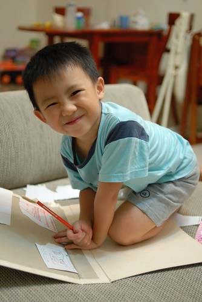
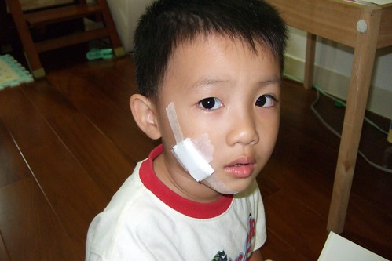
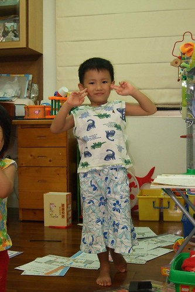
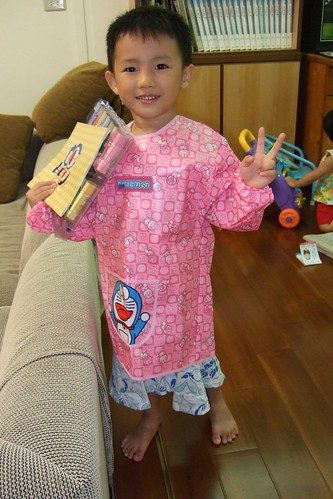
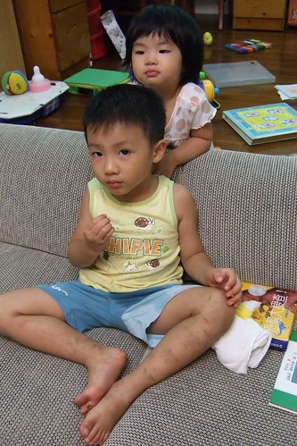

日子總算歸於平靜~~~   
不再唸著 吵著"日本好好玩...明天(或是下次)還想要去迪士尼 "  
總算明白阿娘阿爹是沒法讓他走迪士尼像走隔壁公園般樣的容易  
改口說"等我上小學後 我們再去迪士尼好不好"  
這樣認命才乖ㄚ~  
還是好好珍惜身邊的公園 家裏的玩具書書 還有快樂又充實的上學日子 實際點...  
  
每天該寫的功課就就乖乖認命的寫吧  
雖然娘從小也都往往在最後一刻才抱佛腳趕功課的  
所以娘真的可以體會明白你的心情  
但就因為娘體會明白 所以更不想在每天早上出門上學前催促著你要趕完功課  
所以娘"叮嚀"三聲後  你若真不寫就算了  
反正就是頂多到學校接受老師的處罰 同儕的揶揄  
娘不會在意老師跟我抱怨 我家小孩怎麼沒寫功課  
也不會羞於讓人見到我家兒子作業本上9變成長了尾巴的0   Henry變成 yrneH  
(真的 就像娘跟你說的  能寫出yrneH真的很厲害 不是任何人都能做到的)  
你可以寫的醜 寫的敷衍 但不管怎樣你就是得完成 得自己對自己的功課負責任...  
    
有時候娘跟爹也常互問"跟阿徹講責任 講這些大道理 他懂嗎"  
你懂嗎? 娘真的不懂 爹也不太懂的樣子  
不過娘還是想這麼"實驗"下去  
然後期待有一天娘會赫然發現"原來阿徹真的懂..."  
如果真的可以讓娘等到那一天  那麼你所流的那些淚(還挺多的)才是沒有白流阿  
  
  

  
壓根沒想到從迪士尼揹回來的火箭造型爆米花筒竟然讓阿徹破相了  
(徹爸說應該去告迪士尼的 沒有安全警告標示  也許可以小敲一筆的)  
High過頭的阿徹 猛的不小心就這麼讓底座狠狠的在他臉上畫下一痕  
媽媽是覺得男人有點疤更顯英氣(很多男偶像臉上的疤反到成為個人特色哩)  
但爸爸很擔心阿徹帥帥的臉龐就這麼留下遺憾  
所以爸爸說就算花再多錢也不能讓阿徹留疤(其實也不過是專程去藥店買條專屬藥膏)  
  
  
  
總算在爸爸的費心照料下  疤淡淡粉粉的    
應該沒讓帥帥徹留下不可撫平的遺憾  
  
  
  
以前阿徹常說以後他要生一百個小孩  
現在阿徹體會養小孩很花錢 很難養的起一百個小孩  所以願意只生三個小孩了  
但不管是一百個還是三個 阿徹要都是女生  
他說"男生很調皮哩"  
不過我想他應該想"生女生就可以跟女兒玩屬於女生的玩具玩意"吧  
因為阿徹現在很常假妹妹之名 要我們買歸類於小女生的玩具  
就連媽媽買回來要給妹妹以後穿的衣服  
阿徹也堅持的說"這我穿剛剛好哩"  
  
  
  
連剛從小舅舅家拿回的萱萱姐姐褲子(以後要給妹妹穿的)  
阿徹也在比了半天後說"這是要給我的褲子阿   大小剛剛好阿"  
好啦~借你穿一下啦~ (有一次徹爸都打算這麼帶著小孩出門 幸好阿徹還不敢穿出門)  
  
  
  
再加上堅持要的紅色防水工作服  
吼~一整個甜美 端莊 賢淑吧  
  
  
  
幸好就像阿徹會拿洋娃娃玩著打打殺殺的鹹蛋超人遊戲  
在讓人搞不清性別的穿著打扮下  
阿徹還是常有(頻率還是挺高的啦)調皮 粗壯  英勇 像個小男生該有的行為表現  
最近受了佩佩豬拿掉輔助輪 真正學腳踏車的影響  
我們的阿徹也很躍躍欲試的拿掉了他的輔助輪 開始在頂樓練習"滑車"  
幾次下來  阿徹應該體會卡通都是騙人的 怎麼可能一下子就學會  
但很欣慰阿徹尚未打退堂鼓  
還在努力的滑阿滑 甚至跌倒摔車越來越有經驗了(知道先要大腳張開站穩 然後讓車倒下)   
加油...很快的就可以跟佩佩豬一樣驕傲開心的騎著沒有輔助輪的腳踏車的  
  
(練習完後的雙腳像是被人狠狠家暴過後)  

