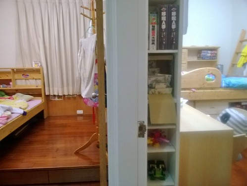
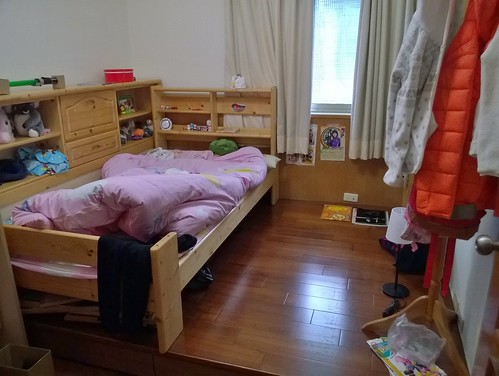
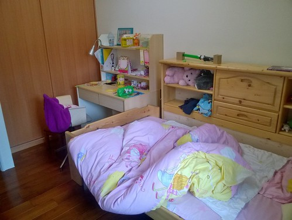
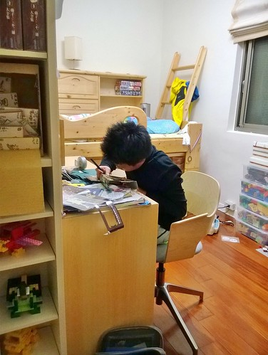
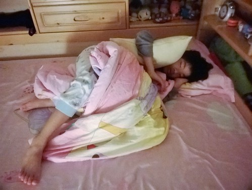
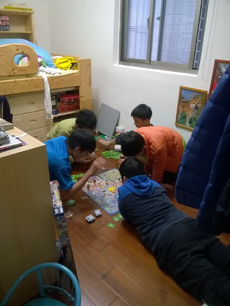

前幾天徹爸在我們的"新"房間裡突然迸出一句"我都快忘記以前家裡什麼樣子了" 我大笑 不過可見徹爸有習慣且應該有喜歡現在家的樣子 隔幾天我跟徹愛說起這事  二人笑說"對啊! 我也忘了" "都忘記門後面(以前遊戲區)的樣子了" 真的! 我百分百確定一家子都有喜歡現在家的樣子 而且快樂的生活其中!

居住十年的房子決定整修最主要的目的就是為了讓已長大的兄妹能各自擁有自己的房間 雖然舊床 舊桌 舊櫃子 能讓徹愛發揮的空間很有限 但徹愛到現在還是不可思議擁有了自己的房間 且真心喜歡自己的小天地!徹愛兄妹同房已經好些年 多年到愛愛的回憶就是跟哥哥一起睡長大的   同房的二人永遠有怪把戲 新點子娛樂自己 逗翻彼此 就像一個掛在床尾的模型盒是他們的假電視  一幕幕影像就在他們口中說著 腦海裡放映著 不亦樂乎  明明各擁有上下鋪的二人 常常還是一起睡在同張床上 有時候是因為哥哥看了恐怖的書或影片後苦苦哀求妹妹陪睡(利益交換) 更多的時後是二人一起用各式理由來解釋他們的一起睡 我跟徹爸每每看到明明已經越來越大隻的二人或糾結或交疊的睡樣 總忍不住搖頭笑著  

繼四年前的分床紀錄後 [blog.yam.com/hmchen1975/article/31881037](http://blog.yam.com/hmchen1975/article/31881037) 總算在徹哥小學畢業前 兄妹倆跨入了下一個也是最後的分房階段 拆開了的上下鋪 加上補進的舊書櫃 新床底櫃 新椅子 二人的房間各自成形  兄妹的房間緊緊相鄰 站在二人房門口的小玄關看進 右眼映入哥哥的房 左眼映入妹妹的房  很明顯的一個男孩房 一個女孩房    不同的是徹哥房裡有的沒的東西真的多很多(很愛撿有的沒與保留舊東西的徹更有空間發揮了) 但二人房間的"亂"卻是越來越像  雖然媽媽一週總忍不住叮嚀個幾聲"房間太亂 要整理下喔" 但因為現在東西亂丟誰也賴不掉 東西找不著誰也怨不得 媽媽挺放寬心胸接受兄妹的自我管理(無為)且樂得輕鬆!  (會做的就是早上拉開窗簾讓陽光映入)  二人的房間裡除那充滿回憶且早已熟悉的床鋪外 還有從舅公家搬來的已有20年歷史 老師傅當年仿愛王書桌做給徹愛表姨表舅的書桌 (椅子是在IKEA搜尋許久 最後媽媽發現又漏看價格情況下殘殘買下去的)徹愛對有大桌面 大抽屜 大置物櫃的多功能書桌滿意的不得了 雖然漸漸的桌面越堆越高越滿  卻是他們想獨處自己做東西 寫字看書的專屬空間  兄妹二人偶而會有些羨慕對方的房間比較好 也有時會希望如果自己的房間可以再大一點 再多個沙發好一點或少個衣櫥更好 二人還是衷心喜歡自己的房且日日好眠  每當我與徹爸睡前巡房 看見徹愛睡的香甜模樣就覺得好欣慰這一路的走來  而話說雖然徹哥很喜歡自己的房也變的越來越勇敢 可以半夜自己去尿尿 也越來越少因為害怕而拜託妹妹陪睡 二人卻還是三不五時找著理由一起睡在哥哥的床 (妹妹很堅持她的床不給睡) 看著兄妹感情好的模樣 我與徹爸也就睜一眼閉一眼的默許他們的黏滴滴  擁有自己的房間後 我們也難得的同意讓徹愛邀請好同學到家裡玩耍  雖然以往遊戲區的童樂不再  但小主人有著自己的小天地招待自己朋友  一如從小跟徹愛說的 這個床要跟著你們好久 直到結婚生子 房間也將伴隨他們接下來的成長 度過他們的國中 高中 大學.... 希望這小小天地是他們最溫暖 最踏實 最堅不可摧的堡壘! 尤其在即將長大的青春期!!!
