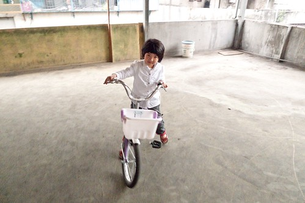
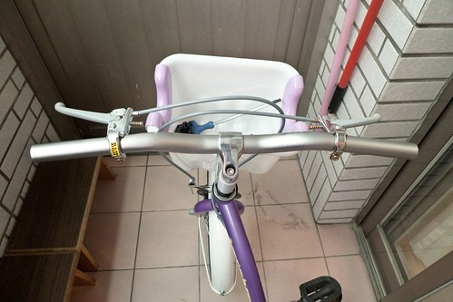
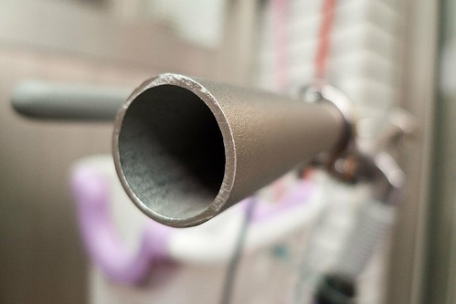
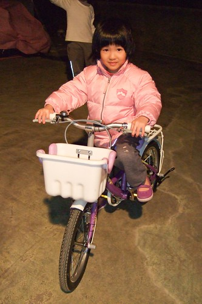
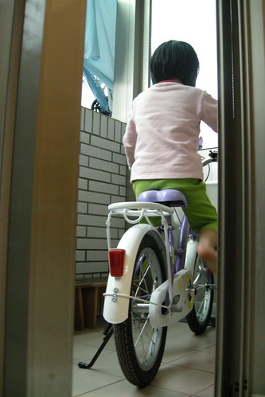

從去年夏天愛愛會騎車起 我們開始勉勵愛愛"等你長到110公分夠高就可以買16吋腳踏車了喔" 愛愛連要什麼顏色的車子都想好了(不過他很明白且接受 想歸想屆時還是要看老闆有賣什麼顏色的車) 有時後愛愛不愛吃飯時我跟她說"要多吃點才可以長好快長好高 然後換大的腳踏車"  愛愛便會努力地多扒飯 而量身高時看到自己的身高標示離110越來越近 愛愛也總會開心的大跳大叫"我長高了 OHYA!" 最近看著愛愛越來越俐落的騎車身手 但相對越來越顯小的車子 我們決定 雖然還沒110 但是時機到了 可以給愛愛換台大一點可以跑遠一點的車子了 於是3/20週日下午 一家子陪著愛愛去板橋火車站對面的G店看車 雖然店員的服務態度實在不佳 雖然也只剩紫色的車 但第一次面對新車尤其又是這麼夢幻的紫色淑女車的愛愛眼神盡是期待與開心 所以我跟徹爸還是當了孝子與孝女 挑出銀子讓愛愛擁有了第一台她自己從店裡牽出來的車 (我可以想像&理解跟用別人二手車的心情很不一樣)

買好車後愛愛在站前廣場熟悉一下車況後就直接在徹爸的護送下自己騎回家 真的是很大膽 很好樣! 騎回到家後也上頂樓繞車更熟悉車況 雖然看的出新車實在不好騎但是愛愛適應的出乎我們意外的快  

從G店買好車出來後 徹爸便帶著車去附近的別家腳踏車店請老闆調整把手 因為一整個覺得把手實在很不順手  愛愛的手琬彎的實在很不符人體工學 我很難理解為什麼大廠出的童車也會這麼難騎啊 徹爸說因為會買童車的人很少 而且大部分都是有得騎就好 這麼一說那我還真只能 喔~ 不過我家的徹爸果然了不得 繼自己動手幫阿徹的20吋車改裝成變速車後 徹爸也要自己來改造愛愛的16吋新車...

徹爸上網買了平手把 還專程去B&Q買了鋸子 在一個休假的週五 花了一上午的時間幫他寶貝女兒改造車子 改造的最大目的及工程就是換掉那超不符人體工學比例的車把 

改裝前徹爸仔細的測量了愛愛手握的地方 然後把買來的把手裁鋸成適合愛愛尺寸的長度 (切口還鋸的很漂亮說) 

本來我們還有點擔心 平手把的淑女車會不會很突兀很好笑 但想不到改裝後的車更是美麗 有個性說 尤其那銀色的把手跟紫色車身意外地搭.......... 我跟徹爸兩人都忍不住讚嘆不已.... 

徹爸量身改裝的車子 愛愛果然一騎就知道 順了許多也快了許多 愛愛還說"之前騎一下手就會好痠(真的很不符人體工學阿) 可是現在不會了" 而車子的好騎也反映在這兩週晚上 她每天都在問"今天晚上可以上去騎車嗎" 吃飽飯後讓她上頂樓繞個10幾20分鐘她就好開心... 

而每天早上睡覺醒來後 等著出門上學前 甚至晚上回到家後 反正就是沒事無聊的時後三不五時就去陽台坐在她的車子上  可見愛愛真的很喜歡這獨一無二 專屬於她的新愛駒阿!

最後就用3/21我在FB上的留言結尾: 愛愛擁有第一台自己的車子嚕.. 白紫的16吋淑女車讓她好開心 晚上坐在客廳地板上看著陽台的車 自言自語說"好漂亮的車啊!" 早上上學路上又說"我好喜歡我的車喔..因為是第一次給我的車 因為是紫色的 因為可以踏一下就跑比較遠 滑比較遠..." 希望這台16吋可以帶給愛愛好些年的快樂單車生活 (起碼有2年吧!) 
