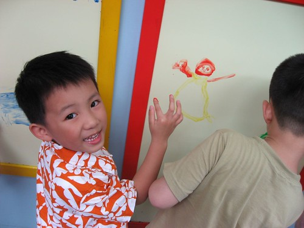
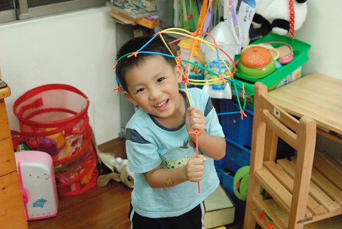
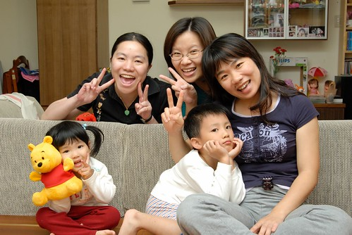
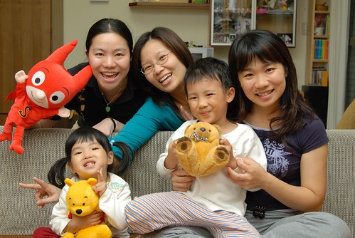
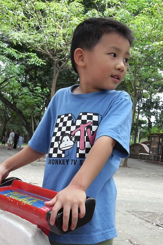
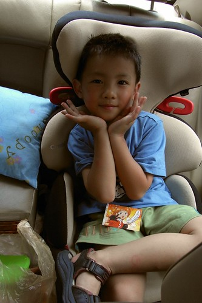
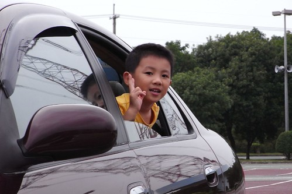

  
  
寶寶手冊老師寫的點滴 :  
  
關於阿徹不專心的部分, Freda也覺得需要強而有力的標準來要求  
因為其實Henry可以做到, 也可以做好每一件事   
只看他"要不要, 想不想"  
只是有時候看他一臉"打結"就忍不住想降低一下標準...  
不過Freda發現 不論是在英文或中文課程部分  
他以自己的步調一點一點前進  
雖不如Freda要求的積極 但和Henry自己相比 他有進步, 也有成長喔  
  
媽媽寫的回應....  

  
的確，很多事阿徹都以自己的步調一點一點慢慢的前進著  
也許偶而會令人心急的想要破口大罵  
但事實一再的證明路還是得靠阿徹自己一點一滴慢慢的走出來  
身為父母的我們也只能訓練自己有更高的包容力  
更柔軟的手腕來執行鐵的政策 嚴格的要求…  
而且真的真的很感謝晨暘的老師們 尤其是阿徹非常愛的咖啡熊老師  
在"開放式"教學中接受包容甚至欣賞啟發這樣的阿徹

我跟徹爸兩人常在對方為了阿徹暴跳如雷時  
用著悠悠的語氣跟對方說"他到底是個好孩子"  
也許當別的父母說著自己的小孩有多棒 有多優秀  
ABC單字 九九乘法表 唐詩三百首 如何朗朗上口  
我們都只能笑著說"你家小孩好棒 我家小孩都不會"  
但我們還是衷心的喜歡我們家的阿徹  
不是因為他是我們的寶貝所以最喜歡他  
而是因為喜歡他是我們心目中喜歡的那樣的小孩 (雖然偶而被氣的半死)

真的! 真的由衷感謝所有教導阿徹的大人小人們….  
  
(一把假洋傘也拿的很開心 雖然不若妹妹沉穩有智慧但創意方面的確勝出妹妹許多)  
  
  
  
(很愛阿姨姐姐叔叔啥的來家裡玩 都會跟人家裝熟搞High  
  那天聽到美賢跟珮君阿姨要回家了 生氣的嘟著嘴不想拍照留念)  
  
  
  
(珮君阿姨用小超人拉攏撒嬌一番後 阿徹總算笑了願意放人走了  
 OS...阿姨們有興趣的記得多來我家幫我們陪小孩玩啦)  
  
  
  
(雖然膽小 但不危險不需大膽的"玩"應該是阿徹唯一的強項)  
  
  
  
(雖然高度喜歡玩女生愛的扮家家酒爸爸媽媽遊戲   
  甚至也會手比蓮花翩翩起舞  但看著他飆腳踏車 拿著洋娃娃打架的模樣  
  我肯定他那一根沒有生錯)  
  
  
  
那天看著阿徹以前的相本 驚覺阿徹真的變"老"了  
沒有了baby face  沒有了以前的傻不巄東  
雖然懷念小baby的阿徹(2歲左右的小孩真的最可愛了) 但也期待長大後的阿徹....   

