本來這回是要接著去年的玉里 從玉里騎到關山 但實在很難忘記去年在193南段看到的那片連綿稻田 雖然那時候看到的是光禿禿一片 但我跟徹爸一致認為那片田如果是綠的一定很壯觀 很漂亮吧 於是兩人決定火車只搭到瑞穗 再騎一次瑞穗到玉里的193 然後再接著到池上 果然193上綠油油的稻田真的很壯觀 很愜意阿... 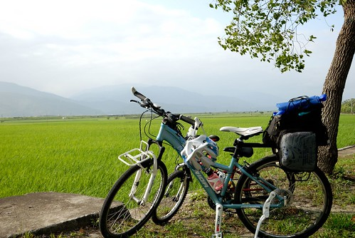

我們的旅行就從瑞穗這一站開始  

只是騎上車後的第一件事就是很墮落的找餐廳吃中餐 原本要要去頗富盛名的芊草園([food.001.com.tw/HL/RS/Grass/index.htm](http://food.001.com.tw/HL/RS/Grass/index.htm))用餐的 而且店就剛好位在往193的路上 可是騎到店門口後才發現門口貼了張今日公休的公告 讓人好失望... 於是我們又回頭騎10分鐘 再次拜訪去年吃過超喜歡的綠精靈([www.poja.com.tw/food/foodRestaurant/2009-08-18/72.html](http://www.poja.com.tw/food/foodRestaurant/2009-08-18/72.html)) 我一樣點了令我回味無窮的鮮奶鍋 而徹爸則在餐單上眾多選擇的掙扎過後也點了跟去年一樣的藥膳鍋 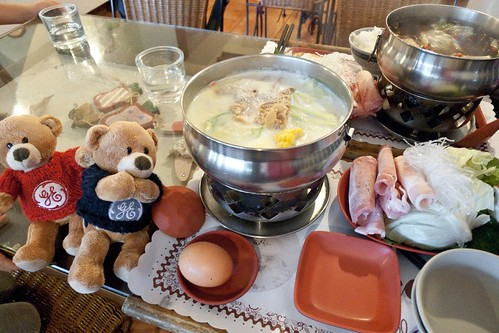 

愛愛跟阿徹則共食一份焗烤海鮮飯 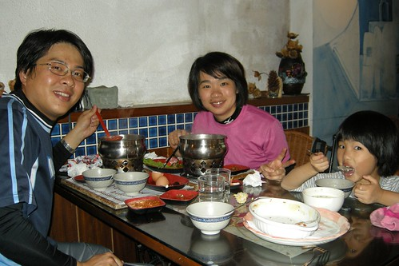

從我們11點半進門到1點離開前 除了我們家外就只有12點時來的三位客人 一整個"很好"的用餐環境 而我們在飽食一頓之外也打算多休息點 晚些正式上路往193 (OS: 旅行的一開始就這麼墮落 實在是...不過剛吃飽 尤其又超級飽真的不適合馬上騎車啦) 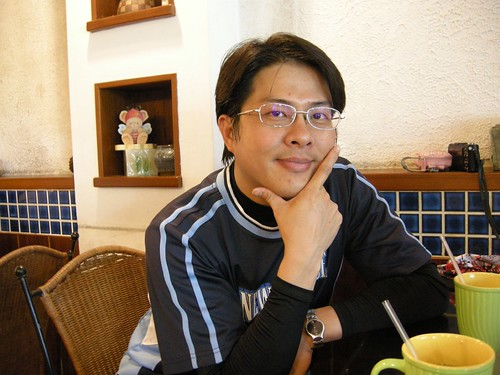

一家子有夠relax的"在休息"  愛愛癱在椅子上而今日異常興奮的阿徹則拿著相機店內到處玩相機 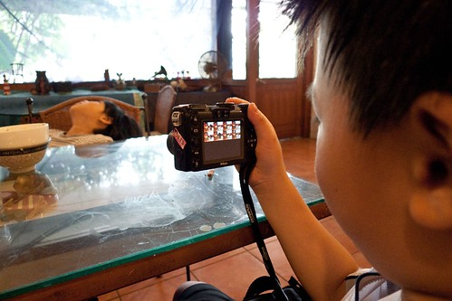

別以為四月天還是溫暖宜人的春天 正中午的南花蓮太陽也是很曬的 所以可以這樣窩在一家溫馨的小店  吹著舒服的電風扇 在營養豐富的正餐之外再來杯冰紅茶及飯後小點心  讓我們一家子的心情放鬆到最徹底了............ 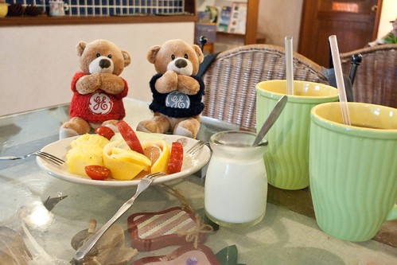

雖然實在太舒服 實在很想再坐下去 但又實在有點不好意思 外加實在怕我們的鬥志都鬆掉了 我們還是在1點時離開綠精靈了 不過我說接下來換去瑞穗泛舟中心休息  哈哈! 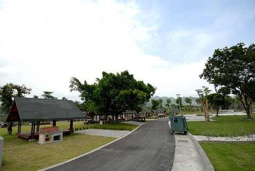

淡季的泛舟中心空蕩蕩的  我們進入露營區選了個涼爽的 有好view的營地繼續墮落 不過墮落前我要阿徹跟愛愛先跟我一起裝模作樣來這麼一張 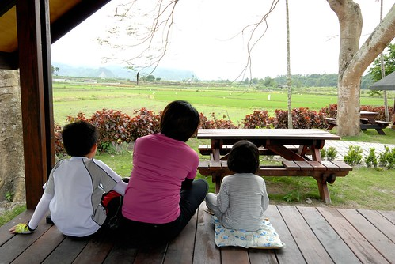

而營地前的小木桌也剛好可以作為腳架來張全家福 爸爸說 好久沒有洗全家福照片了 這張好! 

媽媽在做啥? 做瑜珈? 還是膜拜? 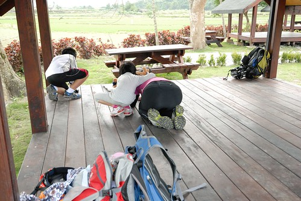

喔 不是啦..  從火車上開始 我本來要用我的小DC讓兩隻小熊當我這次遊記行程介紹的主角 所以我正努力趴在跟他們一樣的高度 紀錄下他們在這所享受的美景 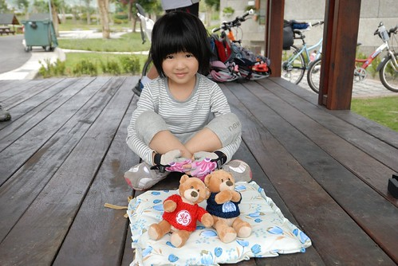

我們放著音樂 吃著零食 在這墮落了半個小時後才又再起身 車子過瑞穗大橋轉進193縣道後 齒輪正式啟動了... 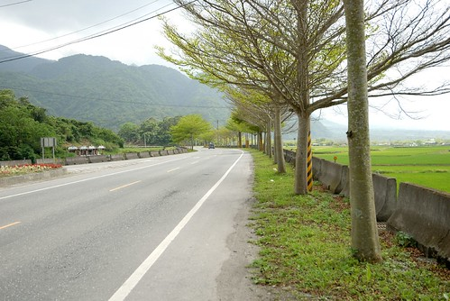

考量地勢的變化 本來打算由南往北騎較輕鬆的 但因為稻田主分布在193的左側 若要賞道拍照還得跑到對向車道去 既不方便又危險 因此我們還是一樣由北往南騎 

只是印象中上回沒這麼爬阿 這回一整個感受到微上坡的地勢 尤其還吹著不算小的逆向風 阿徹騎的有點有點小吃力 中午吃飯休息時看到阿徹high到不行 我們還笑他興奮過頭小心樂極生悲  想不到在193果然吃到苦了 他說 因為我們都跟她說 他也以為今天騎很少很輕鬆的(我們的印象都停留在上回的 ) 不過上坡騎的辛苦 阿徹倒也沒有怨言 甚至愜意到沒有什麼衝勁與堅持 爬的稍微喘了 阿徹就下車用牽的 而且常還牽很久 明明路就不怎麼爬了阿..我說 你這樣用牽的不是更累嗎 用騎的還是比較快吧 阿徹也悠悠的跟我說"又沒有關係...."  看在他這回的好心情好情緒 我們也只能坦然接受 奉陪(徹爸陪比較多) 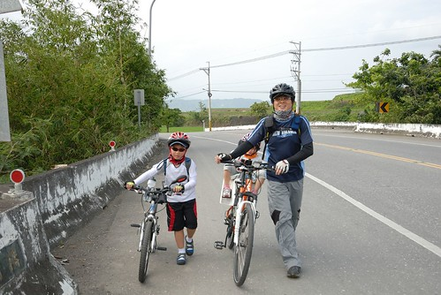

過瑞穗後的193就是玉里了 南花蓮的玉里與富里果然是大米倉 稻田也連綿不絕阿... 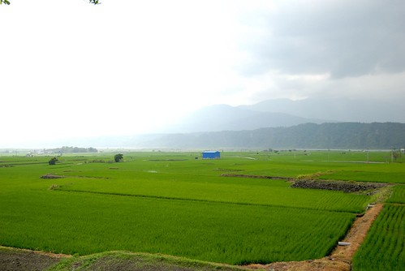

我們看到漂亮的 有衝動想拿相機的點 就停下車拍照 (爸爸拍照時懶得抱愛愛下車或是愛愛不想下車時就由我顧車 結果這個沒堅持釀成後來的小遺憾) 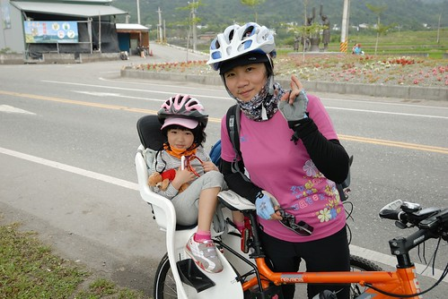

騎腳踏車真的超級機動的尤其又是我們這樣愜意的路程安排 今天下午只要騎20多公里 天黑前到玉里即可  所以看到美景就停就拍 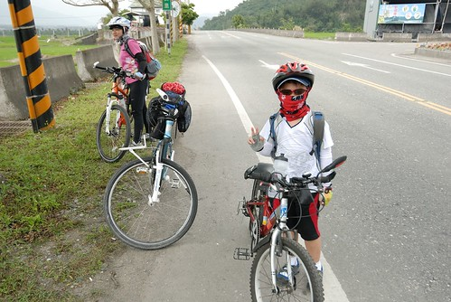

我跟阿徹說 這三天旅行下來 我包準回去後你的眼睛一定又更好 多0.05(阿徹兩眼視力都是1.5) 阿徹聽懂我說的 笑著說"對阿 因為看了好多綠色" 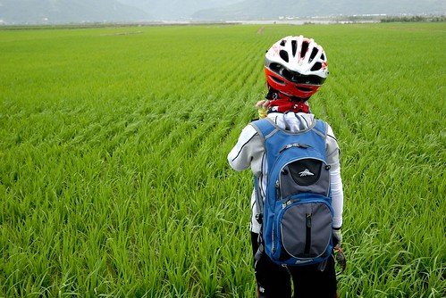

早上還是晴空萬里像是七月的天氣 過午之後雲層卻快速的變多中 果然還是春天... 不同時間不同地點有著不同形狀的雲層當背景 讓每片稻田 每個美景都是與眾不同 獨一無二的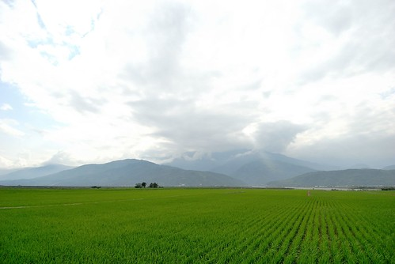

我們稻田看的很開心 拍照也拍的超開心 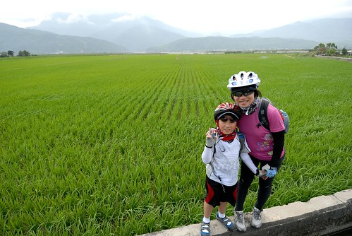

突然間徹爸說"不要動"  然後鏡頭對準了我的眼鏡 回家後看到這張照片 哇賽!  我喜歡.... 有種我的視窗所見被拍出來了的感覺 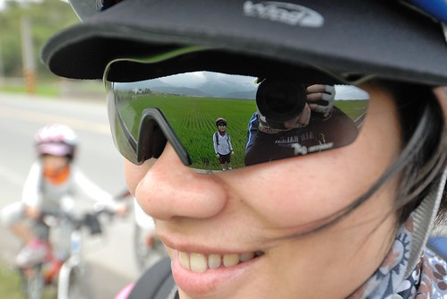

這張照片還有個很有趣的地方 就是淺景深的那個愛愛在做啥? 在偷騎哥哥的腳踏車! 向來出門旅行都是阿徹比較容易出包難搞 小愛則是逆來順受的好吃好睡好玩 但這回情況對掉 阿徹好心情好配合 愛愛則是狀況多到讓我們給了她"trouble愛"的封號 後來我們猜想 她可能是因為不能騎車心情不好吧 因為她常念著"哥哥好好可以騎車"或是"我也想騎車" 甚至常在我們停車拍照時自己偷偷地跑去玩哥哥的車或是坐到哥哥的車上過乾癮 有一次當我跟徹爸在心急找相機時 還玩到讓哥哥的車子"落鍊"  Orz 我們說"你沒看哥哥騎的很喘 很辛苦嗎? 這樣你還想騎車嗎" 愛愛說"要練習 訓練就好啦" 所以我們給愛愛的承諾是"明年可以的話就讓你自己騎 可是今年你還太小還是得乖乖讓爸爸載 好不好" 愛愛有點無奈帶也莫可奈何的點點頭...可是trouble愛那兩天還是很trouble... 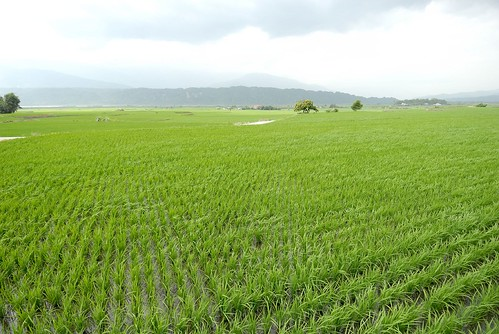

原本一切都很美好的旅行 卻突然有件憾事發生 就是在我扶著徹爸的車以免後座的小愛摔下時 我看那著相機對著稻田的徹爸好帥於是拿出我的小DC拍徹爸 拍完後想把相機放回我車子前面的專屬相機小袋子時 因為距離有點免強於是我打算等上路時再放 這時候阿徹突然不知道要拍什麼需要我的協助 於是我把相機交到小愛手上 然後等我幫完阿徹 一家子就又騎上單車走了 騎了3-4分鐘後我發現我的相機不在袋子裡 心想在愛愛手上吧 等徹爸她們趕上時 我問愛愛相機ㄋ? 愛愛說沒有阿! 啥咪?他說他剛剛掛在徹爸的座椅上.... 於是我趕緊回頭找 找了10分鐘找不到換徹爸再去幫我找一次  結果竟然都找不到 真是太扯了 前後才5分鐘的時間揶 而且還荒郊野外哩 真有這麼巧 相機剛好掉下去 就被路過的人看到然後撿走了.............. 這台富士F30(小名小3 這名字不是趕搭熱潮是當初一開始就這麼喚它了)跟了我好多年了 雖然近來因為阿徹也會帶相機出門 我越來越懶得帶小3出門了(徹爸出發前兩天還特別叮嚀 要記得帶小3喔) 但是就這樣不見了 尤其還是短短5分鐘內 心裡還真是難過 尤其我好不容易catch到徹爸的好照說 不過旅行還是得繼續騎下去而且得努力降低對於我們情緒的影響... 原本我單車握把掛了一個小袋子裝門放小3的 讓我想拍照隨時可以拍 甚至還常邊騎邊拍很方便 少了小3後我只好在等候徹爸他們時(這回都是徹爸在後頭陪阿徹騎居多)  把車停好然後拿出馬鞍包裡的小兩才能拍照 我笑著說"因為小3不見 我升級了"  被迫升級拿單眼相機照相了 哈! 回家後忘了在什麼時機 徹爸也突然跟我說"少了小三也好 這樣就沒有什麼可以拆散我們夫妻了" 挖勒! 徹爸這個笑話有冷 有笑點........ 只是徹爸的單眼跟小DC都是廣角  少了小3的一般焦段還真有點不方便 當我想仿去年 在這同樣地點的反光鏡來個一張時 怎麼拍人就只能這麼小 唉~ 難道這就是小三的命.......... 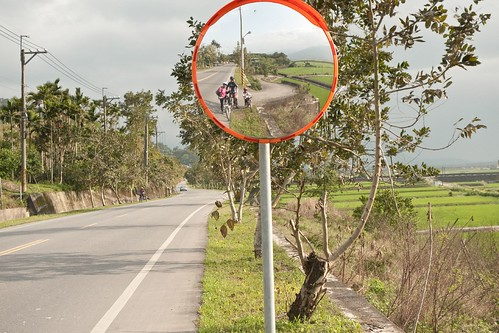

不過壞事之後發生了一件好事 (這就是人生阿) 當我一馬當先的騎在前頭剛好要經過193轉往赤科山的轉角(高寮)時 一對停在稻田邊的單車男女之男生喚了我"加油! 要不要一起來泡腳阿" 原來他們是一對騎著單車環島旅行的父女 正好脫下鞋子泡在冰涼的稻田小圳中 我笑了笑回應" 謝謝 不用"然後繼續騎到不遠的前方路口等徹爸他們 等了一會後 那爸爸喊著問"有需要幫忙的嗎?"(可能以為我單車故障吧) 我說"沒事 我只是在等人" 然後那爸爸回頭看了一下 驚訝的問我"後面那是你baby?" 我點點頭 (以上對話我們都是用喊的) 後來當徹爸他們騎經過那對父女的對向時(他們是由南往北)  那女兒拿了一些仙楂糖給愛愛 然後爸爸也跑過來幫他女兒還有徹爸們合照一張 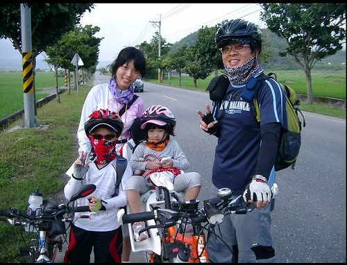

當徹爸他們繼續前騎與我會和後 那爸爸又提了一袋枇杷過來要我們帶著吃(那應該是她們在知本買的) 然後與我們聊了好一會 他說我們真是一對用心的父母 這樣子帶著小孩出來騎車 我說 一對父女這樣一起出來環島才是真正用心而且代表他們父女感情一定很好 結果周爸爸說 這是他們家的18歲成年禮 去年7月他才陪著他兒子環了一圈 今年換女兒 我問 "你家幾個小孩" 爸爸說"兩個" 我說幸好! 要不然一個小孩一圈 爸爸真得是超人阿 周爸爸用他們的行成規劃書(一張A4紙 列了他們10天環島的路線與住宿地)留下他的電話與email給我們 期待大家有緣連絡再相見 可是想不到的是就在兩天後我們回台北的火車上又在花蓮站遇到了他們 當我看到周爸爸時 我一臉疑惑 反射動作的比出10 因為她們預計要花10天環島而遇到我們的時候是第七天 原來因為北花蓮的下雨讓他們提前結束行程 所以才會一起搭車回台北(他們住樹林) 周爸爸說 意義有達到就好了 不用這麼勉強 安全最重要... 回台北後 徹爸估狗到周爸爸的blog(因為她女兒說他爸晚上找網咖寫文)[www.wretch.cc/blog/skipper1228/2792780](http://www.wretch.cc/blog/skipper1228/2792780) 看著他們的環島照片 父女倆一起吃各地的招牌美食 一起在馬路上跳越 一起泡在花蓮稻田清澈水溝裡 一起參加國小的運動會(那段照片超經典的).... 我起了雞皮疙瘩 那是專屬父女倆的滿滿美好回憶阿  這段回憶絕對是女兒以後人生路上很重要的動力來源的 沮喪流淚時 想起這段 應該就會笑了!

切回我們的旅行 帶著周爸爸們的愛心枇杷 我們繼續我們的行程.... 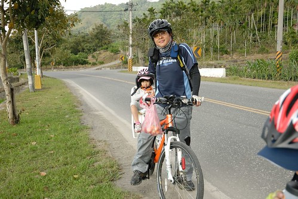

短短20多公里的路程 我們從1點瑞穗出發後騎到5點多都快夕陽西下了才抵達玉里 

這次我們住在玉里鎮上的鏷石民宿 房間簡單但很乾淨寬敞而且週五4人房只要2200算是物美價廉 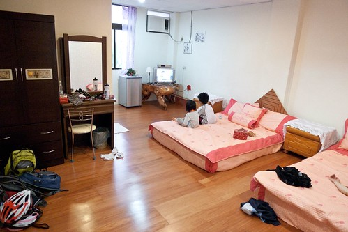

休息一會 我們六點多散步去鎮上最熱鬧的中心覓食 出發前 我們請在門口聊天的民宿老闆娘跟來訪客人推介在地美食 結果兩位媽媽一人一嘴邊鬥嘴鼓邊介紹 讓我們又體會到住民宿濃濃的人情味... 路上經過這家雜貨店時 覺得真是有FU的房子  這樣的小鎮這樣的房子我喜歡 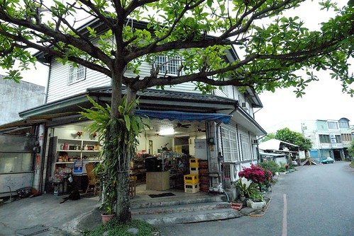

我們去了當地人去的麵舖-慈濟精舍旁的璞石閣吃玉里麵 香濃的湯頭加上現包的水餃 果然是當地人推薦的美食阿 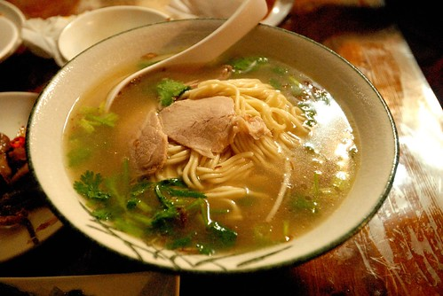

還去吃了那兩位媽媽強力推薦必吃的橋頭臭豆腐 臭豆腐比較不臭也比較軟 尤其上頭除了泡菜外還有的蘿蔔絲 還真是第一次看到 整個搭起來 吃來對味又爽口 連以前對臭豆腐很嗤之以鼻的阿徹 明明說只要吃一口嚐看看也吃得欲罷不能 直喊著"真是太好吃了 以後還要吃"(第三天要搭火車時還念著說想去吃臭豆腐) 

民宿離吃飯的地方走路得15-20分鐘 這也是騎車旅行才會有的小鎮散步 晚上七點多 玉里鎮交通最頻繁的圓環(民宿主人說在玉里鎮裏去哪都會經過這圓環)來往車輛卻也寥寥可數 很難想像台北4小時車程外的小鎮上 竟是這樣跟台北截然不同的生活節奏 我心裡忍不住吶喊 我想移民啦~~ 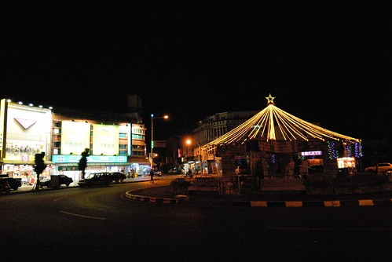

民宿主人說 今天剛好有一週一次的夜市喔 每次遇到我們就說一次 不過我們對夜市向來興趣不大 所以還是早早上床睡覺 明日早起床好精神比較重要 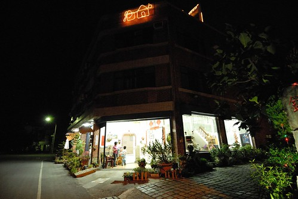

民宿還有一點很好 就是讓我們的車子停放在室內  讓我們完全不擔心車子的安危 車子跟人都有好環境好好休息 旅行才會平安又愉快喔! 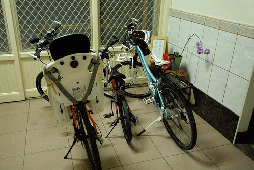
