前陣子徹爸看到我貼了花博的照片(草稿) 忍不住說了句"這也貼(也要寫)???" 阿...人有時候就會有莫名的偏執ㄇㄟ... 就想有始有終的好好結束我記憶中的花博ㄇㄟ 趁著清明連假過後的那周六傍晚 把我們剩餘的兩張花博票用光 來了個花博悠閒便當之旅 不過我們的花博最終之旅 卻因著一個意外事件最後結束的很出乎我們意外  但還算是個值得記錄的"善"終... 

4/9那天等阿徹三點上完學校扯鈴社團活動後 我們便趕著去花博 原本的行程規劃是4點在圓山跟花博娃娃照相 買花博便當 然後去新生園區看夢想劇場 最後去大佳園區吃便當看偶劇團表演以及最後的閉園秀的 結果因為人潮以及阿徹突發的眼疾 我們除了便當有吃到外 其餘都沒達成 真是好個人算不如天算阿!!!

那天伴著夕陽餘暉我們第三度來到花博園山園區 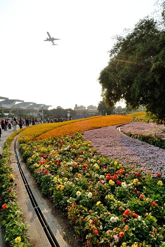 這回的花海又不同於上回所見了 所以我們相機還是喀個不停  低級小學生阿徹認真的用著他的相機記錄下他眼中的花博  而媽媽我也第一次自個負責一台相機 用被珍藏很多年的小7(我們家的第一台單眼) 透過鏡頭感受不一樣的花博 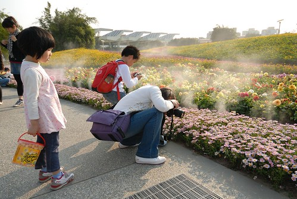 果然要批評人家的照片比自己照要簡單多了 小小鏡頭如何貼切的呈現出 表達出當下的美景或感動 真不是件簡單的事阿! 徹爸 我更加讚賞你了... 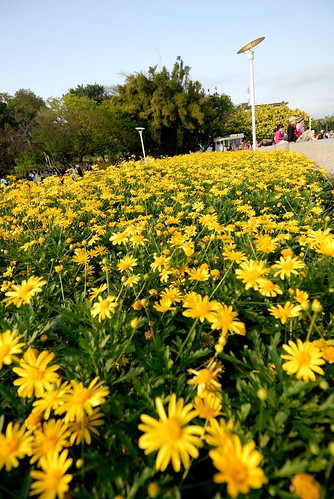 除了四個人帶了三台相機來花博外 今日我們也特意帶了桶人家送的爆米花來 準備實現上回的小小夢想 好好地 悠閒地坐在花海區裡看著人潮 賞著花 吃著爆米花... 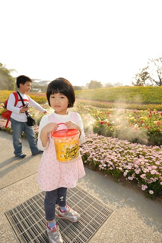 所以我們來到上回令我們很想好好坐下來的地方 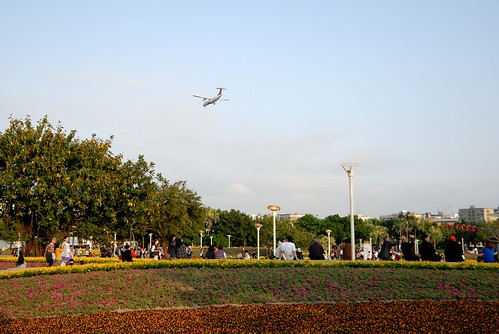 準備抱著爆米花筒看花看飛機  那一天人真的比前兩回多好多 能夠走的動線上人潮都不少 且每個館排隊等候時間都要1-2個小時以上 但在這區 很難得地還有著份悠閒  我們坐在這吃爆米花外 也讓開始喊眼睛痛的阿徹瞇眼休息會(阿徹躺在徹爸的腿上休息) 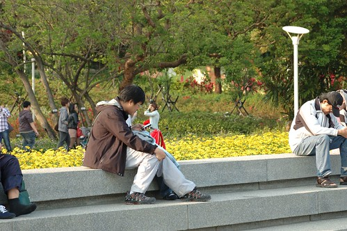 徹爸陪著阿徹休息的時候 我很認真的繼續跟'我的'相機培養感情...  而愛愛則是我的小model 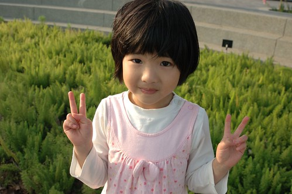 其實我以前拿徹爸的單眼照相都是當傻瓜相機用 所以常照完後都會被徹爸唸'糊掉了阿' 現在既然誓言以後自己也要揹一台 所以得認真點學習了 首要之務就是學著對焦 人不要糊掉 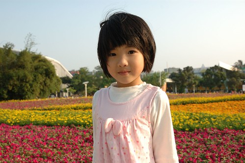 愛愛很有耐性地讓媽媽練習 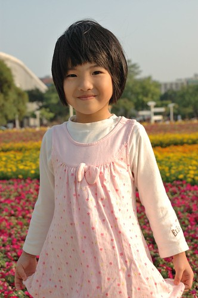 還應媽媽要求變化不同pose  不錯不錯 我果然有認真 有進步了...  眼睛狀況稍微好一點的阿徹 不甘寂寞的也跑來找我們玩 所以也被媽媽喀擦了一張 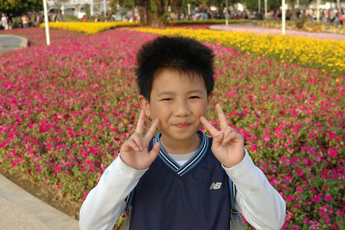 同時間徹爸都低著頭 猛玩他的行動手機 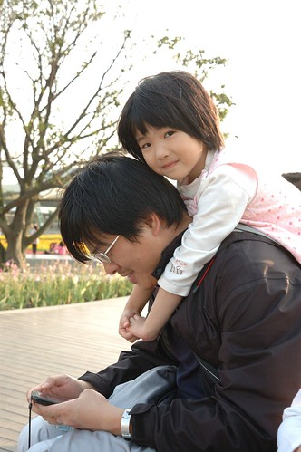 直到我們母女三人晃回來 開始在旁邊吵著 徹爸才開始稍微專心的陪我們  還有教老婆近距離攝影的方法 (不過沒幾天我又都忘光了)  我們悠閒坐了半個多小時才再啟身往其他園區去 繞過大半個花海區時 發現身後這片花海的顏色 摻揉的真是特別阿 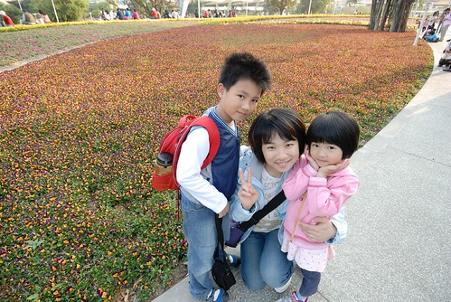 雖然花博閉幕後部分園區都將保留 但少了活動經費的支持以及少了花博志工的人情味 或許風景能夠依舊(高度懷疑)但花博風情肯定難以再現 所以要努力地把這美麗的城市花海烙印在記憶卡裡 記憶裡 ...  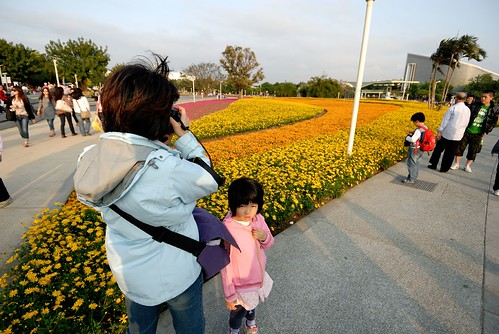邊看著這些花 阿徹邊問"明年還會有花博嗎?" 我們說 沒有 這要看好多年以後看看還有沒有機會主辦 阿徹說"希望我長大後還有機會可以看花博..." 我們說"等你長大後如果有花博 可以來當志工喔" 如果下次台灣有機會再辦花博 我想我們這家子應該有時間跟能力來當那熱情又有活力的志工了  

網站活動表上說5點圓山園區內有花博娃娃遊行 可以照相喔 可是沿路我們一隻也沒看到 於是我們兵分二路 徹爸先帶著徹愛去新生園區夢想劇場 而我去領預訂的圓山花博便當 四月的人潮真的有多 那天搭接駁車的人龍直至圓山入口處了 不過秩序還算井然有序 而且接駁車的數量很多 就像捷運一樣可以很快地消化人潮... 所以當我還在圓山園區排隊領便當買便當的時候 徹爸們已經在新生園區嚕 (下面兩張夕照感覺真好  FU給他有點像在日本) 

 不過就在我也準備搭接駁車過去會合時 徹爸回報"夢想劇場人潮洶湧 得排隊2小時左右" 啥咪?  花博最後大家真的很努力在使用預售票喔!!!!! 本來想讓因為閱讀老師介紹而小小崇拜幾米的阿徹可以去夢想劇場朝聖一下的 也只好讓阿徹失望了  如果四月來花博行程安排很多也抱予很高期望的話 我想真的會令人失望的 因為人真的好多阿!(如下圖背景) 不過如果心態可以悠閒的話 還是可以覺得不枉走此行的...  經過半小時的分道 總算媽媽提著花博便當來會合嚕 我們在圓山入園後預訂的花精靈便當 用著漂亮的綠色小提袋裝著 愛愛提著便當袋 很有氣質的感覺說...  我們在新生園區等了好一會才等到空位置可以好好享用我們的便當晚餐(實在不想窩在路邊吃阿) 總共買了三個圓山園區花博便當: 綠色花精靈便當 彩花星球便當 以及最便宜最簡單的鐵路便當 三個便當總共花掉快500元 不便宜但還可接受 反正就當做是吃頓飯外加買了徹愛家家酒的玩具 但最後發現花精靈便當的兩層設計不錯 以及星球便當是用環保的竹纖維材質製作時 我決定要把這兩個便當盒好好的收起來 哪天要去野餐或是要裝什麼零食點心時便可派上用場嚕... (因為這原因 這一兩個月阿徹常唸著"要去野餐! 什麼時後去野餐?")  花博便當內的食物則是中規中矩 不算頂美味但絕對不難吃 食材沒有過份烹調的"適切"呈現本來味道 搭配上加了紫米的飯 一整個走養生健康路線的 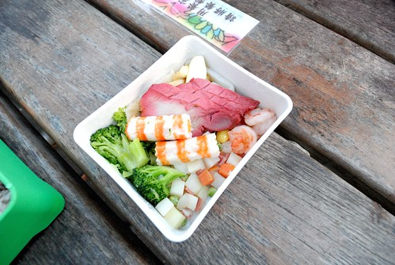 來了三回 我們總算也吃到花博便當了 或許這個原因 讓我們竟也覺得這冷冷QQ的飯是如此的甜美好吃阿! 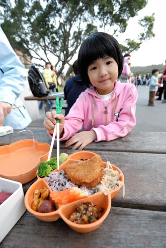 吃到花博便當 我們今日已經算是不虛此行了... 接著我們散步到大佳園區準備看晚上的表演  只是阿徹又開始唉唉叫 喊眼睛痛  痛的很像一回事 徹爸問"你真的痛嗎? 怎麼剛吃便當的時候都沒再喊痛" (可見便當真的有好吃 讓阿徹忘了痛) 看阿徹痛的快受不了的樣子 我問"可以忍耐嗎? 還是要回家去看醫生  如果真的覺得需要看醫生就要馬上回家喔 要不然明天星期日沒醫生可以看 很麻煩滴 " 阿徹反覆想了幾次 回答了幾次 最後決定要回家去看醫生了 於是我們等於是從新生園區走到大佳東站去搭接駁車回圓山 不過途中看到的水舞表演 感覺聲勢還挺澎薄的說 徹爸甚至還說改天晚上要不要專程來看這水舞閉園秀阿?!

阿徹 眼睛應該真的有痛吧 否則愛玩的他怎麼會願意就這樣抱著遺憾回家了ㄋ...  而愛愛雖然很想在花博繼續玩 甚至還說出"媽媽可以先帶哥哥回家"這樣的話 不過還是很配合地一起回家了   乖! 一家子就是要這樣同進退才好啦!  雖然我們的花博第三戰結束地很意外 但起碼是個吃便當的悠閒行阿! 謝謝花博帶給我們三回滿滿 不同以往的美好回憶! 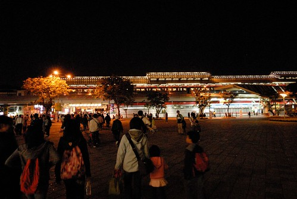

後記: 幸好我們有及時回家帶阿徹去看眼科醫生 因為檢查後發現阿徹的左眼黑眼球破了一小洞了  護士說"這真的會很痛".... 我們猜想應該是下午練拋鈴時 阿徹抬頭等著接鈴時 有異物跑進眼睛了吧 我說下回帶個太陽眼鏡再練拋鈴吧! ^ ^"
