台東~~~  
第一次到台東是高中畢旅的時候  
後來大學時環中橫 南橫時路過了幾次  
真的深入台東則是大學畢業後工作的第二年  
跟著愛玩又有後勢力的玟姿在台東玩了6天  
(因為玟姿的姨丈在\*安\* 所以行程中見了三個鄉長   
坐緝私快艇去綠島 進到綠島監獄參觀大哥們住的地方)  
從此深深戀上這個後花園....  
  
可以帶著小孩趴趴造後每年都會想 來去台東吧  
甚至心理偷偷期待如果可以的話 希望每年都可以去台東  
為什麼這麼喜歡台東ㄋ...不知道耶  
只覺淂在那裡就會覺得自己離山那麼的近 離海那麼的近 離天空那麼那麼的近....  
  
期待了一年 總算又可以去台東了 OHYA!  
這是阿徹第四次去台東 小愛的第二次 希望次數可以這麼逐年增加上去....  
行前來個照片大回顧吧~  
一樣的山 一樣的海 一樣的天空 可是小孩每年每年都不一樣...  
  

阿徹的第一次在阿徹8個月大的時候   
十月的天氣  很涼爽很宜人...  
台北出發 宜蘭 花蓮 台東 嘉義各停留一晚  
停留的點不是很多還是覺得行程很趕...  
不過累積了第一次環島的經驗 遊台東的經驗  
  
攝於太魯閣遊客中心前  
  
  
攝於七星潭   
  
  
花蓮光復糖廠  冰好吃的連小阿徹也受不了  
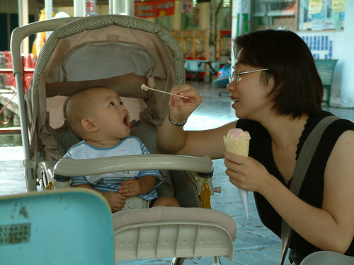  
  
冰真的好好吃  
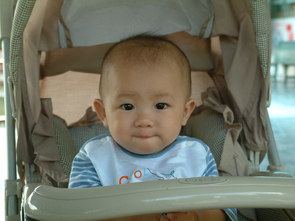  
  
光復糖廠內的舊宿舍  一家子的仿古照片  感覺很像身在爸媽那個年代  
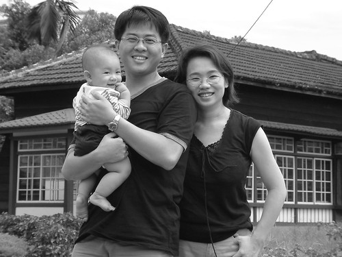  
  
問我花東啥好玩的 我也回答不出來  
不過就是為了這看不盡的山 看不盡的田  
  
  
台東紅葉溫泉 阿徹的溫泉初體驗 (阿徹的小黃泳褲從7個月穿到去年4歲多 很超值)  
其實帶小小孩泡溫泉 大人浴前浴後花的準備整理時間比泡在湯裡的時間還要多  
帶小孩就是這麼的麻煩...但是很好玩 很新鮮 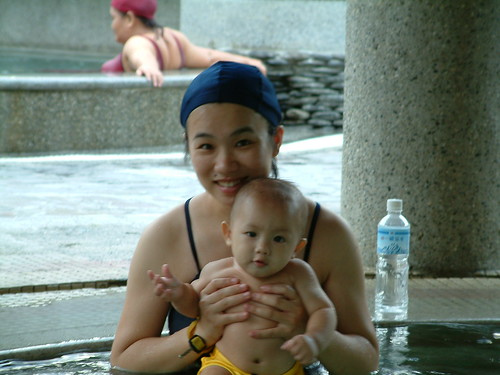  
  
宿台東那魯灣  阿徹爬在用枕頭棉被圍起來的大床中  
  
  
  
阿徹的第二次台東行 在他1歲7個月大的時候  
九月的秋天一樣宜人適合旅行  
這回先回嘉義住了一晚 然後順道去了屏東海生館  然後去台東住了兩晚 花蓮一晚  
又是環島了一圈 只是這回從西到東  
  
攝於屏東海生館  阿徹看起來已經是十足的大寶寶了  
  
  
兩晚都住在台東原住民文化會館   
很不豪華但很乾淨很寬敞 而且週末假也才1000多  
是到台東旅行的超值省錢好選擇 尤其是飯店週末房價貴三三的時候  
  
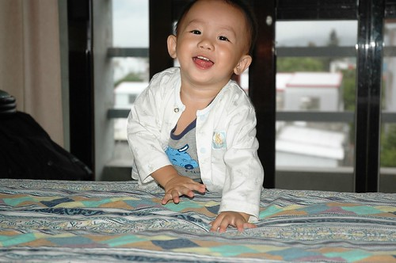  
  
這一次颱風跟著我們跑  
台北 嘉義的家人紛紛來電關切有沒有被颱風給刮到了  
因為風雨去了史前博物館 也算是意外的收穫  
  
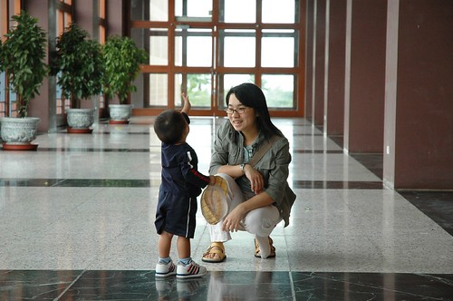  
  
旅行中的阿徹越來越難抓了  
  
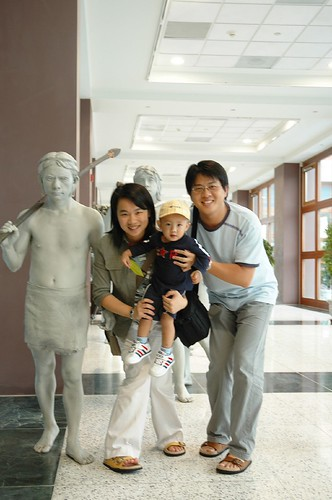  
  
不過不可否認旅行可以增長小孩的勇氣 小孩的眼見  
  
  
  
這回一樣去了台東紅葉溫泉  
涼涼的天 泡著暖暖的湯 群山環繞著 真的只能說爽阿...  
  
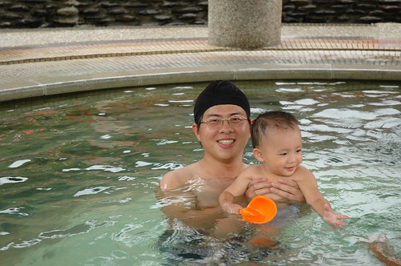  
  
其實這溫泉是因為颱風打亂原本既定的行程而多出來的  
所以阿徹穿了一件小阿公褲就下水了  
  
  
  
所謂颱風來前 天必有異象 大景大景阿!!!  
  
  
  
原住民文化會館的優點之二 是他就在台東森林公園的對面(某面房間的View就對著這公園)  
早晨的黑森林琵琶湖真的很美 很迷人  
  
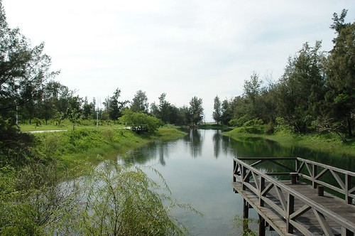  
  
常常陳爸陳媽出去玩回來後 問他們"好玩嗎"  
她們最常說"哪ㄨ好玩 不就那樣"  
呵呵...台東講穿了 也是不就那樣  看來看去不就是山是樹是海  
但她真的風情萬種 吸引人阿  
  
  
  
鹿野高台 看著滑翔翼飛翔在井然有序的稻田上方一整個的心曠神怡  
  
  
很多人說小孩還小哪還記得這些 但記不記得其實也不重要  
重點是小孩帶給爸媽這麼多美好的旅行回憶  
  
  
  
這回排在9月初的目的就是為了一睹金針花的丰采  
  
  
  
阿徹所到之處 很愛撿石頭  山上也揀海邊也揀  
一開始揀回家後 媽媽還細心寫上時間與地點好好保存著  
可多年後 一個不小心都成了阿徹玩煮菜菜遊戲時的主菜了  
  
  
  
金針花 花比人高 但人嬌應該也沒輸花太多啦  
  
  
  
花蓮的磯加魯灣   
第一次到海邊的阿徹初見大海很惶恐  
連沙都怕 還要爸媽先下海示範怎麼玩  
  
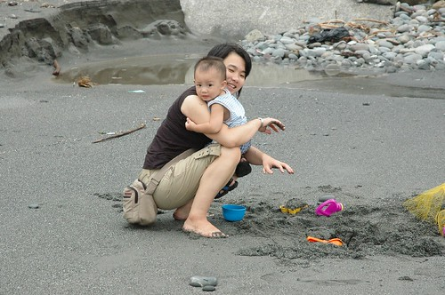  
  
不過愛玩沙應該是小孩的天性吧 誰都很難抵擋沙的魅力的  
  
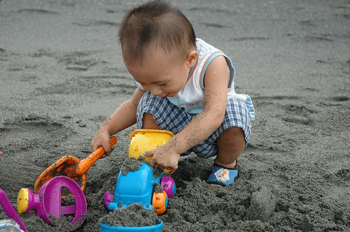  
  
可是熊熊一個海浪拍打上岸 不小心還是會被嚇到的  
  
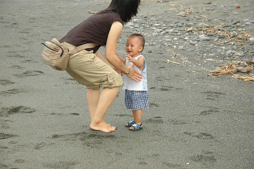  
  
我想阿徹是真的體會到沙的好玩了  
  
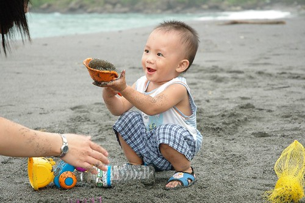  
  
之前被人家傳來傳去的遠來Email瑕的要命 這回花大錢解毒  
感想是徹家還是比較適合平民點的民宿或渡假村  
  
  
  
我說吧 玩到哪石頭揀到哪  
  
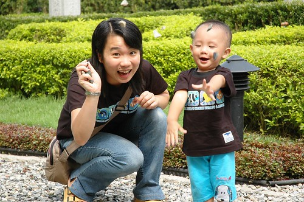  
  
雖然我們都說是小孩陪著我們去旅行  
但行程考量還是得大大考量小孩子 尤其入夜後幾乎是不行動的  
甚至常常得屈服的 照著"大人"(那個大人不是我們這個大人)的意思走  
  
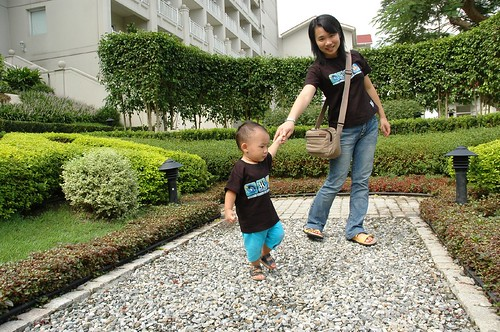  
  
有沒有給他很溫馨很幸福樣子的全家福阿  
  
  
  
阿徹2歲6個月 小愛則是媽媽肚子裡6個月  
這年也是好想去台東但殘念阿...只好到花蓮過癮一下也好  
  
  
  
攝於太魯閣天祥 這時候的阿徹模樣已經大致抵定  
  
  
  
攝於中橫進去的\*\*森林小學    
  
  
花蓮秀林鄉 民宿"花草集"外的沙灘  
這回看到沙就衝啦...  
  
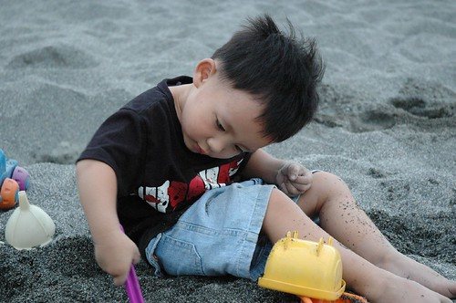  
  
離海水很遠的沙灘  很好奇什麼樣的風浪可以把這些漂流木打上岸  
  
  
  
花蓮海洋公園  總算真的為了小孩排景點  
  
  
  
可是7月底的大熱天 真的是熱熱熱....  
真的...夏天不是出門的天   
每天曬到中午過後就想躲進有冷氣的地方涼一涼  
  
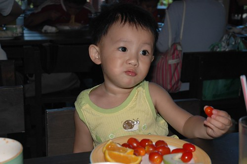  
  
海洋公園除了海豚秀外 最引人的就是這海景吧  
  
  
  
距離遠來飯店100公尺的民宿"七號海洋"  
價格不到一半但一樣的躺在床上看太平洋  
  
  
  
花蓮東華大學  羨慕這裡的學生...  
(看到小愛沒...在那裡...在媽媽的肚子裡阿....)  
  
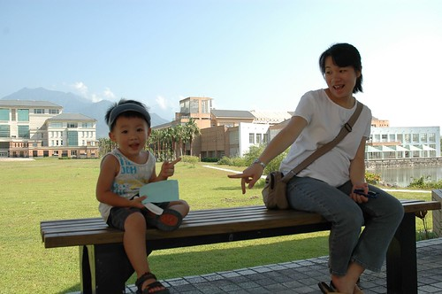  
  
宜蘭羅東公園  搶食的魚兒嚇的人躲也躲不及   
  
  
OH!  七月的傍晚時分還是熱....還是只能說秋天旅行的好  
  
  
  
旅行讓陽光阿徹越來越顯見  
  
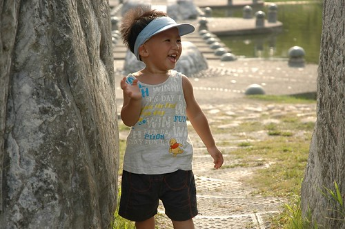  
  
2007年一月 阿徹4歲屆滿前的第三次台東  小愛的第一次 一歲2個月  
  
  
  
小小愛也開始在旅行中探索世界  
  
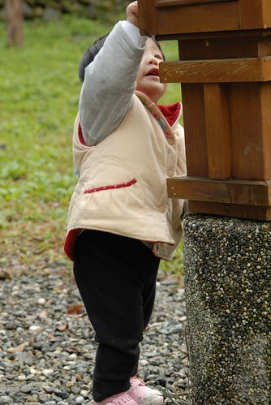  
  
重新再去整理這些照片 與徹爸兩人越看越是回味無窮  
兩人有幾點心得: 小孩真的在大  爸媽真的在老  徹爸的照相技術真的有進度...  
  
  
  
這回的台東衝的是這片油菜花田阿  
雖然套曾經有人跟我說的 油菜花不都一樣 西部到處都有  
但我還是覺得台東的油菜花真的不一樣  再多的文字都無法形容她的不一樣 我對她的感動....  
  
  
  
關山環鎮自行車道    
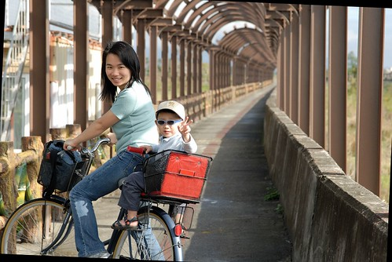  
  
環鎮接近20KM騎下來  很累但是很爽  
  
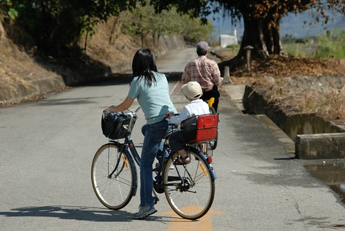  
  
小愛也可以開始享受自行車的快感了  
  
  
  
只是在暖暖的太陽照射下加上香香的空氣 很容易催睡哩  
  
  
  
看著兩個小生命這樣逐步探索世界是件很奧妙的美好事情  
  
  
  
前兩年還不習慣這花花綠綠世界的小愛  
在鏡頭下就像是隻誤闖叢林的小白兔  眼神透露著少許的惶恐與好奇  
  
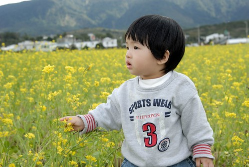  
  
不過沒關係 有阿徹哥哥的陪伴小白兔很快就會把叢林當樂園 笑嘻嘻的  
  
  
  
旅行中 小孩難免都會耍番的  小心照片會留下證據喔  
  
  
  
不管到哪 看到溜滑梯都得停下來的啦...  
  
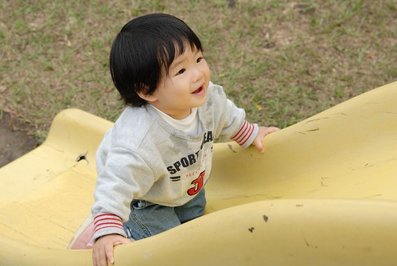  
  
台東海濱公園 ...一月的天還是不太適合來海邊 風大阿....  
  
  
  
一樣的台東森林公園  但去過又何仿   
你會因為家旁邊的公園去過就不再去嗎 ...不過都是放鬆....  
  
  
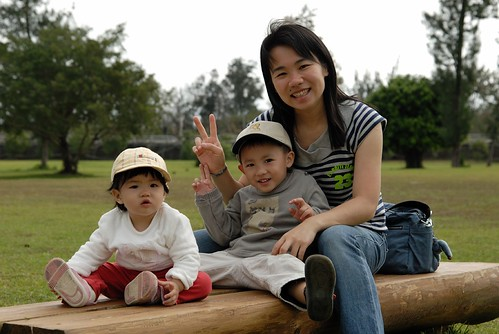  
  
照片不小心選太多 超過一篇的容量  
重點是我要下班回家接小孩 迎接我的假期 我的台東行了....  
雖然氣象預報未來六天都是陰雨綿綿 但台東我還是要來了.......  
  
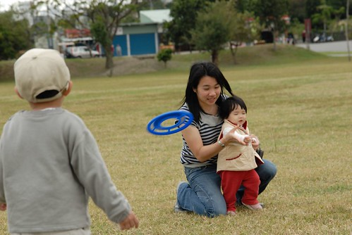
