阿徹很喜歡在家跟愛愛玩爸爸媽媽或是結婚的遊戲 對於"結婚"這儀式超級的嚮往與好奇 還曾經認真的跟我說"我好想當小新郞(小花童)喔"  並且問我要怎麼樣才能當 如果付錢就可以讓阿徹如願當上花童的話 為娘的我一定願意 偏偏這就跟結婚一樣 不是自己想結就能結想當就能當 總算總算在阿徹都已經快要變成"高齡"花童前 阿徹有了當花童的機會 (應該沒有人願意找不可愛又大隻的小學生當花童吧) Thanks 徹爸的舅媽&表弟 讓阿徹有機會獻出他的第一次...

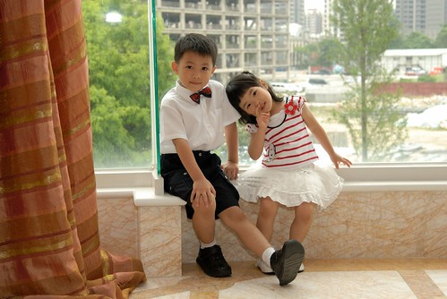

只是答應了當花童後 漸漸明白體會原來花童還真不好當 不過幸好花童的難處還可以用錢來解決(比起真的結婚簡單太多了) 花童的唯一賣點就是"裝可愛" 也因此花童唯一的難處就是"一套可以裝可愛的服裝" 徹爸的表弟說她們上拍賣網看到成套可以當花童的套裝不用1000元就可以買到 我上網一找 哇賽 果然還真的很多哩... 不過向來深信一分錢一分貨的徹媽還是買不下去 因此最後還是去遠百找比較會賣正式服裝的櫃找衣褲 穿了人模人樣的衣褲後再看看阿徹腳上的夾腳拖  忍不住搖搖頭 賣衣服的阿姨說"換個鞋子 整個感覺就會不一樣了" 於是又帶阿徹去買了一雙正式點的鞋子 穿了皮鞋後 再看看阿徹身上的背心運動短褲 還是又忍不住搖搖頭 賣鞋子的阿姨說"衣服穿對了 鞋子就好看了" 也就是說人要帥是需要從頭到腳都花錢的 不過還缺了襪子 所以徹媽又花了好一番功夫找白襪子 (才發現要找到賣襪子 尤其白襪子的地方還真難)

行頭是在當小花童的前一個週末買的 媽媽急著把所有衣物都洗燙過 阿徹也在前一天穿著皮鞋上學去磨磨鞋子

甚在還在家裏跟愛愛模擬結婚灑花瓣的場景 煮完晚餐從廚房出來的我看到這一幕臉都快綠了 平日阿徹蒐集剪集的中古房屋廣告單加上各式大大小小的小紙片全都化成花瓣了

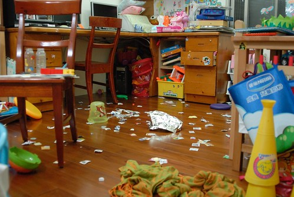

一切的準備 "訓練"就為了5/23當花童的這一天....

還沒打上"啾啾"的阿徹看起來很像長江七號裡面的那個小男生/小學生

因為要當花童 所以我們10點半就抵達台中的婚宴場地 第一次這麼早去喝喜酒的...

打上"啾啾"後的阿徹 氣質一整個不一樣嚕 花童的"架勢"有出來了.... 徹嬤跟阿徹說"你今天好帥喔" 阿徹說"我跟你說 我媽媽今天也超級美麗的喔" 哈哈~ 這兒子嘴巴有甜.. 讓聽徹嬤轉述的我聽的很爽

沒關係...大家可以說阿徹青出於藍更甚於藍  我們不會介意的

那天的阿徹有點靦腆 常常這樣咬著下唇

不過衣服終究還是無法掩飾一個人的本性  還是會不小心就露出猴性的

10點多等阿等 總算等到11點半大中午的戶外觀禮   不過還不是花童上場的時機

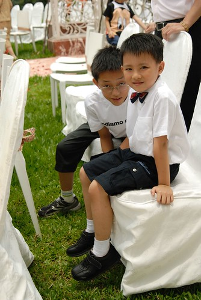

婚宴開始的新人進場前 花童正式就定位準備上陣

關上大門 準備準備...進場....

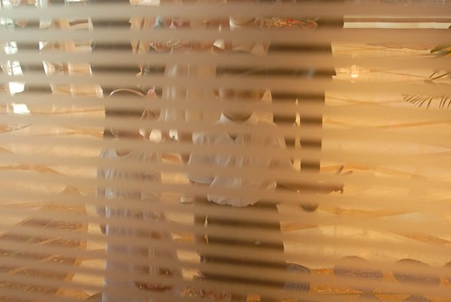

幸好今日沒有爆破 沒有黑漆漆的噱頭安排 阿徹可以放心穩當的走紅毯

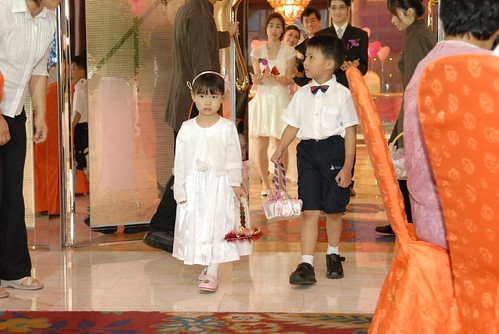

跟阿徹一起搭檔的是新郎同事的四歲女兒

看到沒?! 阿徹的花瓣是往後灑的 哈哈! 超好笑的  當他第一灑出手時"嚇笑"被這天外飛來一灑的人

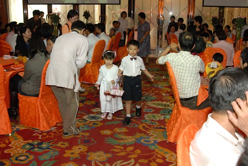

徹嬤後來跟我笑咪咪的描述"阿徹都笑笑的進場 很穩哩" 口氣裏 眼神裏盡是對她孫子的滿意與得意

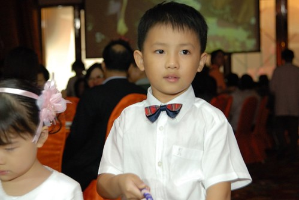

排練時 負責的小姐跟我們這些爸媽交代 如果小孩子走到一半被嚇呆或是哭了 就把他帶到旁邊沒關係 幸好 這樣的窘事沒有發生

YA! 成功順利完成任務  也賺到一個紅包嚕

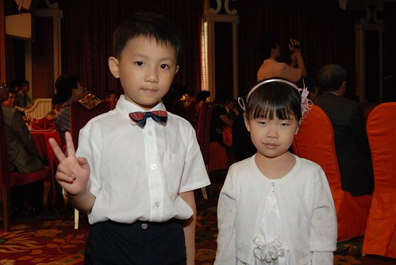

任務完成的阿徹開始大吃大喝 (現在喝喜酒已經很能吃也不是太挑 幾乎每道菜都吃不少)

婚宴結束已經是下午三點 然後又去了徹媽同學家坐坐拿東西  回到嘉義阿公家已經是5點多了 剛睡醒有點狼狽的阿徹看起來又更像"比賽開始"裏的啟聖教練了 哈哈! 帥阿~~~

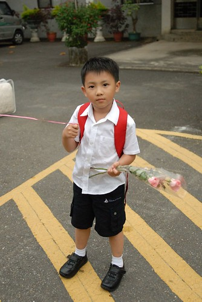

++++++++++++++++++++++++++++++++++++++++++++++++++++++++++++++++++++++++++++ 順道提一下阿徹最近好玩的事: 以前阿徹就曾經用塑膠袋或紙張給自己做了幾次"草鞋"或雨鞋 而在開始上"鞋子踢踏踢"主題課本後 有了課本上更多的"手製鞋"範本 阿徹更是興沖沖的模仿製鞋 在媽媽的協助之下 阿徹如願的做了一雙打X的及一雙夾腳的拖鞋 他也興高采烈的每天在家連續穿它個一兩週 沒多久鞋子就也如以往的每次"作品"一樣 沒多久就被像垃圾一樣的四處塞 可沒想到前陣子他又開始穿著X字型拖鞋在家晃阿晃 而且這回X字上還各多了一朵美麗的花型 原本徹爸還驚訝於他的手怎麼可能剪的出這麼美麗的花樣 結果細問下 原來花型是阿徹從學校的資源回收桶裏給撿回的 阿徹"愛撿垃圾"的美事又再添一樁….

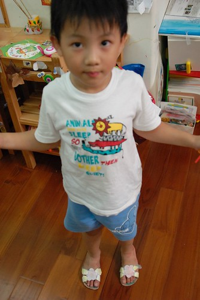

添了花朵及葉瓣的拖鞋更像回事了 真的粉像今夏流行的花朵夾腳拖哩!

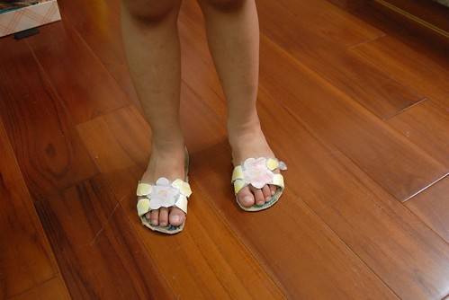

阿徹最近很喜歡找我聊天 說笑話 只是他說的笑話老實說實在很不笑話 有一次他問我"從天上掉下來的狗是什麼"  我回答"飛狗" 他說"不是.........................是過世的狗" 他又問"那從天上掉下來的車子是什麼"好難我答不出來 他說...............................是壞掉的車子" 他又再問"那從天上掉下來的香蕉是什麼" 哈哈...這冷笑話我聽過 這回總能答對了吧 我說"是茄子" 可是阿徹說"不是 .............................................................是爛掉的香蕉" 哇勒!!!還爛掉的香蕉勒...好冷好冷喔 莫非這就是傳說中七歲小孩講的笑話..........................

阿徹跟他娘一樣不善於講笑話 邊講自己邊笑 然後口齒不清的讓人聽不清楚他講的笑話 然後場面越來越冷.... 哈哈 不過跟阿徹這樣耍白痴 比講冷笑話 過程比笑話本身好笑多了

阿徹皮歸皮 讓人氣歸氣 有他相伴的生活真的很有趣

希望就如同他頭上的那頂泳帽 雖然突兀 雖然似乎不該戴在那 但它很幸運的被一個不在乎外人眼光 怡然自得的小孩所戴著 希望怪怪徹也能像這頂泳帽一樣  幸運的遇到可以懂他的朋友 老師 伴侶...

