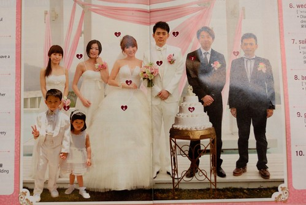

五月的時候 flicker收到ABC互動英語雜誌的編輯留言詢問是不是可以拿徹愛的花童照片放在她們雜誌上雜誌編輯說 徹愛的那張花童照片真是很適合她們七月份的結婚主題所需的花童照片雖然我跟徹爸真是又驚且喜...

這是原始的照片 是正中午在教堂外面照的 一整個陽光烈阿 而照片裡有一個除了膚色外 從頭白到腳的小白馬王子 以及一個站著小三七步 厚胸膛 沒有笑容的乳臭未乾小公主 看到原檔 真的會讓人很狐疑這樣的照片到底可以怎麼放到雜誌上阿 到底怎麼樣的適合阿  後來看到雜誌上編輯過後的照片 I got it 我猜應該是因為阿徹這身白 以及難得的有陽光 有立正站好的小花童照片吧 這麼兩張照片擺在一起 愛愛的臭臉顯的很微不足道了... 看的我們只能說編輯真是太強啦!!  因為知道是七月份的雜誌 六月底去書局時我們刻意地去翻找雜誌 看到照片後 拿給阿徹跟愛愛看 原本趕著回家 沒啥耐性的他們 看到照片後嘴巴張得大大的 我們問"這是誰阿?" 兩人異口同聲說"我們阿" 然後有點笑有點害羞的問我們"照片怎麼會出現在這..." 直到走出書局後 兩人還是一臉不可思議的臉 哈哈! 看到自己出現在書局就可以看到的雜誌上的確是有點"複雜"的心情阿! 兩年前的兄妹倆花童體驗([blog.yam.com/hmchen1975/article/22444840](http://blog.yam.com/hmchen1975/article/22444840)) 沒想到可以留下這個出乎意外的美好回憶  真是奇妙~ 不過看到雜誌上寫 原來花童就是flower boy/girl   這...這...怎麼突然覺得好台的說法阿!? 阿徹是flower boy 愛愛是flower girl 一整個好flower 阿~~~~~
