6月的遊記果然如我一開始所預言 夭折沒寫完 都已經是半年前的事了 好快阿...    趁著這美好的季節 就再來完成個一篇吧! 這回要回顧/介紹的是位於花蓮磯崎的後湖水月民宿 一個就像秋天一樣 令人舒爽難忘的地方

當初純粹是想找個離海邊近方便讓阿徹小愛玩沙的地方 用花蓮+民宿+海邊在估狗時 篩掉一堆坐落於海洋公園附近的民宿後 剩下的寥寥可數 上網看了後湖水月的介紹  感覺簡單清爽 實用中卻又極富特色的樣子 於是便訂了空間與價錢皆適合我們四口人住的四人房(不是Villa) 出發前徹爸跟他花蓮同事聊到民宿要住的地方時 我們才知道原來後湖水月還蠻紅蠻夯的哩 真是覺得自己運氣小小的好 就這樣讓我瞎矇到有口碑的民宿了

那天下午4點抵達後湖水月停好車後 我從房子後半段的走廊入口進去辦理checkin 這樣的走廊讓我第一眼就喜歡上這地方 (好有日劇的感覺喔)

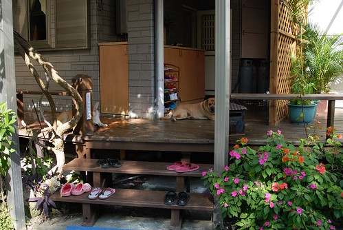

我們的房間位在房子的後方 需沿著外面的樓梯上去

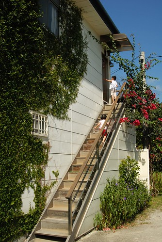

簡單中帶點浪漫的四人房 出門旅行時我很喜歡找有木地板或是大通舖的房間 一來容易加床 二來小孩子玩耍的空間大很多也不用擔心一堆家具的碰撞 不過當初會選這房型的四人房主要也是看上那兩頂蚊帳 果然阿徹小愛看到這蚊帳愛的很哩 她們說這是公主床 倆人進房後就熱烈的玩起公主與王子的遊戲

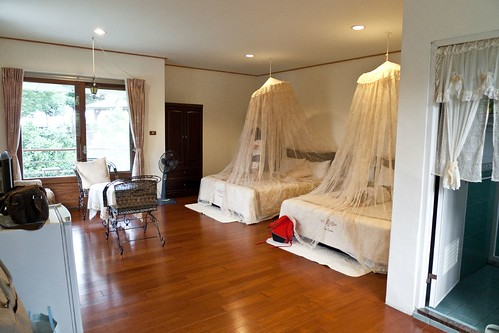

瞧~多嬌羞的公主阿

躺在床上撥弄著蚊帳

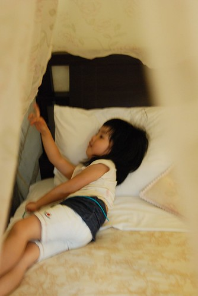

這公主還當的蠻自得其樂的哩

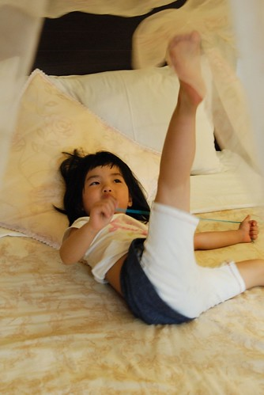

阿徹則一方面忙著當公主的王子 另方面也四處在尋寶有啥好玩的 阿徹小愛似乎越來越喜歡過夜的旅行 不同的民宿/飯店有著不同的樂趣

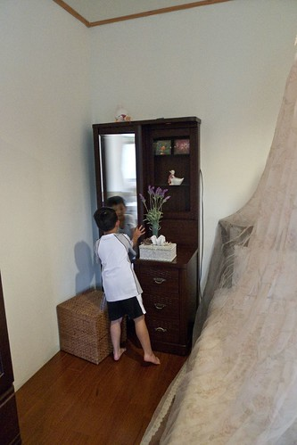

一旁的座椅 貴妃椅是夜晚我跟徹爸聊天嗑泡麵的好地方 整個房間沒有太多搞氣氛的累綴裝飾(房價上也同步反映)  蠻合我們胃口的

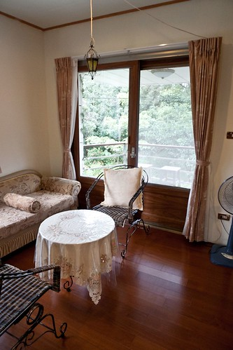

民宿就坐落在臨海山頭之中 所以不管從房間哪各窗戶或陽台望去都是一片綠阿 晚上的蛙鳴禪叫聲大到讓我們後來關起門窗開起冷氣(真是過與不及都不好)

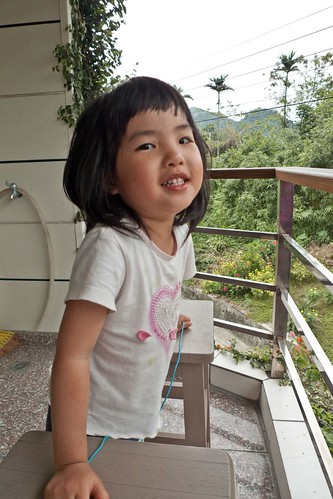

在房間溜達半小時後 我們便去磯崎國小後沙灘玩沙 (見另一篇:[blog.yam.com/hmchen1975/article/22642277](http://blog.yam.com/hmchen1975/article/22642277)) 然後天黑才又回到民宿洗澡吃晚餐 所以其實是在第二天早上吃完早餐後我們才好好的把這給逛了逛 好好享受在後湖水月才有的那份寧靜與愜意

拖晴天娃娃的福 五天旅行的最後一天是個爆藍的大晴天.... (我們正準備進入餐廳吃早餐)

我們選擇在走廊的位置享受我們的早餐

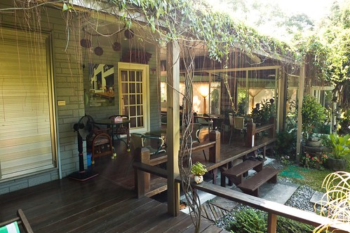

正前方望過去的景

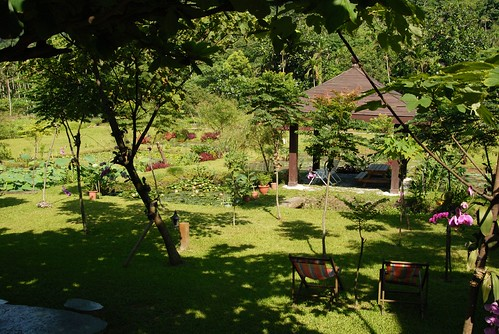

左方望去的景  (照片中的白色建築物是臨池而建的招牌Villa)

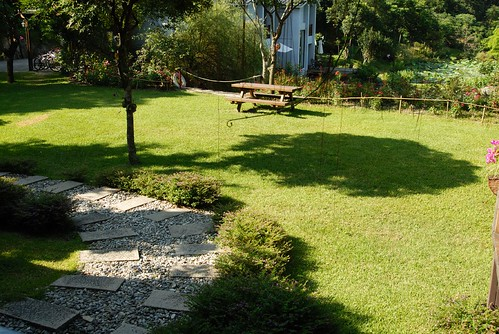

坐在房子沿廊下 視線沿著45度斜角望上去的天空

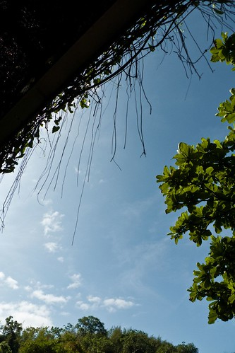

徹爸就是這麼悠哉的享受美景 拍照 看漫畫

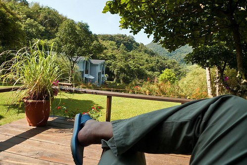

民宿餐廳裡有幾套收錄完整的漫畫 尤其有阿徹跟著徹爸迷的火影忍者 等候早餐上桌前以及早餐過後  阿徹就都這麼坐在躺椅上享受他的漫畫 這小子真的越來越懂得享受了....

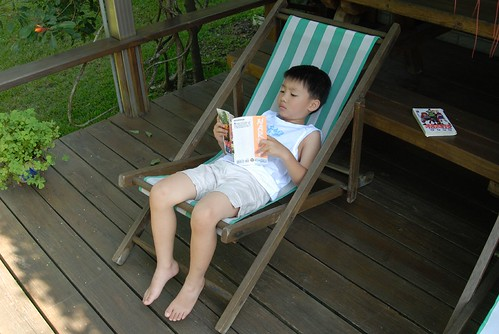

餐桌旁的海報上 簽滿各大旅遊雜誌 電視節目的到此一遊紀錄 看到此我真的相信他很夯了 只怪自己平常太少看電視了

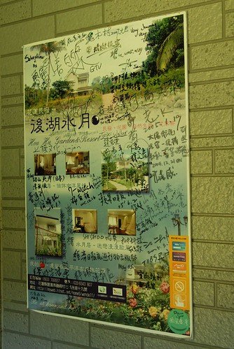

爸爸跟阿徹都已經在享受的同時 我還在跟愛愛的早餐奮鬥 Orz 早餐跟前一天的晚餐一樣 滿滿自家種的菜 釀的/打的果汁  讓人吃了很感恩的兩頓飯

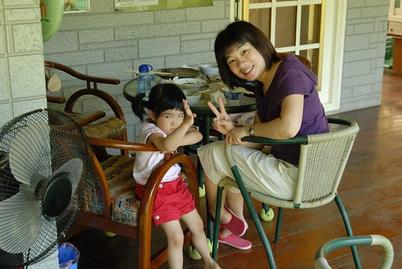

總算愛愛也解決她的早餐 追隨他哥哥的腳步去享受了

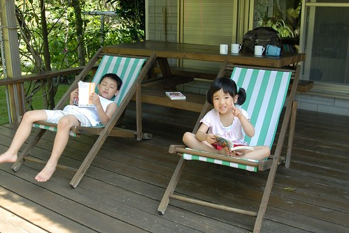

而我也才得以開始好好的四處走走看看... 我又忍不住要說 我真愛死這種有沿廊

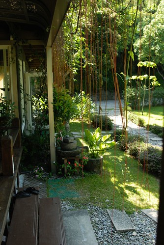

不過據跟民宿爸爸(主要都是第二代的孩子在經營打理了)聊天聽來的消息 這幾年民宿前前後後投入的資本額已有好幾千萬以上了 埃~ 聽到此 我們開民宿的美夢頓時幻滅 看來以後能有點老本買塊小地蓋間小木屋兩老住 就已經讓人很感恩嚕

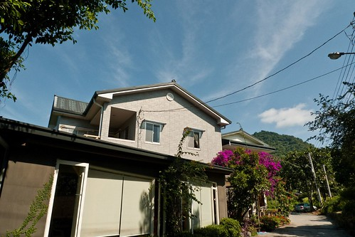

民宿主建築的另一旁有條小徑通往眺海平台 (那也有今年新蓋的帳棚型豪華Villa)

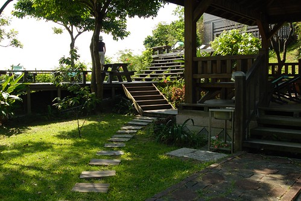

在山的這一頭就這麼的看到大海了 你說這裡是不是一個神奇的地方 一分鐘前還讓人彷若置身在深山中 一分鐘後卻又感覺離海這麼的近 而更神奇的是 炎熱的夏天裡離海這麼近的地方卻絲毫沒有臨海的熾熱感 且聽民宿爸爸說 這的冬天也不會像海邊那樣風大寒冷  所以冬天的住房率還是很高 看來這裡還真是一個冬暖夏涼的好地方阿  有機會的話一定得找個冬天來這裡試試

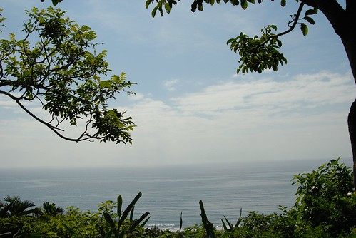

回到民宿 從前院望進房子的FU (看到阿徹的頭還躺在那個躺椅上嗎 他真的真的超享受這的 )

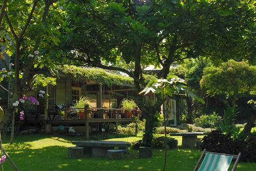

民宿主建物正面全貌

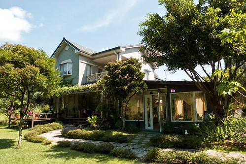

我想這是一種福分 讓我們旅行的最後一晚住在這麼棒的地方

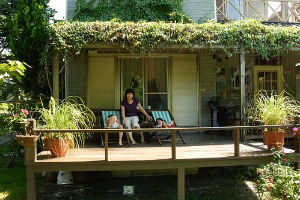

讓我們可以這樣發呆

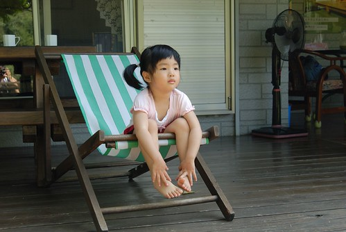

這樣放鬆

這樣愜意

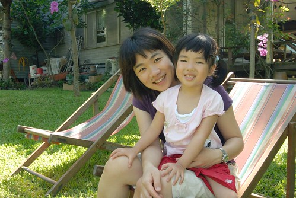

這樣享受一家子美好時光

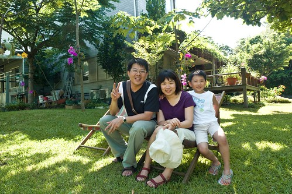

跟阿徹說"我們該走嚕"  阿徹捨不得的說他還不想走... 我說"好阿 那我們繼續在這坐下去 海洋公園就不去了" 小子才心甘情願 依依不捨的離開後湖水月....

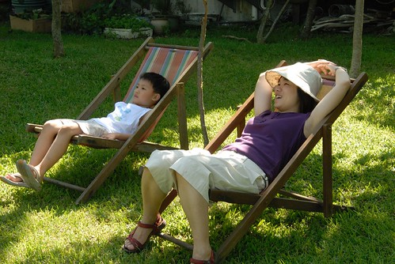

一個又是另一番風味的花蓮民宿...  值得讓人留下美好的記憶與再次探訪 ....

順帶貼了張 從後湖水月離開往北走經過芭崎瞭望台照的照片 真美的一個弧度與地方!!

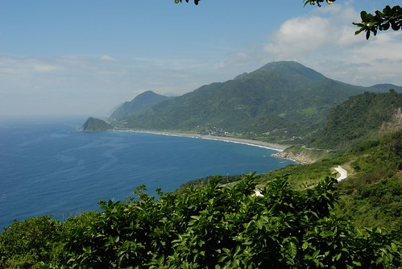
