鯉魚潭的自行車道這幾年蠻夯的 總算總算在這次不是刻意但卻順道的情形下我們一探其究竟 可能因為那天天氣剛好有點陰濛(講真的 陰濛的花蓮更有一番詩情畫意) 加上端午假期大假過後的第一天 人潮少的出乎想像 一趟環潭自行車道騎下來 覺得鯉魚潭還真的挺美的說~ 

下午兩點多抵達鯉魚潭 停車場上的車輛不超過個位數 而進去園區後看到的更是一片空曠阿...

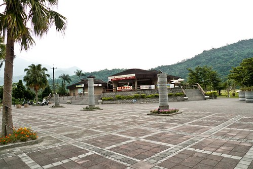

潭面上也是靜悄悄的 所有船隻都排列整齊在潭邊

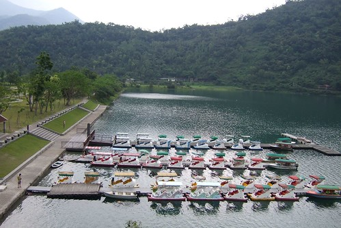

站在瞭望台上一眼望去~~~心曠神怡阿

空! 空!! 空!!! 完全沒人的空~

來鯉魚潭最主要的目的當然是要騎一騎他的環潭自行車道 這是這回５天行程中唯一一個可以騎車的地方 因此趕緊去找號稱在潭邊美麗的ＧＩＡＮＴ出租站

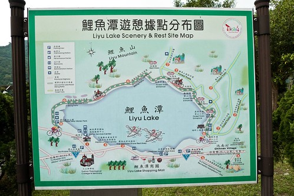

今天阿徹租了台２０吋變速車試試 而我跟徹爸還有小愛三人合騎一台親子車（捷安特沒有二人親子車可以選擇）

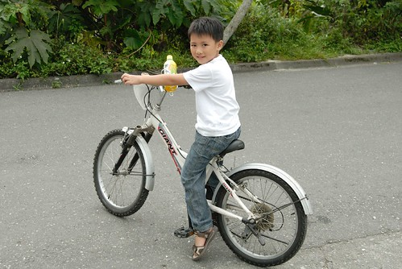

沿路沒有遇到跟我們一樣騎車的遊客 也就是說除了零星的一些健行客跟騎著機車的巡守員之外　環潭車道被我們包了啦 因此我們騎騎停停　慢慢享受這好山好水好景

小愛完全恢復　早已看不出一早上山路的疲態

鯉魚潭不算大　從岸的一邊便可望見岸的另一邊

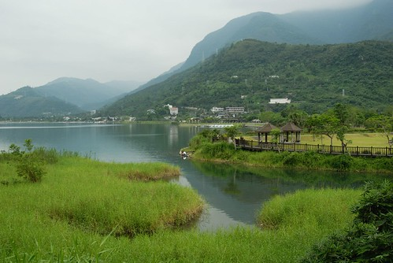

而環潭自行車道總長約６公里　約３０分鐘的時間即可完成

發現現在的登山步道或是自行車道都設計有符合其特色的＂路程指示標＂　都很小巧可愛

阿徹現在出門騎車已經可以靠著他的小力氣或是＂蠻＂力　自己牽著車過各種關卡 （為了防止汽機車進入的關卡　有些設計真的很爛　非得你下車九彎八拐的進入）

第一次騎變速車的阿徹　１２３４５６亂換檔的換來換去

尤其上坡的時候變速變的很開心賣力 只是可能因為具備變速功能所以車身就也比較重 所以徹爸問阿徹今天的車好騎嗎　阿徹搖了搖頭

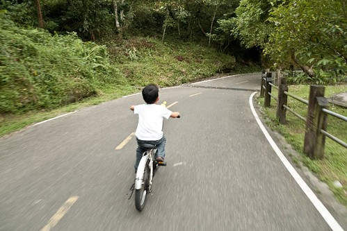

哈哈嘿！雙人自拍再一張

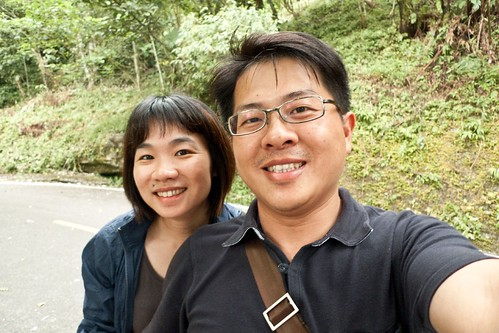

今天租了兩台車騎了一個鐘頭　花了２５０大洋　好像有那麼一點貴．．． 不過現在ＧＩＡＮＴ出租站的車都比印象中出租的車輛好騎很多了 像我跟徹爸兩人難得共騎一台協力車 當我在後頭納涼休息時　前面的徹爸問＂你很賣力在踩喔　我都不用怎麼踩＂ 我說＂沒有阿　我根本沒什麼踩阿＂ 可見這協力車還算是不難騎　不需太費力騎

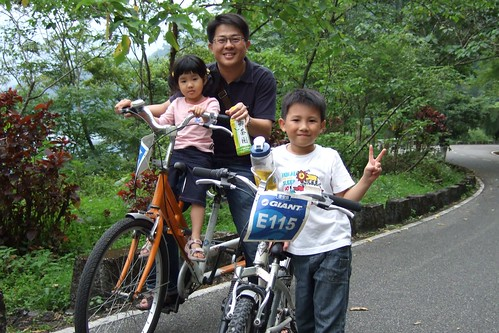

雖然車道很短但風景很棒

硬是要阿徹在這美麗的湖光山色旁留下這紀念性的一張照片

快回到出發點時　發現車道旁剛蓋好待售的＂度假＂別墅 住在這看著鯉魚潭的晨昏變化會不會太奢侈幸福啦 徹爸說照一張下來　說不定我們以後成了這的主人更別具意義　（真是想太多．．．）

６公里的車道當然花不到１小時便完成　還了車後阿徹小愛在Giant的休息區玩盪鞦韆

發現除了阿徹以外　怎麼其他三個人都有點水腫阿

不過小愛有時候照相pose擺的好　露出假鵝蛋臉

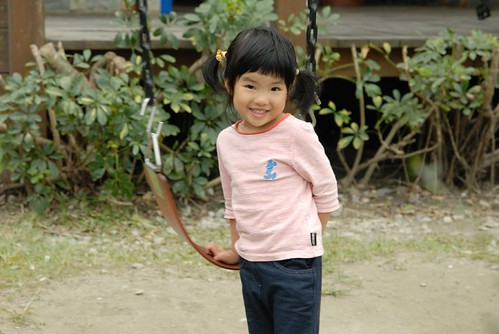

宏偉壯觀的鯉魚潭GIANT自行車出租站　　還蠻美的啦

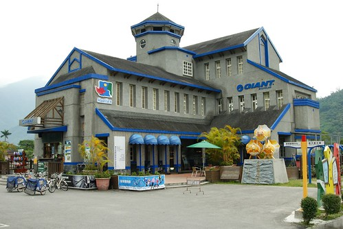

不過出租站位在多元漁業園區　其實離鯉魚潭的入口有一段距離　走路大約得走個５－１０分鐘

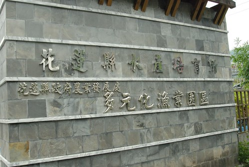

有機會去花蓮推薦大家也去鯉魚潭騎騎車　看看美麗的山水景色 （嘿嘿！　難得的旅遊地標照！）

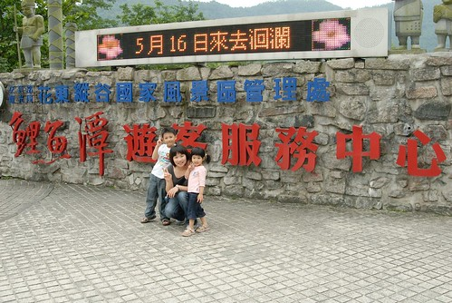
