12月的第二個禮拜是徹媽家的家族旅行 綜合大家的喜好去了泰安溫泉 採草莓以及飛牛牧場 很高興此行大人吃的愉快  小孩玩的開心 大家都留下美好的回憶

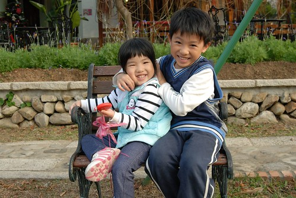

接下來一樣來看圖說故事嚕.............. (照片粉多)

大家約定周五下午各自前往泰安的住宿區集合 難得的我們是最早上高速公路的 因此抵達轉往泰安的路上後我們趁機去媽媽耳聞許久的巧克力雲莊逛逛 巧克力雲莊裡包含有溫泉區 巧克力屋 民宿區 餐廳區等...

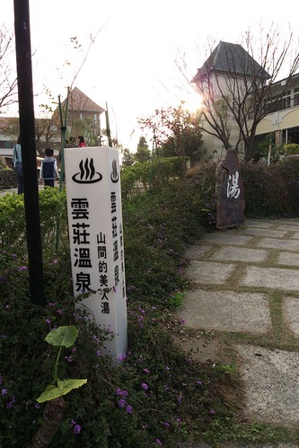

規模一年比一年大 感覺越來越有渡假村的架式

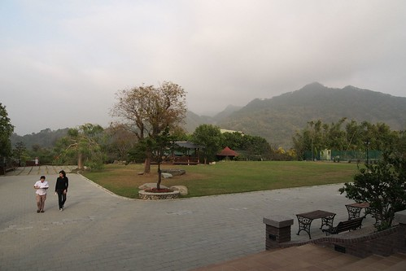

整個空曠 乾淨 愜意的規劃似乎很得徹爸的意  竟然說他一定要來住過一次 嗯~很好 衝著徹爸這份意念 徹媽我一定在適當時機灑銀子讓全家過過癮的

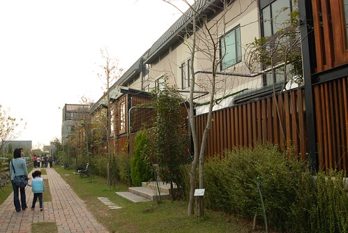

徹媽VS愛妹 很多人說愛愛越大越像媽媽了 真的嗎?!

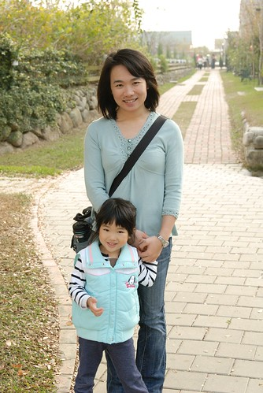

徹媽VS徹哥  不知不覺兒子已經到我胸部這麼高了(好啦 是媽媽長的矮啦)

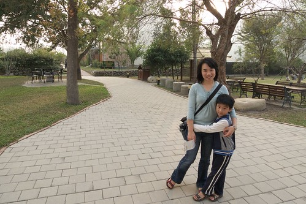

其實會來這最主要的目的是為了這裡出名的 排山倒海草莓冰阿 所以逛完園區後 我們就回到入口處的巧克力屋準備吃冰嚕

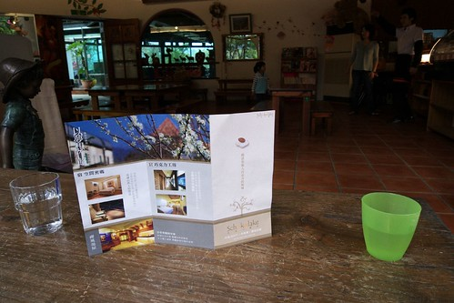

星期五的下午 只有兩三桌的客人 很安靜很舒適

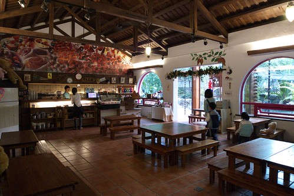

我們刻意挑了個編號為"門"的桌子坐 之所以編為門 因為這桌子就位在被鎖上的側門處 挺特別的一個小角落

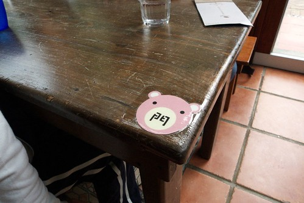

噹~ 很特別的一桌吧  就在門邊

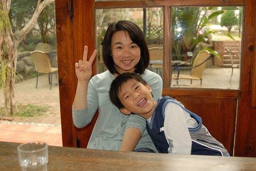

不知道是不是只有非假日 遊客少的時候才會把這門鎖起來 才會有這麼一桌

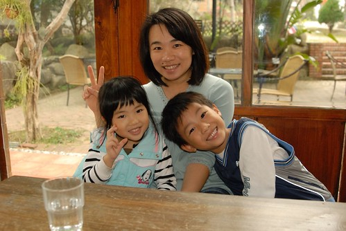

坐在這望出去便是這美麗的屋簷

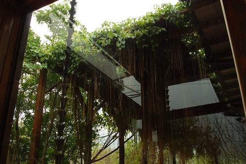

連去上個廁所的路上都還能裡外相見 來個一張

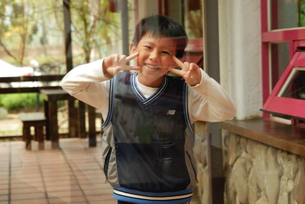

以為冰會上的很快 可是竟也等了20來分鐘...

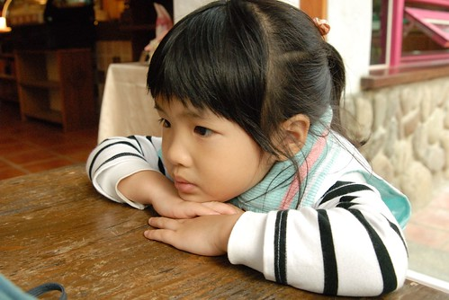

什麼時候冰才要來阿..好渴望 好好奇阿...

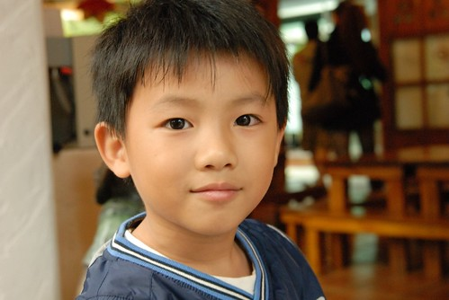

總算總算 鬆餅送上來了 徹媽記憶中最後一次像這樣美麗 讓人胃口大開的鬆餅已經是大學時代的事了 那時後很流行的"玫瑰園"招牌水果茶+鬆餅 就是這樣的視覺+味覺感動阿...

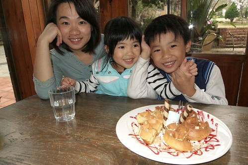

好吃 好吃 連愛愛都吃的津津有味

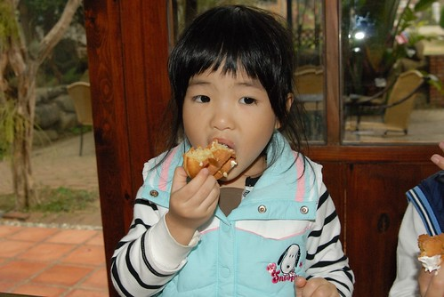

尤其已經被告知 咳嗽不能吃冰的她更是珍惜這鬆餅的美味阿

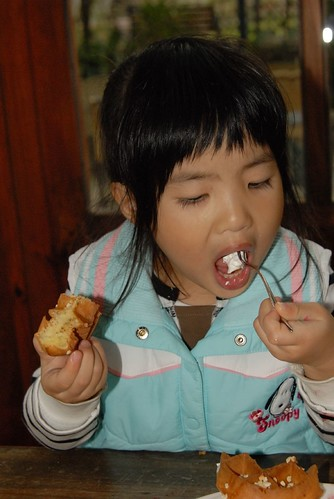

最後 鐺鐺鐺鐺~ 主角登場嚕... 所謂的排山倒海冰阿...

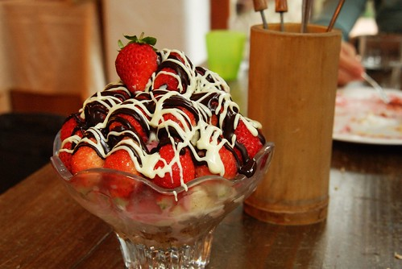

寫到這徹爸剛好看到 說著 "哇~好好吃的樣子阿 一看就是高熱量"

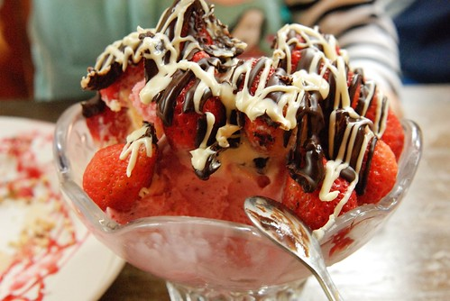

從最外層開始的煉乳 巧克力醬 約莫40顆左右的草莓  不知道算幾球的冰淇淋  玉米脆片以及香蕉片 哈哈~絶對高熱量沒有錯 不過真的好好吃 好享受 好滿足 好痛快阿.........

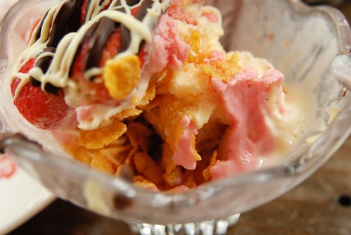

完整 新鮮 扮著煉乳巧克力的甜美巧克力就這樣一顆顆送入口

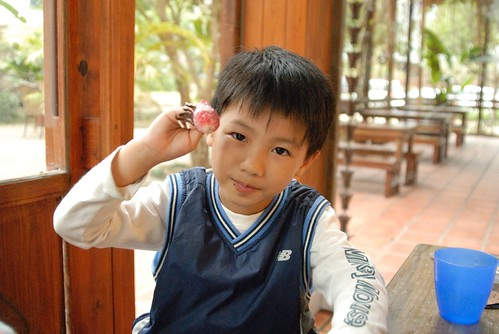

連向來不吃草莓的徹爸也吃了好多草莓 從不覺得好吃的玉米片 拌著冰淇淋入口竟是這樣美味

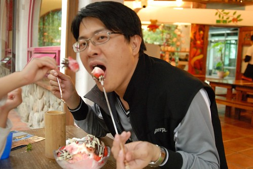

2-3人份享用的這樣一盤冰要價350元 初看到MENU上的價錢時會頓ㄉㄟ一下 這麼貴該奢侈嗎 不過上桌後 吃完後 真的覺得蠻值得的 我跟徹爸說 那麼下回草莓季就如你所願來這住一晚再順道來個排山倒海吧

那天下午巧克力屋裡剛好撥放著聖誕節歌曲 一整個讓人很有提前過聖誕節的FU

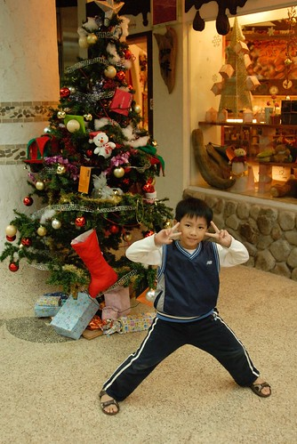

這次住的地方是泰安溫泉區裏的湯唯溫泉民宿 別懷疑就是跟那個明星一樣的湯唯 也別懷疑這民宿還真像渡假村的規模哩

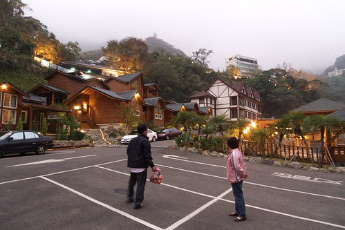

考量價錢以及陳媽生意的問題 我們選擇週五晚上入住 陳二嫂負責這次的訂房 訂了間有四個房間+客廳還有一個戶外湯屋的獨棟小別墅 整間原木的建材 加上前年方開幕的新意 入屋後的感受就很棒

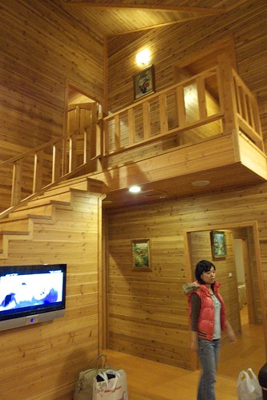

挑高設計的客廳也是一家子聊天嗑零食的好地方 (小孩ㄋ? 小孩早就在房間玩瘋了)

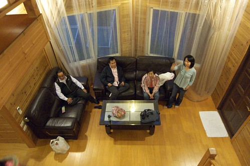

二樓還有個可鳥瞰整各渡假村的陽台 傍晚的時候 徹爸聽著渡假村放著的音樂 躺在椅子上小憩 好不愜意阿

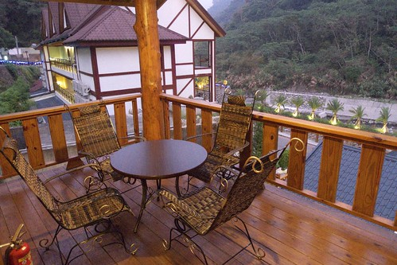

房間內也都是原木打造 連衣櫃冰箱櫃也都是原木設計 房內該有的都有 不該有的奢華 賣氣氛裝飾品也都沒有 很對我們的味 徹爸給了它85分的高分

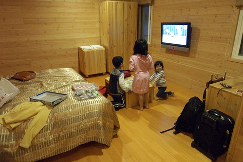

清晨起床後的山景也很清新迷人

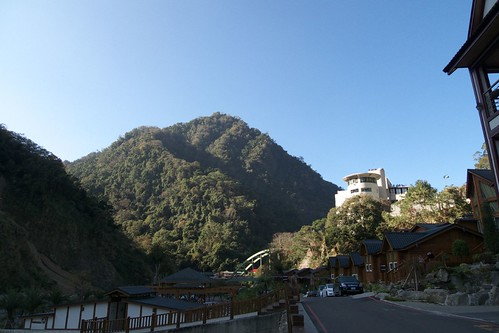

來過幾次泰安還蠻喜歡這裏鬧中取靜的感覺的 (下圖的建築物是我們曾經去泡過湯的日出溫泉 )

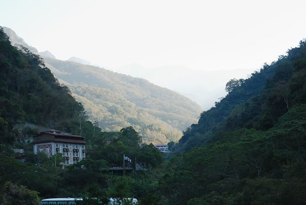

小別墅的外觀

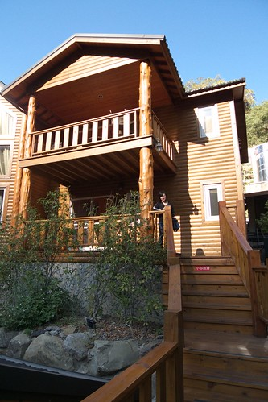

擺滿一大家子的鞋 感覺真熱鬧

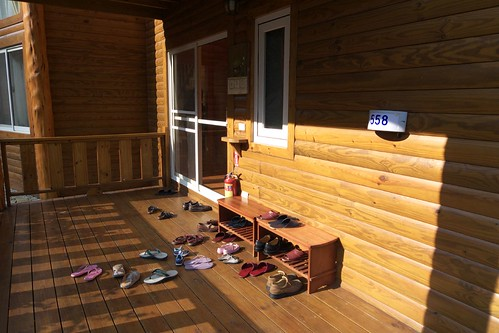

住宿的晚上一夥人是去泡戶外的湯池 雖然不若二哥一家人她們在八八水災過後情況 沒人到還有青蛙陪著泡湯 不多的遊客 上乾淨的地板 適當的水池溫度 很舒服的泡湯環境

而第二天早上一大早 小人們便又嚷著要泡別墅內的戶外湯池嚕 (PS 每間房間也都有附有大按摩浴缸的大浴室 大到連乾濕分離都不用做了 )

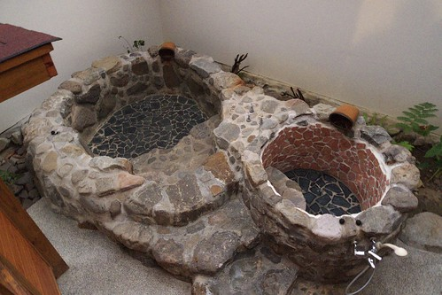

池子雖然不大 不過也夠這五個小朋友玩的  加上灑下的陽光 溫暖 舒服 開心阿~~~

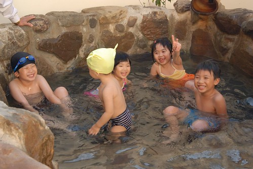

淋濕頭髮的阿徹 這模樣有夠像黑狗兄的 徹媽硬是去把窩在床上看棒球的徹爸挖起來照一張

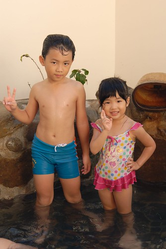

離開前最後來張全家福大合照嚕 (考量光影問題 最後的最佳合照地點竟然是在這樓梯上)

愛徹一家子跟陳爸陳媽的合照  (阿徹你的臉就得這麼苦嗎)

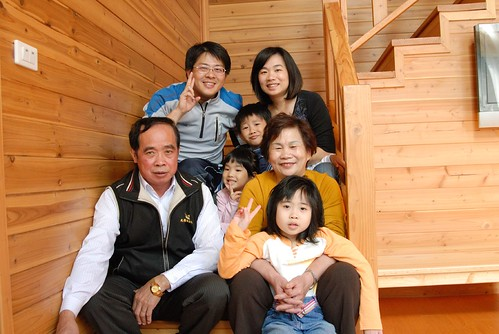

離開泰安後我們前往下山路上的大湖草莓園採草莓 選擇兩年前我們來過的來來草莓園 老闆說今天是開放採果的第一天喔 加上一大早遊客尚未湧入 滿園新鮮大顆的草莓隨便我們採 ...

愛下面這幾張不同階段的採草莓動作 徹爸拍的很有感覺 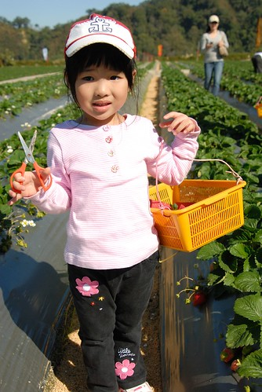

(徹媽) 那顆好紅 可以剪...

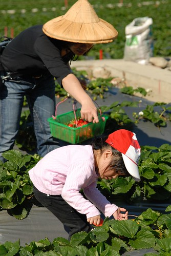

(徹媽) 小心喔 不要剪到旁邊的草莓花了

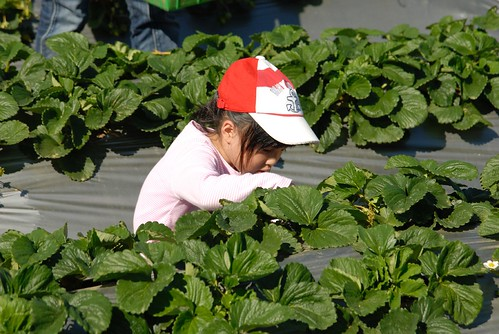

(愛) 媽媽 草莓給你

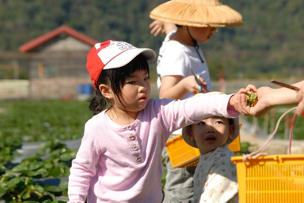

雖然草莓採的很過癮 因為隨便就看到可以剪想剪的又大又紅草莓 可是不消30分鐘 大家的藍子就都滿了 一斤250元算下來很可觀勒 所以沒多久大家就坐在一旁小憩

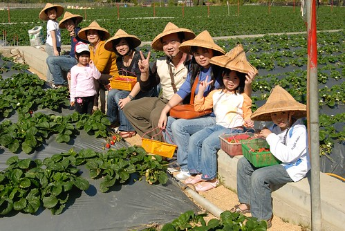

反倒是陳爸出乎我們意外的剪個不停

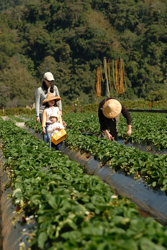

雖然地上傳統栽培的草莓有著農藥過多的問題  而且親手採的也沒比買現成的來的便宜 不過就是過程中的樂趣嚕  況且久久才吃一次草莓  洗的時候多泡一下多沖幾回也還OK 所以強烈推薦大家有機會的話可以來苗栗採草莓

(又是很愛自拍的夫妻倆) 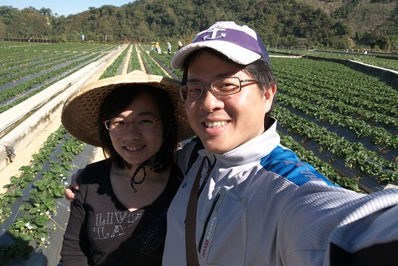

最後裝箱打包時 可能因為我們實在採的有夠多 老闆就把那些有碰撞傷的草莓送我們 要我們直接洗一洗吃掉 瞧~愛吃草莓的愛愛吃的多認真狼狽阿

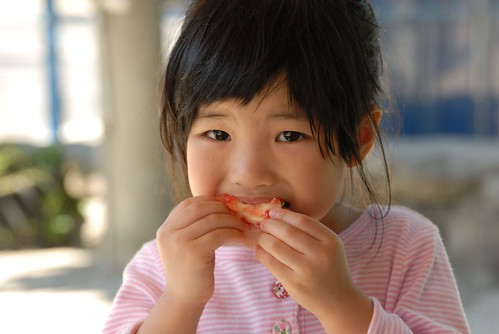

離開泰安接著我們就前往飛牛牧場 沿路因為導航系統的秀逗加上徹爸的愜意開車法 帶著其他兩台車花了好一會時間才抵達飛牛 真不好意思...

上次且唯一一次來飛牛牧場是阿徹四個多月大的時候 那時候新手爸媽第一次推著嬰兒車帶著小baby來戶外踏青 老實講沒逛什麼 只有對這的貴三三門票 還有送的超小杯牛奶有印象 這回依舊被她的門票給貴嚇到  不過呆了3-4個鍾頭也繞了大半個農場還算有值得

到達大草地後 三個低級小學生早已迫不及待的滿場跑 到處探險 而我們這些大人舖起野餐墊 就是打算裝死休息嚕

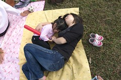 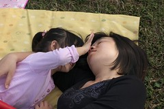

雖然遊客量不算少尤其超多年輕學子團的 不過整的感覺還算愜意(餵食區除外)

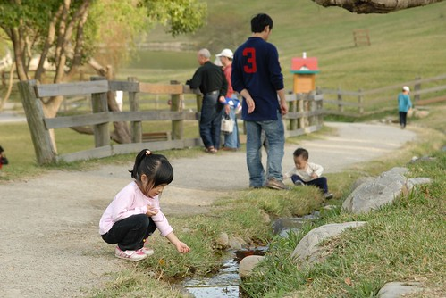

而大草皮旁的一條小小溪流竟也讓這幾個孩子玩的不亦樂呼

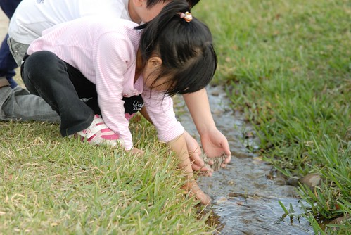

講真的家族旅遊最大的目的就是讓這些小孩們一起玩一起過夜一起瘋阿 每個小孩都玩的像個野孩子似的髒兮兮

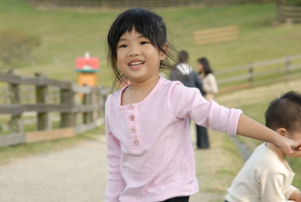

而大人們看到這群小孩玩的這樣興奮開心就也開心了 而且有自家人互相/輪流cover小孩  各自夫妻還可以偷個時間發懶或浪漫一下還挺不錯的

人家都說小孩子會互相帶來 就像大哥的小孩(瑜)大二哥的小孩一個月(萱) 而二哥的小孩大我的小孩(徹)二個月 (也就是說三個小孩最大的差距才四個月 ) 我們真的是一起看著這三個小孩一起長大 雖然三個小孩的個性 表現都不一樣 我們三對爸媽的教養方式也都不同 不過能這樣一起成長 一起互相學習當個好小孩好爸媽 我想或許這也是老天爺給我們陳家三兄妹的福分跟美意吧

在大草坪休息時看到很多這樣的學生團體在玩團康遊戲 呵呵~ 讓我們這些中年人忍不住都想起學生時代的回憶

怎的~現在已經小孩這麼大啦... 徹媽又忍不住要唉 時間納ㄟ過的這麼快阿................ 沒關係 老就老... 我越來越喜歡我的年紀我的回憶...或許這就是所謂的人生阿...

太陽下山嚕~縱使玩的不想回家也還是該啟程回家了

要上高速公路的途中恰巧經過了苗栗的花海區 替這回的家族旅行增添一個美麗的ending回憶

(這張是小愛拍的喔) 

(這是徹爸拍的 怎覺得她女兒上張的構圖比爸爸好阿) 

這樣照下來 以後就知道花在哪看的嚕 哈哈~ 

好天氣 好心情的美麗夕陽........

