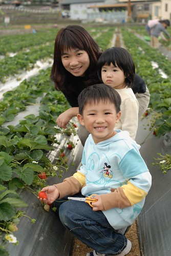

很奇怪小孩子都很愛草莓   
草莓蛋糕 草莓優酪乳 甚至草莓洗手乳  
草莓不像其他水果那樣甜滋滋的甚至帶點酸酸的味道  
而且不小心抓兔子的時候 那濃濃酸酸的草莓味總嗆的大人差一點也抓兔子  
真的搞不太懂草莓的魔力何在....  
  
每次出去玩如果經過草莓園阿徹都會嚷著要採草莓  
10月中去苗栗泰安洗溫泉時在路過的大湖及泰安看到成片的草莓園  
跟阿徹說"等聖誕節後有草莓了 我們來這裡採草莓"  
天越來越冷 聖誕氣氛越來越濃  各式草莓蛋糕大福也紛紛出籠  
甚至巷口發財車賣的東西也跟著季節變化   
從夏天的荔枝 秋天的花生菱角到現在冬天的草莓  
櫥窗裡 馬路上隨處可以聞到草苺酸酸甜甜的味道...  
  
趁著草苺季即將開始 人潮尚未湧現前 來去採草莓嚕~  
這是我們第一次下園採草莓  很新鮮很有趣也很令人回味無窮  
那種感覺就像是聽演唱會一樣   
親身感受歌手那令人起雞皮疙瘩的演唱魅力後就此深深愛上這位歌手  
回家後吃著親手採的又新鮮又紅嫩的草莓 真的覺得特別甜美可口  
有機會的話這個冬天還想再去採草莓~~~  
  
  

本來預計一家四口輕車從簡的草莓行  
因為徹嬤徹公剛好從嘉義北上新竹過冬至  
所以就召了張三姐全家跟阿公阿嬤一起踏青去  
到達苗栗已經中午時分 就剛好去泰安村的清安豆腐街吃中餐  
上回晚上7點多經過這條老街時一片黑暗與安靜 完全難以想像他的熱鬧  
這回正中午來果然有看到老街的人潮  
張三姊夫說大概客家人都比較早睡吧...(呵呵 未免也太早了)  
  
  
  
這個是黑豆腐 真的有夠像木炭的  
  
  
  
小愛常走一走 不知怎麼了就到了阿公阿嬤的手上  
果然跟阿公阿嬤出來玩比較不苦命  
  
  
  
其實整條街的重點就這家清安豆腐店(人太多沒去吃)  
跟大排長龍的粉圓綠豆冰(這就好吃了 不過張三姐排了好久的隊)  
除了這以外沒有太多店家也沒有太多的人潮  
對了... 這有賣草莓香腸  
像大腸包小腸那樣的裹草莓嗎?還是香腸裡面吃的到草莓果醬ㄋ?  
徹爸問了老闆原來是用草苺酒下去做的香腸啦  
香腸聞起來吃起來真的有草莓特殊的酸甜香味喔 還蠻好吃的說  
  
  
  
YA!!!有人抱真好ㄚ...  
  
  
  
老街晃了一個多小時總算去草莓園採草莓嚕  
本來想要去採高架草莓的 因為聽說比較有機少農藥  
但是高架草莓畢竟是少數不好找加上徹爸說採草莓就是要彎著採才有味道阿  
所以就找了沿路上某個方便停車的草莓園就下去了  
各家草莓園都連在一起 應該差不多吧 太難吃的應該也無法混下去吧  
大小孩們各自拿了一把剪刀一個提籃下園  
老闆有交代 大顆是送人好看而已  重要的是要紅 紅才會甜好吃  
所以叮嚀阿徹看到草莓剪下去前要先問過  
要不然總不能剪了一堆不好吃的草莓回去 那可都是要錢的ㄚ  
看哥哥剪草莓剪的不亦樂乎  小愛也想搶著剪 還剪的欲罷不能  
我得稍微誇讚一下阿徹 真的有疼妹妹啦  讓妹妹剪的機會比自己剪的還多  
  
  
  
對小愛來講是享受拿剪刀"剪"下去的樂趣  
至於阿徹跟我們則是更享受於發現一顆顆紅通通草苺的驚喜  
"哇 這顆好紅 "的聲音此起彼落的在草莓園裡出現  
  
  
  
新鮮的草莓真的有水 嬌嫩愈滴的模樣很討人喜歡  
讓人不想錯過 剪的欲罷不能   
只好一再提醒小孩"夠了 夠了 不可以剪太多會吃不完"  
  
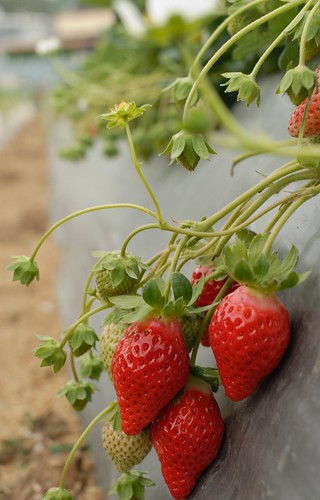  
  
看到草莓花才恍然驚呼草莓會開花阿   
而且還是這麼小巧雅致的小白花 真的有美有美  
  
  
  
大湖草莓季12/29才正式開跑  所以這時候草莓還沒有最旺   
不過就因為沒有最旺 所以草莓園還沒有被眾人揉佞過的痕跡  
而且才可以看到園裏交錯的成熟紅草莓 未成熟白草莓跟盛開的白草莓花  
紅白交錯 煞是美麗的說~~    
  
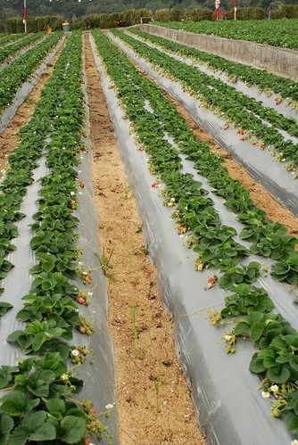  
  
嘿嘿~媽媽挑染過後的捲捲髮有沒有給他生色不少阿  
歷經尷尬的一星期黑捲髮等待染髮期 媽媽新造型正式閃亮出爐  
  
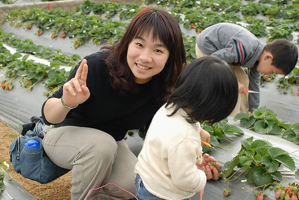  
  
二兄妹顧著搶剪刀  媽媽在一旁則是擔心兄妹倆一個不小心狼悵跌坐草莓園  
  
  
  
明明已經摘滿一堆的草莓了 看到紅滴滴的草苺手還是會癢  
所以打定主意採夠了後 眼睛就不要再看了  
趕緊拎著籃子找老闆秤重給錢去    
要不然花錢事小 回家得吃一堆草苺才事大  
  
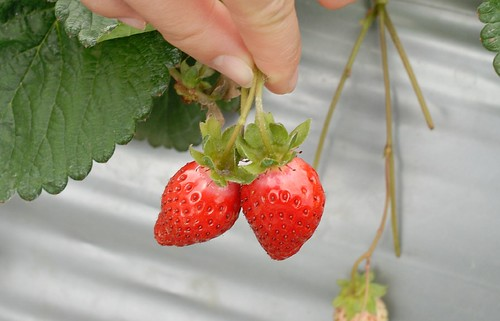  
  
阿嬤也採了不少喔 因為聽說徹伯挺愛吃草莓的樣子  
(很難得聽到有大男生喜歡吃草莓的)  
  
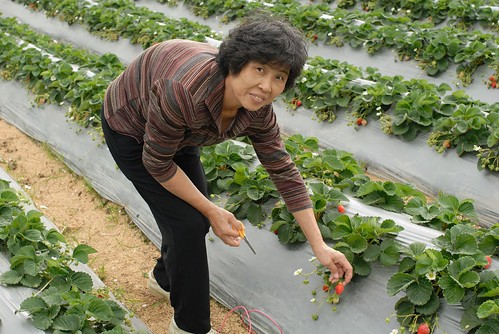  
  
泰安村的草莓園群山環繞  感覺真的還挺不錯的說  
很適合都市人來這裡採果踏青 享受大自然  
  
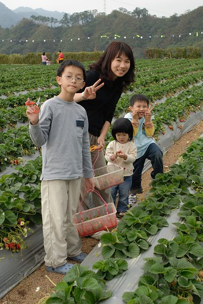  
  
小愛硬要自己拿草莓 一顆草莓都快被他的小手捏成果醬了  
  
  
  
OHYA! 大豐收...  
草莓園秤斤計費一斤230元  不算人頭  
我們家採了40來顆200元 價錢應該跟在水果攤買的差不多   
不過真的有新鮮有好吃哩...  
  
  
  
感謝熱情共同參與的張三姐一家人  
  
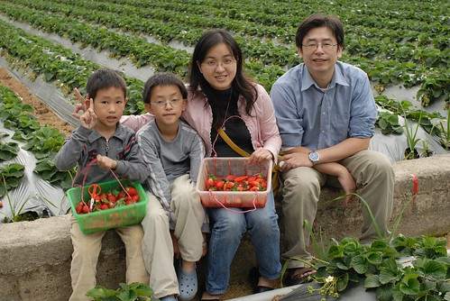  
  
小愛竟然發現爸爸有在偷拍  還擺POSE哩  
  
  
  
快快快....再不離開草苺會被我們採光了  
阿徹你別再說"媽媽 這個草莓好紅喔"    
最後一顆了 真的最後一顆了 剪完這顆就不行再剪了...  
  
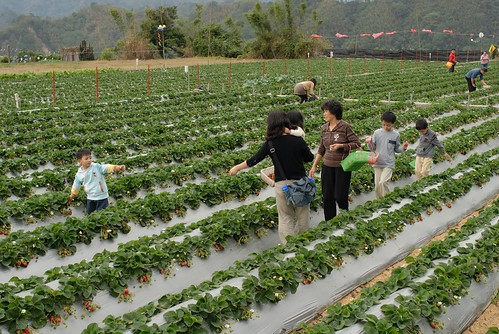  
  
當大伙忙著採草莓時 徹公玩起農家們專門照顧採收草莓的椅子  
坐在這有輪子的椅子上就可以用雙腳滑動   
來回採草莓摘雜草 就不用辛苦的彎著腰了  
  
  
  
孩子們~ 拿出你們最大最紅的草莓...  
  
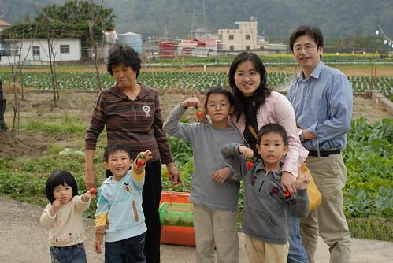  
  
今日草莓行~~成功~~~  
(徹爸總算入鏡了 唯一的一張)  
  
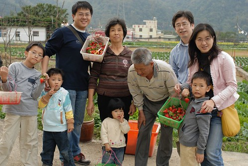
