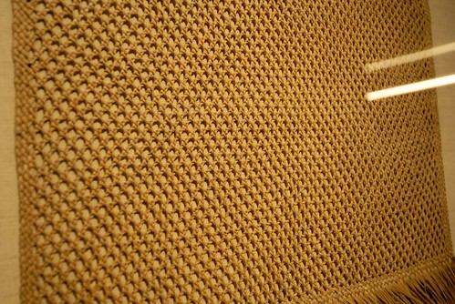

兩年前因為華陶窯 我跟徹爸才真的知道苑裡這地方 可能因為街道很乾淨的原因 可能因為每次走高速公路經過中部時總會特別注意到鐵鉆山對面的這寧靜小區塊 我跟徹爸對於苑裡有著異常好印象 兩年間兩人常嘀咕著苑裡這地方好像不錯 但卻也一直沒再去過苑裡... 這回趁著十月在三義的家族旅行集合前 我們總算再訪苑裡這個質樸又寧靜的好地方我們先是來到由舊穀倉改建的藺草文化館(藺 ㄌㄧㄣˋ 這回才認識了這個字)   苑裡是台灣的編織故鄉 藺草的編織已有百年的歷史  曾經創造我們現在難以想像的經濟價值與繁榮  館內展示與介紹著藺草在苑裡的過去歷史以及正努力的現在與未來  也有許多作品展示供觀賞  讓遊客近距離觀賞藺草編織的質感與細膩  看著一件件的藺草編織作品  我們越看越是嘖嘖稱奇  也好喜歡館內瀰漫著的藺草香味~  在館的對面還有一座高台  可以看到由不同顏色稻子種植出的稻田彩繪  而且在上頭 360度視野盡覽小鎮 (文化館旁邊很像豪宅的建物是農會的辦事處 真是太屌了)  今日太陽很大但風很涼   是很適合小鎮旅行的好天氣 可能因為這樣 這回又更加深我們對苑裡的好印象了!  接著中午時分我們來到苑裡老街上的聞香下馬用餐 這裡的老街真的看的出歷史 但卻很不像別地方老街那樣的"新穎"與熱鬧 一種繁華退去 洗盡鉛華的真實存在  這是行前估狗到的餐聽 好像來到苑裡的遊客總會提到這一家(網路上苑裡的遊記文挺少) 從開始的詢問位子 及等候10多分鐘後才能的點餐 明顯感受到這是很有堅持的店家阿 但上桌後的每一樣小菜或炒菜(沒點大菜 熊熊不知道怎麼形容小菜以外的菜)都好好吃ㄚ  浸泡三天夜 從頭到尾 連骨頭全都可以吃的香魚  滷羊蹄筋  老闆說不吃會後悔的涼拌黑木耳  招牌鯊魚煎  以上都是小菜 (沒有單獨照的福菜肉丸也很香很下飯) 點菜時看著10多樣的小菜 每樣看起來都好好吃 好想吃 但礙於只有四張嘴 我們只有點五樣 下回有機會再去一定要嚐遍阿~ 小菜外 我們只再點了炒高麗菜與菜圃蛋 以及一鍋野生蛤子湯  野生蛤真的好小好小 但湯真的好鮮美  我們好認真的把所有的小蛤子都啃乾淨  堆起一座小蛤殼山  好久沒有吃到這樣讓我們嘖嘖稱讚的餐廳  大推!!! 只是等候位與等點餐真的需要點耐性

吃飽飯後 我們驅車來到東里家風  東里家風三合院已有百年歷史 是台灣難得保存良好的紅磚陶與交趾陶建築物 除是苑裡重要的觀光景點 以及電視劇拍攝地外 也是一家特色民宿  這個午後 有開了好幾桌用餐的單車團  也有包了一台遊覽車來的攝影團 拍攝簷下挽臉的阿嬤(兩位阿嬤很厲害 自顧聊的很自在)  好不熱鬧的古厝  卻也沒有了我本以為的寧靜 (母子三人真的好像路人甲乙丙)  不過我們還是有努力東看西摸一下 上轎的愛愛姑娘要出嫁  機會教育讓小人曉得晴耕雨讀之積極人生  倒是這裡賣的牛奶糖還蠻好吃 一家子吃的很開心!  接著我們來到今日預訂的最後地點 山腳國小 為的是看日治時期所保留下來的木造宿舍建築  還沒找個簷下乘涼 倒是先被一間屋子裡的藺草工藝展給吸引  好多的藺草帽 看的我們愛不釋手 很想買的爸媽 硬是買了一頂女童帽給女兒 老房子裡 可愛的姑娘戴著美麗的草編帽 佐上映入的陽光 水啦~  向來很愛買紀念品的徹哥 當然也好想買一頂帽子阿 不過ㄧ家子有戰勝理智的只買條草編手鍊作為徹哥的紀念品  對色彩有獨到見解的徹選了條令我們意外但卻深感佩服的配色  買完東西 一家子找個檐廊下納涼  休息  把玩紀念品  加上編織老師送的小鹿 三個紀念品讓我們很開心&滿意  然後我們走進國小的新穎校園裡  好有穿透感的大中庭  好齊全 好好玩的遊戲區  兩個台北小學生 好羨慕在這裡上學的小朋友阿~  最後漫步到讓眼睛好舒服的國小大操場  我喜歡這個山腳國小  這個苑裡小鎮  真是令人心曠神怡~ 
