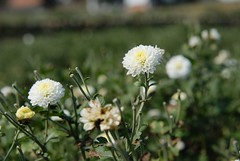
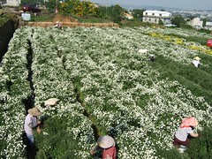
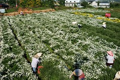

我們似乎常常錯過花期最盛開的時候～  
向陽農場的向日葵如此  
苗栗銅鑼的杭菊亦是如此  
呵呵～真是消息有夠慢半拍  

上週五跟徹爸突然心有靈犀的決定  
趁著週六回嘉義順路去銅鑼賞菊  
只是搞不清杭菊花期的我們去到當地才發現花期似乎已過  
只剩下一小塊的杭菊還盛開著  
農婦們也已經辛苦在做最後採收了（應該是最後了吧）  
雖然有點失望沒能親眼看見網路上眾家攝影好手拍的杭菊花海  
但卻意外的驚豔於波斯菊花田  
  
  
且在這樣的好天氣下漫步於田野間心頭便已洋溢滿滿幸福  
大口大口貪婪的多吸了幾口新鮮的空氣  
努力張大出血的眼睛（眼結石造成的小血塊啦）好映入最大範圍的藍天白雲  
很久很久沒有在這樣乾淨的藍天下拍照了  
真是太太太爽啦～  
  
(硬要徹爸在照片中塞下藍天/花還有我)  
  
(天空漂亮的連小3都能拍出他的美麗 只是人的臉都黑黑的了)  
  
(以為徹爸已經收工才把小愛交給他的 怎知一轉身才發現徹爸辛苦的抱著小愛拍著杭菊)  

今天依然是雙機出動　我的小３跟徹爸的小兩  
看的出來下面兩張照片那一張是我用小３拍　哪張是徹爸用小兩拍的嗎  
  
  
  
  
如果慧眼的你看出來了拜托請留言寫下答案  
讓徹爸開心一下  
感恩哩～
