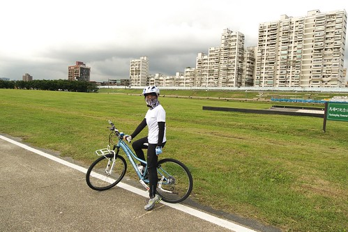

今年的秋天天氣很多變很多雨 尤其是週末很難得可以有好天氣 而難得好天氣的週末我們卻又常因早已排定的事情而錯失出門踏青騎車的機會 真的只能說今年的秋天一整個天不時 地不利 人不和  玩很少... 總算在11月中那週讓我們騎到車 踏到青 捕捉到美麗的台北秋景 心情愉悅的騎在美麗的新店溪畔 甚至還有溫暖的陽光伴著 這真的是忙裡偷閒的最大"小小"幸福與滿足阿!  

11/19那天跟徹爸倆人休了個假打算去騎車 雖然那日的天氣一樣變化難測 但老天爺可能有受到我那澎拜想騎車的熱情感召 許了我們三小時的沒下雨空檔  讓我們得以板橋-新店碧潭來回了一趟 然後就在我們中午十二點半進家門後不到3分鐘 砰的下起磅礡大雨... (很多人應該對那天中午突然的那場大雨印像深刻) 我跟徹爸倆人對於老天爺這樣的"安排"忍不住直呼這真是太神奇了 而為了不辜負老天爺的厚待 我們又接著出門看電影 敗家去..(出門時雨又變小了 那天我真是愛死老天爺了)

沒去過碧潭一直很想去碧潭看看  雖然徹爸一直說那裡沒有什麼可是還是帶老婆去了(徹爸萬歲) 騎了一遭後發現果然還真的沒有什麼哩 可能夜晚燈火明亮的時後才是美麗熱鬧的地方 可惜那也不是我的菜 所以純粹當做一趟騎乘的轉折點  來個到此一遊照紀念一下即可 

有沒有發現我們家爸爸變瘦一點點了?! 

那天我們花了兩個半小時騎四十公里來回板橋碧潭 少了阿徹那個拖油瓶 跟徹爸兩人尬車尬的很開心 或是看著風景愜意的騎 或是跟徹爸併排邊騎邊聊家裡兩小的事... 一整個的很愉悅 尤其在公館與華江/華中橋中間的馬場町公園那段 一大片的草坪加上河岸兩旁美麗的城市景觀會讓人覺得台北其實是個美麗的城市 

隔天(11/19)是個晴朗的週末 媽媽大心肝的想要去金瓜石野餐賞芒 結果車子駛到木柵基隆竟然就被大雨打回... 殘念阿.... 不甘心啥都沒玩到的就回家 帶了阿徹愛愛去前一天騎車經過時為之驚豔的華中橋河濱公園散散步 吵著要去花博的阿徹一開始臉很臭... 

還是愛愛好 去哪都隨遇而安 有玩的命 

不過幸好阿徹在看到這十二生肖石座後心情也開了 明瞭阿母不是隨便找個地方打發他而已 

今日下午真的就是單純的散散步 散散心... 邊走邊玩邊拍  拍之一  拍之二 

很堅持今日下午是去野餐的愛愛連野餐墊也帶下車 一心要找可以野餐的地方 

不過在看到遊戲區後墊子就丟給媽媽 跟著哥哥開心找樂去... 盪鞦韆  寶寶版盪鞦韆  搖馬椅  繩索遊戲 

 站在高點笑看一切 

華中橋河濱公園有兩二處遊戲區 一處是如一般公園的設施而另一處則是有如小型山野訓練地 很多繩索類的遊戲設備 正值血氣方剛 勇於冒險的阿徹在這裡玩的很開心 

玩了一會後我們總算在遊戲區旁坐下來野餐 吃水果剝栗子 而向來很會裝模作樣的阿徹也拿出他的畫本塗鴉 

今日主題是蘋果點畫 他明明很想去玩的 所以硬要媽媽幫忙點一點 要趕緊收工去玩 

而主角"蘋果"功成身退後也進了最近胖了不少的阿徹肚子裡 

在阿徹小愛玩耍時 徹爸躺在這睡了好一會 還真的睡著 睡到小打呼說 

短短的兩小時內 對愛愛來說就是有吃(有野餐)又有玩 

很是開心滿足了 

睡了個愜意午覺的徹爸最後帥氣登場 噹噹噹~ (我慧眼幫忙挑選的新相機包真是水阿.. PS 徹爸說要照全身要把包包入鏡) 

回程的時後經過這片大草坪 忍不住停下來大照一番 這是愛愛幫忙拍的我們三人 

要愛愛站著假裝躺在草地上的樣子 

不若愛愛的嬌羞羞 阿徹躺的大辣辣的樣子 

又經過一條兩旁盡是楊柳的小路 一家子四人忍不住大呼"這真是太美麗了" 

尤其太陽西下的餘暉  真的..就像徹爸說的"拍不出來"的美麗阿 

徹爸努力的要拍出美麗的意境 試了好多張 可惜都不甚令我們母子滿意得再多練練阿 

我真的覺得台北的河濱自行車道跟公園真是越做越好 越來越美麗 若要問我說台北哪好玩的 其實光沿著幾條線的河濱公園就都很值得走一遭 甚至騎一回 就算什麼也沒做 就這樣坐著發呆也很棒! 尤其在傍晚時分.............. 
