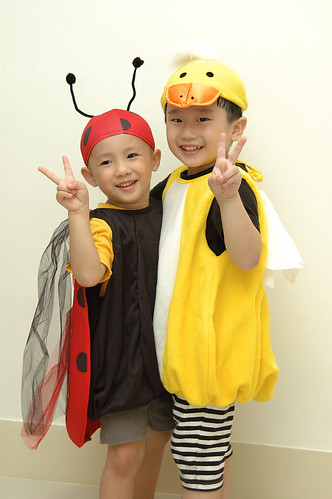
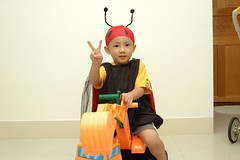
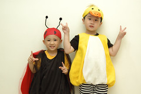
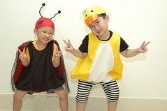
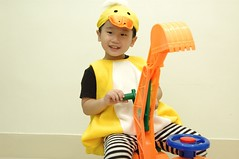

一年一度阿徹最怕的萬聖節又到了  
還記得去年念寶寶熊時  
阿徹被幼稚園裡各式萬聖節裝飾品嚇的足足有兩週每天早上都哭哭啼啼喊不要上學  
也被戴著面具上課的Tony嚇的聽到美語課就退卻三分  
不管是萬聖節相關活動或遊行 都得靠老師抱著保護他  
真的是好個"惡人沒膽"

過完中秋節後我就一直擔心著萬聖節的到來  
實在很怕阿徹再像去年那樣  
果然兩週前的週一早上到學校時  
看到校門口擺的兩個披著黑色塑膠袋斗篷的小巫婆(其實真的很可愛)  
阿徹臉綠了...  
頭一抬 哇塞~  
幼稚園的落地窗全覆上黑色塑膠袋了 上頭還有可愛的南瓜臉  
處處可見老師們用心設計打點的裝飾  
阿徹真的徹底的呆住了...  
待我開口跟他說再見時 總算忍不住的大哭了起來  
ㄘㄟ~ 勇敢點 Ok  
接下來的兩週偶會聽到老師說"今天阿徹哭哭了"  
不過情況已經比去年好多了  
可能因為現在美語班萬聖節相關課程比較多  
加上班上大小孩比較多吧  
不過阿徹還是很怕萬聖節

本來想要賢慧的跟阿徹一起做黑色巫婆帽  
看他會不會藉由做的過程減少一些恐懼  
但阿徹堅持的不要  
後來看到HOLA DM上的南瓜裝 阿徹很喜歡  
於是週末跟著哥哥(大哥小孩)一起去HOLA找南瓜裝  
南瓜裝現場實在有點醜  
好說歹說的請兩個小孩改選其他款式  
其實阿徹比較愛公主裝啦 但是媽媽不准  
只好想了好一會後選了小瓢蟲  
幸好在我跟他說瓢蟲是你最愛的紅色耶  
小子就很愛了  
挑完他的瓢蟲裝 阿徹就迫不及待的要離開那"鬼地方"(萬聖節專區)  
回到家後跟哥哥也喜孜孜的換上新裝  
哈哈~真的有夠好笑  有夠可愛的  
希望阿徹的可愛小瓢蟲能夠讓他在今天的遊行中信心一百 勇氣一百

超讚的一張照片 徹爸超喜歡

哥哥只有大阿徹三個月 但是體型大一倍
