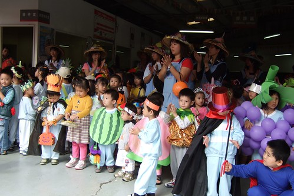

今年的萬聖節遊行真的讓我跟徹爸嚐到了現代父母難為的苦楚  
不若以往學校可以統一代訂服裝 或是可以去大賣場讓小孩自己挑一件喜歡的現成造型服  
今年完全之無法花錢了事  因為今年學校訂了個遊行主題"水果"  
而且阿徹班上的代表水果是"奇異果"  
奇異果???哇勒....這這未免太難了吧  
要完全沒美術天份的我跟徹爸自己動手做已經夠難了(雖然徹爸常很自豪他小時候學過畫畫)  
現在竟然還限定這麼難的奇異果     
奇異果我真的只能聯想到咖啡色圓圓的一顆  
可是總不能就穿件咖啡色衣服代表"我是奇異果"吧  
徹爸竟然還說 就寫張"我是奇異果"掛在胸前 夠特別吧 (Freda老師說好歹掛個彩帶寫係金ㄟ)  
  
不死心的上什麼都有賣的yahoo拍賣搜尋看看  
結果跟奇異果有關的只有寥寥可數的奇異果造型化妝包以及奇異果造型喇叭   
苦思了好幾天 總算想到一點辦法  就來模仿去年的瓢蟲衣服來做一件奇異果吧  
咖啡色的衣服 加上抄襲自奇異果化妝包的嘴巴以及奇異果喇叭上的大眼  
這....應該可以交差  算是對的起阿徹跟奇異果了吧  
  

為了這顆奇異果  媽媽長這麼大第一次進到布莊買布  
真是在布莊大大開了眼界  差點感動過頭的想要發憤學裁縫當個賢母  
  
  
  
媽媽還沒發奮當賢母前當然得先請家職畢業的張嬤動手逢衣服嚕...  
很久沒有做衣服的阿嬷很緊張  還一大早跑去問隔壁修改衣服老闆娘的意見  
聽老闆娘說 這布不是布 像是紙所以可以不用車邊  
阿嬤總算比較有信心且放心的放手一做 不過阿嬤還是很謹慎的先用別的布試做一遍  
等阿徹試穿Ok後才用我們買的布正式來過  
  
  
  
想不到從阿嬤製本所工廠退下來的兄弟牌老裁縫機  竟然有機會爲小孫子阿徹服務  
(裁縫機在製本所裡辦演什麼角色ㄋ?  縫製線裝書阿...  
 聽到時媽媽真是孤陋寡聞的大ㄚ了一聲  原來這裁縫機這麼的猛阿 還能車書)  
  
  
  
赫然才發現 阿嬤竟然很"扛夫"的先打版 (難道這是專業做衣服的人所有的堅持與不馬乎嗎)  
而且本來以為阿嬤花了一小時用別的布試做過後 正式來時應該會很快吧   
結果阿嬷越做越歸毛  越要求完美  把衣服的編都收的美美的  
有點自問自答+詢問+解說的直念著"這樣子行嗎 這樣好看嗎 這裡這樣收....  這要怎麼做比較好...."  
實在不忍心阿嬤為了這衣服浪費太多腦細胞 我也在一旁一直念著"很漂亮了啦 這樣就好啦"  
可是嘴角泛著笑容的阿嬤 手還是一直在做 然後說著"這不車好 人家看到會笑啦"  
ㄟ...阿嬷 這是小朋友的萬聖節遊行 沒有人會去看這麼仔細 也沒有人會在乎這的啦...  
不管我怎樣試圖勸說阿嬤別太認真了  阿嬤還是花了一個上午完成這任務  
  
  
  
衣服帶回台北後就換我們跟阿徹貼上眼睛 嘴巴 還有做翅膀嚕  
貼好眼睛後 阿徹突然拿了幾條白紙往眼睛上方貼  
他說"她是女生要化妝 所以睫毛要長長的"  
我心裏偷笑很想跟她說"那要不要畫藍色睫毛比較shiny阿"  
不過講真的 阿徹的這幾根睫毛還真有畫龍點睛的效果  
  
  
  
10/31 禮拜三的早上 全副武裝要萬聖節遊行嚕  
  
  
  
雖然阿徹的衣服比上真的差很多  但起碼也沒有太顯出爸媽的無能  
  
第一次有幸參加幼稚園的萬聖節遊行  媽媽又被大大的開了眼界  
長長的一排人 浩浩蕩蕩的從學校出發  
首先來到菜市場 然後停在事先串通好的某攤位前當起路霸搞鬼   
真的就把菜市場完全之截斷  沒耐心等候的騎士都只得回頭繞道  
我笑著跟一旁看熱鬧的其他老闆說"哇 都不用作生意了"  
中年老闆竟然也笑的很開心的說"沒關係啦 這樣尬熱鬧"  
呵呵...這一群小鬼似乎反而替這因為高菜價而有點冷清的菜市場帶來些許人氣與活力  
  
  
  
然後又來到板橋赫赫有名的鴉片粉圓總店  
哇..幼稚園真的交友廣闊喔 還是該說家長裡藏著許多來頭不小的人物ㄋ  
  
  
  
接著第三站又停在文化路上有名的"大"辦公大樓中庭裡  
大廳旁邊就是銀行跟證劵行  這真的又有猛了  
不過大樓的管理員們還是很熱情的接受園長託付的發糖任務 ....  
  
  
  
穿過辦公大樓回到幼稚園巷口 一群人竟然又浩浩蕩蕩的全進了7-11  
哇哇哇...這真是太猛太猛了   全塞滿人的7-11要怎麼做生意ㄚ  
不過店長竟然還很熱情的送了一大疊的史努比卡給小朋友們  
  
  
  
搗蛋的最後一站來到某家長開的汽修廠  
穿著帥帥橘色工作服的爸爸 接受眾小鬼們的歡呼與搞鬼  
  
  
  
遊行了70分鐘後 總算回到學校嚕  
小愛很棒只被老師抱了10分鐘左右 可是走到後來已經一臉快睡著的樣子  
  
  
  
Apple媽媽幫她做了一套漂亮的奇異果公主服裝  
阿徹跟她站在一塊  徹爸說這畫面怎麼很像小龍女與楊過ㄚ  
哈哈 不食人間煙火的姑姑ㄚ  不過Apple這造型可能比較像是吳倩蓮版的姑姑  
  
  
  
幼幼班時都會嚇的要命的阿徹已經大到完全融入enjoy這萬聖節的搞鬼了  
  
  
  
還裝出恐怖的鬼臉...只是怎麼大家的鬼臉都非得這麼粗暴的虐待自己的雙眼ㄚ  
  
  
  
這是奇異果精靈的翅膀  
  
  
  
這是媽媽給的今日最佳造型獎  
這真是太酷了 用氣球做成的葡萄串 叫她第一名  
  
  
  
很難得的遊行經驗   
明年有機會的話 徹爸值得背起他的相機好好替這些孩子們留下美麗的回憶紀錄的
