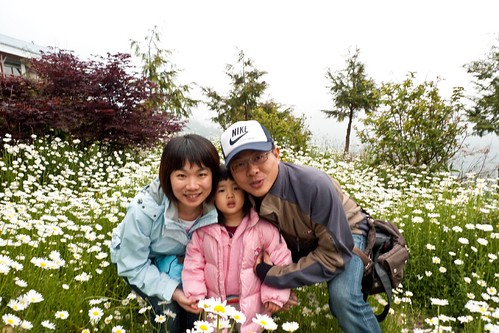
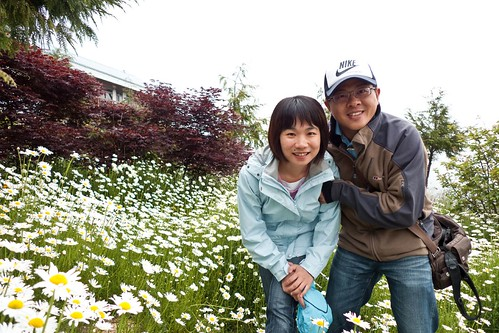
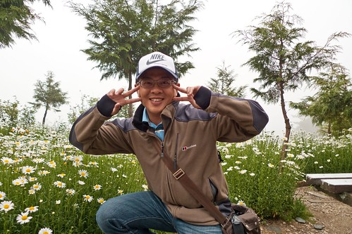

**因必須配合林務局政策 山莊不再對外營業了。** 一直以為合歡山那的住宿選擇只有合歡山莊, 關雲山莊這些很救國團式的選擇 年初在搜尋合歡山的相關資訊時才赫然發現了落X鷹山莊這個天堂邊界 (應主人要求拿掉山莊名稱只好中間補了個X) 落X鷹山莊是合歡山境內唯一的民宿　海拔２８００我想應該也可能是全台最高民宿吧 落X鷹山莊的blog裏　主人小齊稱落X鷹山莊為天堂的邊界 看了blog裏不同季節不同色彩的山莊美景照片　讓我深深嚮往著這個天堂 這次的旅行如願的在山莊住了一晚 看到還不算盛開的法國菊　天況不佳的半片星空　翊日早晨的日出　藍天　山巒 我相信我看到的絶對不是山莊最美的時候 也不是山莊可以見到的所有美景（起碼被白雪覆蓋的美景就沒有） 但自己卻已經可以感受主人稱呼這裏為天堂邊界的感動與＂豪氣＂ 只是天堂真的不是人人都有勇氣／可以住的　給落X鷹山莊一家人拍拍手 謝謝你們讓我們也有機會來這天堂享受天堂美景～ 

山莊的房間是出發前一週才打去訂的 可能是連假最後一天的原因　訂房的人並不多　所以連訂金都省了 只要當日三點前來電最後確認即可 那天走完石門山後不到２０分鐘的車程我們便在下午４點半左右抵達落X鷹山莊 辦理好住宿登記, 預訂好晚餐的菜 也將行李拿到房間後 我們便滿懷期待的穿過小徑進入山莊的後花園裏

嘿嘿！就是這嬌客吸引我在這個時節來的啦～

雖然尚未綻放的花包還挺多但是這樣的花況已經讓我們很驚艷嚕

不用再爬山的阿徹心情也大開了　只是怎麼笑的好像老頭阿

徹媽對於花卉並沒有任何研究也沒有那種逸緻在自己家裡插瓶花 獨獨偏愛這種看似野生的白花　例如野薑花以及這種成片小野菊

生長在大自然環境中的花 "氣質"就是不一樣

倘佯在花海中的我們開心的一直照相 阿徹先幫我們三個照一張

換小愛幫我跟徹爸照一張　愛愛現在出門很愛說＂來 我幫你們照相＂

看到阿徹現在心情大好的樣子　我忍不住又對他碎碎唸一番　（爬山就那麼苦阿？！．．．）

小愛那天很愛照相　我跟徹爸只好充當Model讓他照不停

ＹＡ！媽媽一直想拍一張滿是法國菊當背景的照片

阿徹摘了一朵花當作他的頭飾　（三八徹）

哈哈 這對夫妻當然還是例行性的來一張自拍嚕

徹爸難得買到一頂適合他頭型戴起來好看的帽子 那天戴的都捨不得拿下 (不過應該是頭髮已經被壓壞的關係吧?!)

從花園池塘望過去的山莊

小愛賞花賞的也很開心哩!

主人說山莊周圍有一環園步道 整趟走下來大約2-30分鐘 可是我們越走卻越雜草叢生 人煙罕至的樣子 只好落荒回頭...

而且今天也走不少路了 所以還是愜意點好好享受這美景就好

阿徹國王登基 坐上王座.... (吼~我還是忍不住想念 這表情跟在石門山上實在差有夠多的)

因為約了晚上6點30用晚餐 所以溜達到5點半多得趕緊回房先洗澡 要不然入夜後 天就更冷了....

(下面這張的小愛有夠帥氣 / 自得的)

房間外面就是這一個長長的走廊可以看雲海 觀星 賞日出 我想這絶對是落X鷹山莊最特別 最有價值的地方

那天晚餐我們點了炒高麗蔡 波菜 紅燒魚 醬爆豬肉 還有一個金針湯 數量看起來頗多但我們竟然還是把他吃光光 (幸好沒點山莊的招牌雞湯 要不然肯定爆肚) 在高山上竟能吃到這麼豐盛好吃的餐點 真是幸福阿... 雖然吃完飯菜加上喝了一大壺主人送的新鮮薄荷茶真的超飽的 但我還是忍不住點了一碗住過落鷹山莊的網友們皆極力推薦的紅豆湯 果然像網路上大家說的紅豆粒粒飽滿 軟硬適中 一整個剛剛好的好吃阿 (隔天早餐又忍不住點了一碗喝)

山莊的大門/外貌

山莊內有豪華型跟經濟型兩種房間選擇 我們選擇了經濟型四人房 從網友PO的照片看來 經濟型房間應該就是少了個閣樓吧 房間當然是無法跟山下的民宿飯店相比 但很整潔整齊也算寬敞 讓我們在高山上渡過舒適的一晚 (床還有舖電毯哩 在冬天零下溫度時應該會讓人覺得格外溫暖幸福的 而那天喝太多薄荷茶的阿徹尿床了 幸好有電毯可以把床單烘乾)

因為看到網友說落X鷹山莊在夜半時分可以看見滿天星空  甚至有人形容就像銀河一樣 因此徹爸特意帶了要拍"銀河"的腳架出門 晚上要入睡前去走廊看看 1/2的天空被雲遮住了而且那雲看起來短時間是不會消去的 1-2點起床尿尿時忍不住又去外頭看看 只剩1/3的天空被遮住而沒有雲的天空果然星光點點 數量很多 但今晚是真的沒有機會看到銀河了 於是我認命的乖乖睡覺不再一直牽掛星星的事

辦理入房時 看見山莊櫃檯上放了一張牌子預告明日日出時間是5點10分 我心想如果真的可以在房間外面走廊就看到日出 也許我們可以"勤勞"點起床看日出 其實徹家出門遊玩向來很遵守平日在家的作息 尤其怕小孩作息亂掉影響精神情緒 更是盡量讓阿徹小愛們如在家般的晚上9點多上床 早上7-8點起床 所以日出再美 也完全不在我們的安排規劃中 這回雖然已經可以這麼便利看日出 但我們還是抱著隨緣的態度沒有調鬧鐘叫起床 "幸好"隔壁遊客5點鐘便起床  兵兵磅磅的開門說話聲吵醒了我 於是我順著緣分起床 想說來看個日出好了 出到走廊看到這樣的雲海其實我就已經很滿足了  所以也去把徹爸叫醒看日出 只是徹爸說 "雲這麼厚不會有日出啦" 於是在照了幾張照片後我們就又回去睡覺了

我們還真的又睡著了... 結果又好巧不巧的在5點10分左右徹爸突然醒過來說" 再去看一下" 嘿~這回看起來有像會有日出的樣子了吧

於是我們真的看到太陽這樣咚咚的慢慢"跳"上來

印象中我只有在10年前上阿里山看過日出 但祝山看日出的人潮太多 看到的人頭比看到的光芒還多 而且太陽是真的是咚一下子就完全跳出來 老實講辛苦的早起又等了個把鐘頭然後看到那樣的日出 心裏小失望說 所以後來一直沒有那種強烈的動機渴望會想要早起甚至千里迢迢去看日出

這回沒有刻意但卻是超級超級方便的就這麼看到了日出 心裏還真有點悸動 感動說..........

徹爸直呼"想不到還真的給他看到日出了...真不可思議"

從層層山巒裏漸漸攀升而起的日出真的很漂亮

而雲海隨著太陽不同的亮度變化著色彩  真的很美說!!

只是看日出的代價就是沒睡飽 臉水腫啦...

看到太陽都咚咚起來後才想到去叫阿徹起來看剛升起的太陽 阿徹睡眼惺忪的看了一眼後就又回床上倒頭繼續睡 後來想到忘了幫他拍照 問他要不要再去外面跟太陽公公合照一張時 小子連眼睛都沒張開的搖搖頭說"不用了" 只是阿徹在後來7點多起床醒來後竟用著有點炫燿的語氣跟他妹說 "你有看過晚上天空上很多的星星嗎? (我們11點入睡時有依照他的叮嚀把他叫起來看一眼星星) 你有看過清早剛出來的太陽嗎?" 哇勒!! 他也不過都只是看一眼而已竟然就這麼的得意

早上8點多起床要去吃早餐時 站在走廊上看到的山巒又不一樣的美麗了

往右邊看去的景

往左邊看過去的景

令人體驗多變 回味無窮的山莊走廊!

山莊溫度計顯示著19度 我想清晨看日出時應該只有10多度吧 6月初的高山還真像平地的春天

吃早餐時 看到一樓餐廳的走廊上已經曬了滿滿的被單 山莊主人們應該已經起床工作好一會了吧!

吃飽飯後出來山莊門口找山莊的"喵喵"玩

很可愛的一隻貓 花色跟體態都很像以前陳媽家養過的貓 看著喵喵舒服慵懶的在高山上作日光浴還真羨慕哩..

山莊門口旁觀景台看出去的景

而山莊門口正面對的是這樣一個大轉彎山路

很不可思議的一個地方吧! 關原58號!! 就在台14甲38.7公里處 一個前不著村後不著人的山路旁

有著一個會讓人記憶深刻的天堂邊界

在天堂花園裏最後巡禮  假裝自己就是那個女王... 這個女王很爽喔 還有小李子跟攝影官服伺ㄋ

在天堂裏還看見了兩個太陽 一個已經高高在天上 一個在池塘水面上...

再喜歡再不捨還是得離開 繼續趕路往我們的下一站...

媽媽在天堂呆的太開心 竟然忘記山莊就在那山路中段 之前是山路 之後也還是那綿延的山路阿... 太晚讓小愛吃暈車藥 果然在車行10多分鐘後就開始吐了

趁著停車幫小愛換衣服 休息的空檔 順道來介紹一下我們家這趟的行頭 兩大袋的換洗衣物  日常起居睡覺用品  還有一大袋外套 一袋戲沙傢斯頭 還有換穿的涼鞋... 小小的小紅後車廂被我們塞的滿滿滿

小愛的體質算是容易暈車的 而且年紀也尚小容易一不小心就感冒咳嗽的 所以每次出遠門前 我們都會去小兒科家醫那備些感冒藥還有暈車藥 小愛已經很習慣走山路前要吃暈車藥 也很認命走山路時盡量多睡覺 偶而不小心還是暈到吐時  吐一吐唉一下  換個衣服後繼續睡覺上路 從沒聽她鬧著說 暈車不要出去玩 不要坐車 甚至在行前講到會走山路可能暈車時 她處之泰然的說"就吃暈車藥就好了阿..." 很有出去玩的命!!!

停留休息20分鐘 讓小愛的徵狀舒緩也讓暈車藥多些時間發效後  繼續上路 從落X山莊到花蓮市的鵝肉先生有100公里的路要開 而其中的2/3是綿延的山路 再上路後 徹爸小心翼翼的慢速開著 直到小愛睡著後才恢復一般速度 總算2-3小時候 我們離開中橫路段 進入花蓮市區...

(第一天在台灣工藝所時買了一本台灣護照 現在出門多了一件事可以做  就是找能蓋章的地方 所以都走中橫了 當然得去太魯閣國家公園蓋個章嚕~)

