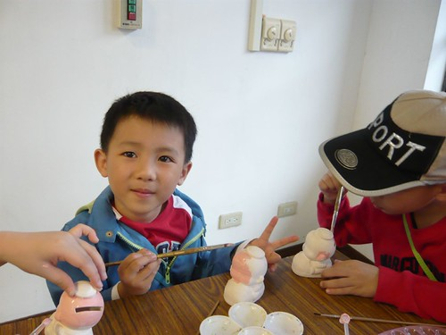

期待了一年多 總算我們家阿徹可以跟到學校的畢業旅行了  
阿徹當然還沒要畢業  
畢業旅行也沒那麼誇張的提早到中班就舉行  
而是大班的畢業旅行擴大範圍連中班的小朋友都可以參加  
也就是說唸這個幼稚園除了每個月或大或小的戶外教學外  
還可以參加2次甚至以上的兩天一夜旅行(當月的戶外教學依然照舊喔)  
徹爸說 "會不會有家長抱怨這樣擾民阿"  
我說"家長應該都知道Kitty媽咪很愛玩吧 習慣了吧  
       不習慣的也應該把小孩都轉走了吧"  
真的!跟其他媽媽閒談間可以感受到大家都習慣了 呵呵...  
  

去年阿徹還是小蜜蜂的時候 看著班上的中蜜蜂大蜜蜂去畢旅  
我們跟阿徹說"你要開始學晚上不包布布了喔  
             要不然明年去畢旅就被大家發現你還在包布布了"  
而到去年底我們這對懶媽媽+懶兒子總算積極想要採取些作為好脫離尿布歲月  
所以每天除了睡前必有的一泡外  
還多加了11-12點時我們入睡前 把阿徹從溫暖的被窩叫起來的那泡  
只是每天早上起床後尿布還是滿溢 徹爸說這真的很難吧  
總不能為了不要包尿布而不喝水吧  
所以除了11點多的那泡尿外 其餘的我們就抱著順其自然的態度

只是阿徹似乎感受到戒尿布的壓力  
某天突然悠悠的說"我今年不要參加畢業旅行 那沒什麼好玩的 大蜜蜂的時候再去"  
害我跟徹爸反倒擔心因為尿布的事讓他不想跟同學去外頭過夜了  
只好再苦口婆心的跟他說"包尿步也沒有什麼 請老師幫你包就好了"  
徹爸甚至說 "要不然來學自己包尿布好了  
            自己偷偷躲起來包尿布就沒人發現啦"  
可是阿徹還是都悠悠的說著"他不要去"  
我跟徹爸真的擔心起 到時候阿徹還是不想去怎麼辦...  
  
4月初的某一天去接阿徹放學時  
阿徹用著超high心情跟我說"我已經長大了 可以去外面住試試看"  
一張小嘴吱吱咂咂的說個不停  
幸好媽媽還聽的出來是大班的過夜畢業旅行這事  
就在我還在遲疑該不該問他尿布的事的時候  
阿徹自己說"在外面住一個晚上 我只要帶一個尿布去就好了"  
恩~很好 這樣媽媽就放心了  
這樣的過夜旅行對阿徹來講會是很難得且美好的回憶  
若沒去參加真的很可惜  
所以阿徹願意去 當爸媽的我們比他還期待還高興  
  
畢旅前一週的某天晚上睡覺前 我用著驚訝的語氣跟阿徹說  
"哇 再一個禮拜你就要去畢旅 就要跟同學一起睡外面了"  
徹爸說"你真的可以嗎?"  
阿徹一臉堅定的說"要試試看阿"  
徹爸又說"你會不會哭哭 想爸爸媽媽阿"  
然後阿徹又更是堅定的說"可以打電話阿"  
恩~很好 勇氣有持續保溫中  
希望這份期待與嘗試的勇氣可以延續到下週  
然後帶給他一個截然不同的美好旅行回憶….  
  
第一天行程  宜蘭綠色博覽會  
  
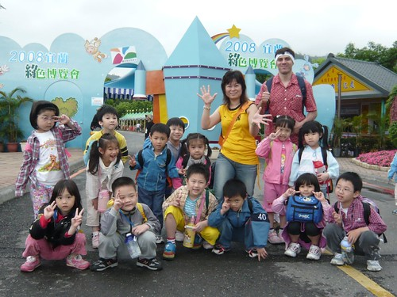  
  
週四週五的旅行 旅客不太多 旅遊品質很不錯的樣子  
  
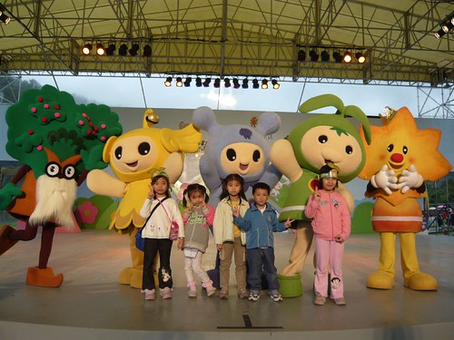  
  
涼爽的春天是個適合郊遊旅行的季節  
  
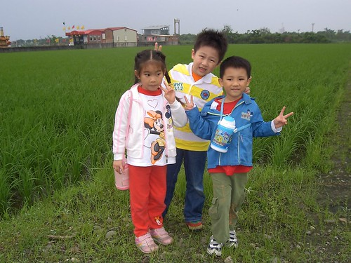  
  
第二天的行程 冬山河以及傳統藝術中心  
  
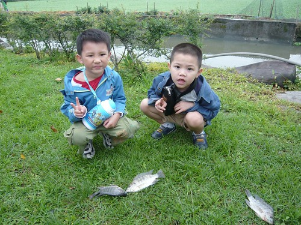  
  
在交回畢業旅行的同意回條時  
阿徹說"\*\*沒有要去 因為他說他都去過了"  
我們說"你也都有去過 那你也不要去好了 "  
阿徹說"沒關係啦..."  
我們又說"那我們可不可以一起去"  
阿徹說"你們去過了啦..."  
  
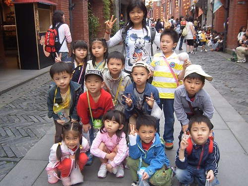  
  
這兩天阿徹的衣服穿的哩哩剌剌  
給他感覺有點疲累 有點狼狽...  
  
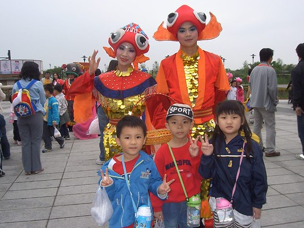  
  
這是全部參加畢業旅行的大人與小人  
大約6成的中大班有參加  中班參與人數更少 10來個左右  
  
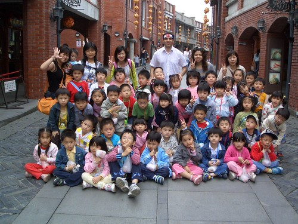  
  
這是阿徹班上去的4個中蜜蜂  
阿徹左邊是這學期才從其他中班轉來的新同學  
聽說(其實阿徹也常念著)跟阿徹很不對盤  
徹爸說人家長的斯斯文文的阿  哪像阿徹活像隻小猴子  
  
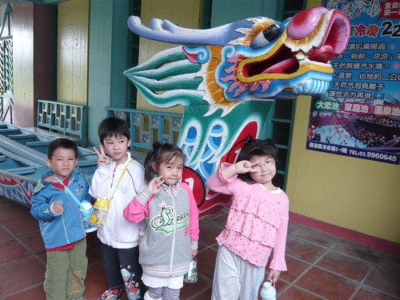  
  
出發的那天早上遇到Martin 感覺他也很High 像是要去玩一般  
問了他一起去嗎?  
他便批哩啪啦 滔滔不絕的說起 這是很難得 會很美好的回憶  
還要我不用擔心一切會很好 他也會多關照阿徹  
他是多麼喜歡阿徹 阿徹平日還會唱歌給他聽之類的  
英文很遜 很俗辣只會ㄣㄟㄚ的我只能傻笑....(每回跟外籍老師ㄣㄟㄚ後 我便會對自己的濫英文懊悔不已)  
  
從照片可以感受到Martin 似乎真的有特別多關照阿徹喔  
  
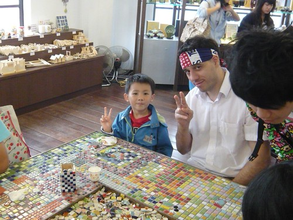  
  
傳藝中心裡的玩意挺多的  
不過重點是真的不可以大熱天去 大熱天下對什麼事都很難提起勁的(上回我們就是這樣)  
  
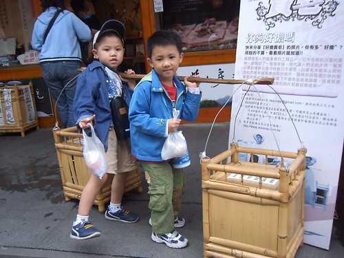  
  
第二天的中餐 燒賣大餐  
阿徹這張算含蓄的 看到不少照片中的小朋友是一人對一籠  
  
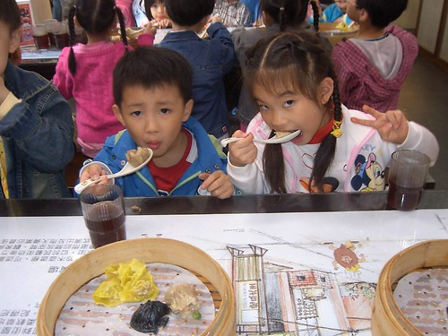  
  
兩天的旅行小朋友與老師應該都很開心但也累壞了吧  
  
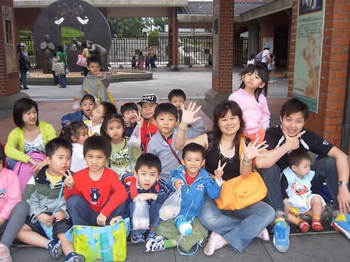  
  
這次的蘭陽之行果然再次證明了 其實是爸爸媽媽我們離不開阿徹的  
唉～～～  
行前一天幫阿徹準備行李時　媽媽費了好些腦細胞想著該準備些什麼衣物  
怕衣服太少太薄太短恐難以應付這後母心的四月天  
可若長的短的厚的薄的都帶的話　只怕小個子徹不堪負荷那重重的行李  
睡一晚醒來後看到那又濕又涼的天氣　媽媽又忍不住重新調整行李內的衣物  
還再三的交代涼了的話要穿啥　熱的話可以脫掉啥的  
搞的徹爸總算忍不住出聲制止我說「夠了喔」  
唉～我真的就是緊張擔心ㄇㄟ…

那一天晚上因為沒有阿徹　家裏得以享受難得的寧靜與乾淨  
而向來跟阿徹搶玩具、搶媽媽說故事的妹妹也很把握機會的超high超忘我的當起家中的獨生女  
但我們還是好想阿徹阿…  
跟徹爸兩人嘀咕著?什麼時候會打電話阿？洗澡前還洗澡後？夜遊前還夜遊後？?  
盼阿盼…總算８點多電話鈴聲響起了　?是阿徹…阿徹打回來了?我跟徹爸倆人興奮的喊著  
然後兩人靠著電話　聽著電話擴音器傳來的阿徹聲音  
聽的出來阿徹有想爸爸媽媽　有想愛愛  
但也更加聽的出來阿徹玩的很開心　甚至想趕快講完電話跟同學玩去了  
掛下電話後　媽媽心上的石頭總算落下大半（重力加速的接近地面　只差１mm就完全著地了）  
我相信也接受?阿徹是真的長大　真的學習獨立了?  
而第二天接到阿徹後　看到他用著有點疲累卻閃閃發亮的眼神告訴我畢旅有多好玩  
外宿有多麼沒有什麼的時候　我更加確信小男孩長大了

只是…外宿這關破了後　恐怕就得擔心小孩以後會玩的不想回家睡了  
以前怎麼好說歹說用盡心思的利誘　阿徹怎麼樣都無法接受自己去別人家住的事  
而就在畢旅後的一週　爸爸那無心的氣話?要不然你去住＊＊家好了?  
讓想跟小表姊好好玩爸爸媽媽遊戲的阿徹 在思考三秒後就回答說?我可以試試看?　  
跌破眾人的眼鏡…尤其是根本沒想到會是這答案的徹爸  
那晚我們家又是寧靜與乾淨　妹妹依然enjoy的當獨生女  
只是這回我與阿徹都平常許多甚至有點不以為意  
倒是徹爸一整晚嘀咕著?阿就真的給我去住了…阿你真的不打電話去問看看?  
甚至在我打電話過去道晚安時　徹爸連問了阿徹兩三次?你要不要回家?  
聽的出來想兒子的徹爸想要冒黑（其實也才晚上１０點）去接兒子阿　  
只可惜阿徹完全不明就裡而且樂不思蜀的直問?什麼？什麼？我明天就回去了?  
我跟徹爸說?小孩長大嚕以後要少罵點嚕　小心他會離家出走…?  
小心『逃家小兔』就在我們家哩…  
（莫非阿徹畢旅帶去的那本『逃家小兔』童書真的是冥冥中有暗示有啟發…唉～）
