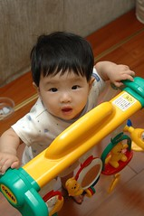
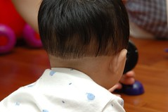
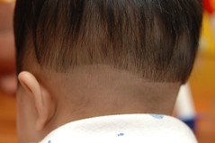

我真的得澄清"媽媽不是故意的"  
自從小愛滿40天時帶去家裡附近的髮型工作室剪了個鳥頭後

  
我就發誓這輩子要好好保護小愛的頭髮了  
所以小愛4個多月大時 就預約上髮廊剪頭髮了  
大師出手果然令人驚艷  

最近小愛的頭髮除了前面已快到眉毛外 後頭也鬚落的有點醜  
因此一直想找機會帶去修一修  
上次剪的家庭設計師(媽媽已經剪了快10年了)因為將修產假預約爆滿  
只好帶著小愛去住家附近的工作室剪  
除了是樓下王太太介紹的之外 每次經過看他生意也都很好  
心想應該起碼可以剪個中規中矩的頭吧  
剪髮前 還跟我確認了是女生嗎  要留長嗎  
剃刀從後面一刀下去 讓我想唉想逃都來不及  
偏小愛又狂哭更讓理髮師有藉口為啥要這麼剪  
理髮師還說 這樣比較涼  比較像女生  
哇勒~我真的只能說 我是帶著小愛落荒而逃  
現在每每望著小愛後頭的西瓜  
真的也只能安慰自己 這樣比較涼  
嗚嗚~真的超像技安妹的  
爸爸更狠說背影像櫻木花道  
媽媽發誓 再也不讓家庭設計師以外的人動你的頭髮~

