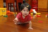

小愛最近有點令人好氣又好笑  
好氣的是常常半夜2-3點起來嬉戲  
本想依照以前對待阿徹的方式  
放到大床中 她玩她的 我們睡我們的  
不過小妮子很愛爬過爸爸躍入哥哥睡覺的角落裡  
越爬越醒 看到哥哥更是眼睛全開high番天  
常常吵的哥哥忍不住抱怨"妹妹好吵 吵到我了"  
我跟徹爸只好輪流強爭開著眼睛抱著小愛到外頭客廳中  
來到外頭 有時小愛會認命的小範圍內自己打發自己  
(比較會騷擾爸爸 跟爸爸玩 所以我說小愛擺明是想起床跟爸爸玩的)  
有時撒嬌帶點無力的或躺或靠在我們身上  
總以為她可以很快睡著  
但她就是有本事可以稱個1-2個鐘頭  
搞的我跟徹爸兩人大喊吃不消  
實在很想打她的屁股 不過也都只是戲謔的捏捏她的小臉  
男女果然生而不平等...

最近爸爸生氣"ㄏㄚˊ"她時 似乎稍微有效點了  
偶而也會在大人說"拍手" "再見"時  
湊巧?巧妙?的出現上下或左右的搖動小手  
徹爸很得意她女兒只會跟他拍手  
陳嬤很開心小孫女會跟她再見  
我的解讀都是"大人開心就好" 哈哈~

不過臉部表情真的是越來越成熟 越鬼靈精怪了  
很多人說越大越像哥哥了  
(其實大家想說的是不像小時候那麼呆啦)  
張阿伯更狠 說"小愛現在真的變漂亮了 小時候覺得她好醜 都不敢說"  
ㄘㄟ~張阿伯你講話也未免太實際了 (雖然為娘的我實在不能否認啥)

小愛阿小愛  
你要乖乖睡覺覺 不要吵大家  
你要乖乖喝ㄋㄟㄋㄟ 不要只顧玩  
為娘的我 目前對你就只有這麼簡單的要求 OK?

我也會連拍 有資格當偶像玉女了嗎

依舊愛吃玩具

不過偶而還算有長進啦
