昨天讓阿徹難得看見我寫的BLOG

我跟他說"我這是寫給以後我孫子看的 以後你兒子跑來跟我哭訴"阿嬤 爸爸他對我怎樣" 我就可以找BLOG給他看 跟他說你爸在這個年紀的時後做了些什麼(蠢)事.."

阿徹聽了大喊"哪有這樣的" 而這時候徹爸冷冷說了句"幸好我媽媽不會寫BLOG"

哇哈哈~~~

我們的愛愛上小學滿月了

當了一個月的小學生 新鮮事還很多 但煩惱的事也漸漸出現了

每天聽著愛愛說著學校的大小事(其實哪有大事) 很有趣也很是以這位新鮮人為榮

但媽媽最在意聽到她說"好煩喔 明天整天不能下課 因為班上太吵被老師處罰"

"我心情不太好 今天幾乎都沒有下課 訂正作業好久 "

沒有下課時間的小學生活 好令人無力又沮喪阿!

幸好除此之外 愛愛是習慣且喜歡她的小學生活!

而經過這一個月 我也益加深刻體會當初所說

"就讓我們每天用滿滿的故事,遊戲與陪伴 與愛愛一起面對這可能艱辛的低年級"

只是句子中那個"可能"可以修正為"絕對"了

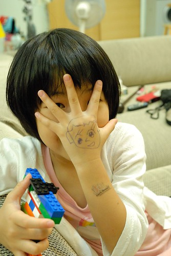

下面是這陣子陸續記錄下來的一些事:

愛愛跟阿徹哥哥交朋友過程很大的差異是

阿徹剛上小學時 都是講我們班幾號怎麼樣 跟幾號做什麼 完全的用座號來代稱

但愛愛永遠都是用名字來稱呼他的朋友 座號只是她在一開始跟我講解她的新朋友時的輔助說明

"XXX 她(他)是幾號 坐在我位置的前面(隔壁)的旁邊(後面) 點點點..."

前兩週裡 對於"交朋友"這事愛愛是有點擔心與心急的

第二週時在隔壁班的幼稚園同學因為有了好多新玩伴 找不著熟悉玩伴的愛愛有點落寞

愛愛說他就一個人在二樓走廊散散步或是下到一樓自己玩跳格子

雖然玩跳格子的時後 有班上的新同學跟另一位的安親班同學主動加入 但愛愛對於自己的朋友數很少還是很介意

有一次當她細數著她新朋友的名字時 我說"哇 有5個了 很棒了ㄋ"

愛愛嘟了一下嘴說"XXX很多ㄋ"

我說"每個人交朋友的方式不同 而且有的人天生容易跟人家玩在一起 有些人是需要時間慢慢才能變成朋友的 你就照你自己的方式交朋友就好 不需要跟人家比較"

不過好笑的是當我在聽那5個同學的名字時 我問"之前你說很愛叫你名字的那男生怎麼沒有"

愛愛搖了搖頭說"他很愛沒事就一直亂叫我名字 我不喜歡"

原來愛愛也是有在挑朋友的 不喜歡太調皮 太沒禮貌的(好像太恰的也不喜歡)

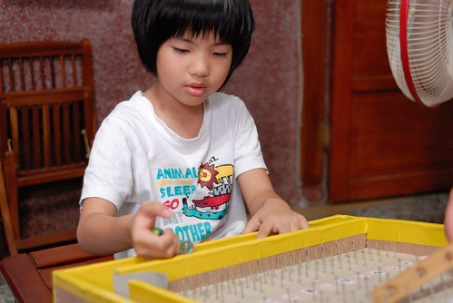

有一次當愛愛又說著她下課時就自己在走廊散散步 看看綠色植物後就回到教室畫畫

我說(當時心裡真的有點不捨)"你可以主動加入同學的遊戲裡阿 請她們讓你加入"

愛愛說"她們說我黑黑的 不行"(這算是被老師舉例說明後的副作用吧)

我聽得完全摸不著邊際 愛愛接著說"因為她們在玩美少女戰士 她們說美少女戰士都是白白的 我黑黑的不行"(老實承認當時我心中碎念了一下這些小女生)

我就說"那你可以去跟男生玩阿" 愛愛說"男生說我是女生 不行"

我又問"那應該有女生沒玩美少女戰士吧" 愛愛說"她們都在畫畫"

我總算寬心的說"不用擔心! 慢慢你會交到跟你喜歡做相同事情(有相同興趣)的朋友"

愛愛點了點頭 但我想以前在幼稚園是人氣王的愛愛肯定還是很介意與心急自己的孤單

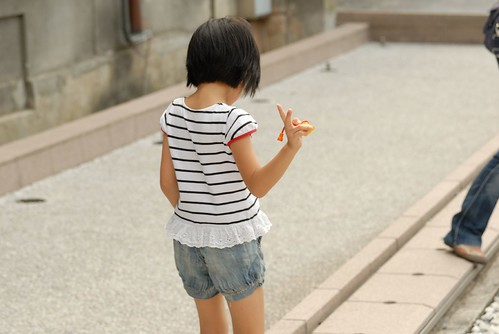

老師預告得要自己抄聯絡簿的那天 愛愛更是在意自己得要準時上學

第一次的抄聯絡簿 愛愛寫的工工整整漂漂亮亮(當然老師還是像批改作業那樣訂正不標準的地方)

那天晚上愛愛交代說"我明天早上要再提早5分鐘到學校 因為明天有防災練習會很忙 所以要早點抄完"

愛愛又補充說明"老師說時間到就會收聯絡簿 沒抄完的老師會打問號"

於是那天起愛愛每天早上更是努力的吃早餐

只要跟她說"你說要早點去學校的" 吃早餐 上學準備的效率絕對就提升

然後愛愛出門上學的時間硬是比阿徹一年級的時後早5-10分鐘

只是常常老師預告會抄聯絡簿的早晨 最終常因許多的臨時事情與原因而取消

因此開學到現在愛愛只有自己抄過兩次聯絡簿  所以還在抄聯絡簿的新鮮期

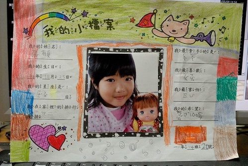

開學第二天的回家作業是完成上面照片裡的個人小檔案

那是愛愛人生中的第一份小學作業 愛愛好開心 好熱烈

緊張又興奮到把已經很OK的字擦擦又寫寫 把"我的希望"從"漂亮"改到"開心" 最後是"考試100分"

而紙上的小圖案用色鉛筆細心的上色 然後這邊再加一點顏色 那邊再加一點色塊

花了近兩個鐘頭 直到我發現她在答案旁加的小花圖案恐影響到答案的觀賞才出面柔性勸說

期間阿徹忍不住向我搖了好幾次頭 說"愛愛好無聊喔"

但我肯定愛愛這份認真與執著 成就這份令她心安與喜歡的個人檔案

愛愛的第一份國語作業拿了個甲上 而且老師還蓋了個"寫字很漂亮"章 讓她很是滿足

她還笑說"老師好奇怪 明明前面有她訂正的紅字 可是還又給我蓋章"

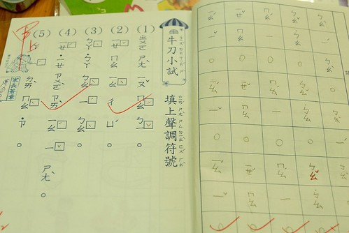

只是隨著認識的注音越多 寫漂亮的難度越高 愛愛就再也沒得到老師的章了

這點似乎有點讓愛愛小介意 雖然她嘴上沒說

愛愛的字跟阿徹相比真是整齊美觀許多 如徹爸說讓人一看就覺得有誠意的字

所以即使知道老師的標準很高 我不會擦她的字

只有一些品質弱些的字 我才會告訴她好像跟上面的字不一樣 要不要再寫寫看

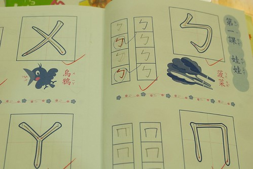

最近可能因為過了蜜月期 加上字(注音)的困難度越來越高

愛愛被老師用紅筆訂正的字數顯著變多

需要訂正的字有時後是在學校完成 有時後是帶回家寫作業前完成

每次寫作業前得先訂正這麼多的"沒達標準"的字 愛愛寫國語作業的心情沒再像開學第一週那樣雀躍了

而且常寫完一個詞就東擦西擦 最後滿意了但也辛苦到非要起身走個一圈再回來寫下一個詞

然後一頁10個詞的注音花了半個小時時間才完成

老實講 我心裡是很難接受老師這樣的訓練 但只能努力壓抑自己的主觀想法與喜好

一再告訴自己 愛愛可以的 愛愛撐過那就是她的了....

不過我還是會清楚跟愛愛說明我的看法(或許是原則)

"我覺得你寫字很努力也寫的不錯了 只是你們老師要求的標準比較高

那麼多紅字不代表你寫不好 只是老師覺得你可以更好

你只要每次都有認真寫 不要擔心會不會有紅字 有紅字再去訂正就好了"

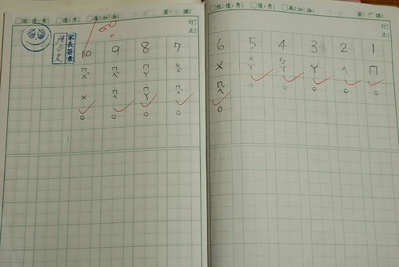

愛愛的國語第一課聽寫前一晚 主動要求我幫她在家考過一遍

果然後來100分的成績 讓她好開心阿

只是後來因為二和三聲常搞錯 接下來的聽寫成績快速下滑到81分與 70分

昨天再問她需要先幫她考過嗎(今天要考第四課) 愛愛說"考了也沒幫助 不用了.."

唉~~其實我不心急 因為我覺得每個人學習東西(尤其語言)的速度不一樣

加上我們從小完全沒要求與加強小孩子的注音符號學習 所以愛愛可以算是沒什麼基礎的

只是我在乎的是她的態度 尤其最近她很不喜歡我們教她東西

例如看她洗便當盒的時後跟她說流程可以怎樣 玩跳棋可以嘗試什麼方法

她一開始都會很排斥我們要"教"她什麼 我們只好努力的"換個方法說"...

當然這件事與學校間有沒有關係無法釐清也如徹爸說不用過度放大

但我的確特別關注愛愛的變化 尤其是她的心情與態度

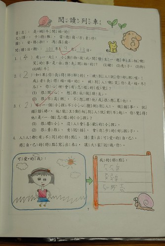

閱讀課的第一份作業也是在愛愛滿懷的期許與熱誠下完成如上

我喜歡她畫的她自己 小巧可愛

我與哥哥一起跟她討論她有哪些特點時 我說你也沒有很黑阿 愛愛說"老師說我黑黑的"

問仔細點 原來課堂上老師要愛愛站到台上 以她為例說明她有什麼特點

然後我們的愛愛非常堅持她的特點有黑黑的

只是後來發回來的作業這答案被畫了半勾(就是一個打勾加上半撇) 因為應該要寫"皮膚黑黑的"

而理所當然的下面寫的也應該是"長的瘦瘦的"

至於我跟阿徹覺得很棒且當初一直慫恿愛愛要寫的特點"很愛笑"則改為"身高矮矮的"

因為老師說很愛笑不是外表.....

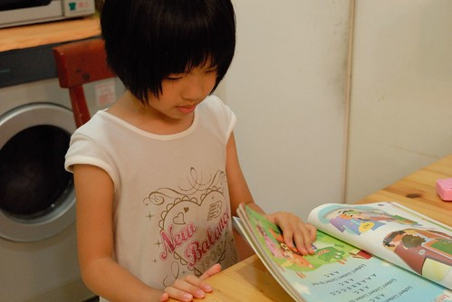

愛愛自己很明白老師的嚴格 還曾經很有感而發的跟我們說

"雖然我們老師很嚴格 但其實她對我們很好"

我很高興愛愛能夠這樣想 但我也希望她能一直這麼想

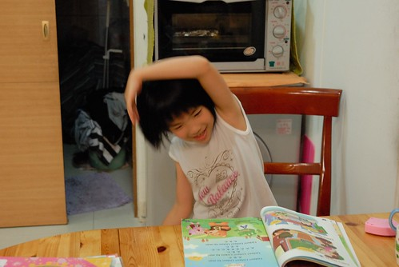

其實看愛愛的作業本 以及聽她所描述的班上大小事

我相信老師絕對付出很多時間與心力 也肯定老師是個優秀好老師

只是立意良善的"習慣養成" 是不是需要透過如此的過程 我個人是真的不很認同

我常想這考驗的不只是愛愛 更是我這個媽媽阿!

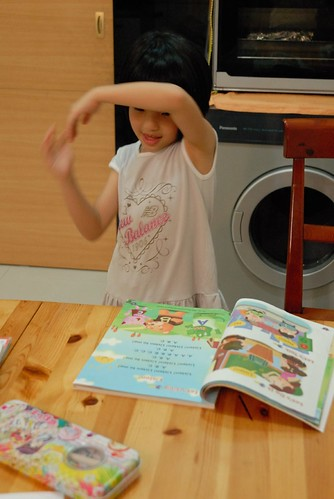

但我也慶幸著自己在這學期的轉速改變

讓我可以看到好多時後的愛愛在家開心的學著跳繩 東跑西忙 玩遊戲 聽故事...

自己才能釋懷 又開心

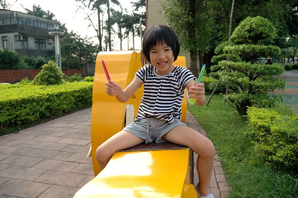

從小開心又愛笑的愛愛要努力開心的學習下去~

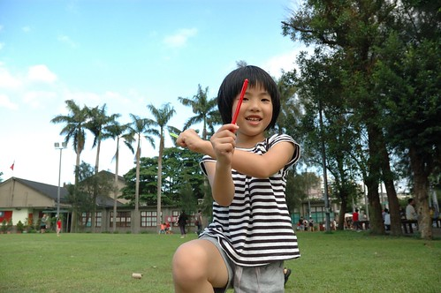
