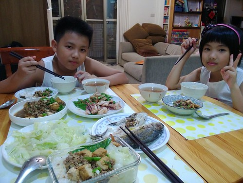
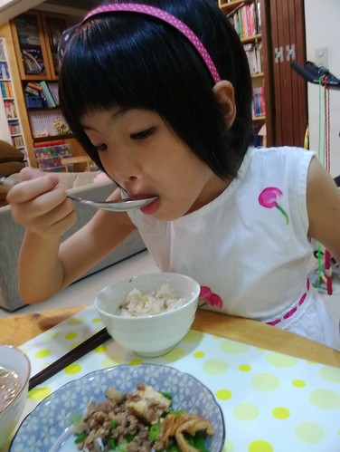
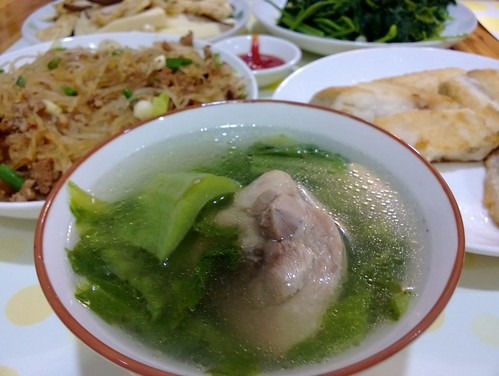
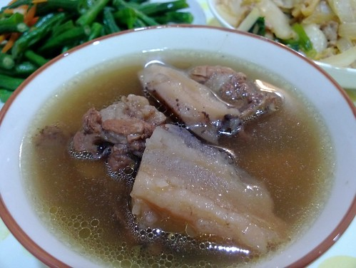

換了手機開始愛曬幸福後 有一次PO了張"呷飯"的照片沒想到引來許多朋友的議論紛紛 "伙食辦很好喔"~我 嚇很大~我突然想 會不會是現在的小家庭真的太少開伙了 以...

  自己開始學做菜 真正的自己全權調味與配菜 是在大四那一年 大學最後一年課很少 又沒有準備考研究所 所以時間很多 真的很多... 加上家裡做生意一直很忙 每天這樣只是等著幫媽媽切菜上菜 我心裡實在很過意不去 於是我開始試著自己煮一頓飯  還每天看電視上的阿鴻上菜 且勤做筆記 然後就這麼開始煮 一直煮到自己的小孩都快小學畢業了... 其實會煮的都是家常菜  都是上不了大場面的"小菜" 但每天自己吃的很開心 小孩也都好滿足的媽媽味道  是留給自己與小孩的最美好回憶與資產 也更是push自己每天煮飯就像刷牙那樣理所當然的最大動力~  

打算一段時間就把FB上的PO文 整理到BLOG裡 除了是自己的紀錄外 也是日後留給徹愛的媽媽的話 有關廚房這件事 ----------------------------------------------------------------------------------------------------------------------------- "秋冬限定之芥菜雞湯開始上桌 每人都喝二大碗，不小心就飽過頭...."  小提醒: 芥菜要先川燙過後再入湯才不會有苦味, 兩三片薑片與些許鹽巴的簡單調味便凸顯芥菜的酸甘味

"白吃白喝禦秋燥，秋食白色果蔬補肺又養神 蓮藕湯不愧是徹小子最愛的湯品之一~"  去年在市場賣自家蓮藕的農友教: 燉湯的蓮藕用拍的可以保留較多纖維質而且湯更濃郁喔! 另外蓮藕節的地方最精華 千萬不要丟了 湯真的很好喝, 徹爸形容就像清燉花生豬腳那樣香濃~

"週五清冰箱料理之累積剩飯+都一些些的青江菜,高麗菜,彩椒=〉只有媽媽才會這樣搞的炒飯"  有朋友留言: 看了最近妳PO的家庭料理....覺得跟我家的料理很相似ㄝ~呵呵，每天回家看到媽媽煮好的一桌飯，就算不是山珍海味，剩菜剩飯變出來的料理，也會覺得很幸福~ 朋友一語說中我那沒明著說的初哀，我們都該珍惜，放大這樣的小幸福~

"徹愛滿肚問號的早餐，從馬鈴薯,茄子,香蕉...猜到竹筍 吃完後謎底才揭曉，原來是山药松子煎餅 再加上杯黑糖鮮奶茶，是媽媽的愛心秋補早餐~ 只是不知道小人下次還願意吃嗎...."  雖然滿肚問號 但小人不為難的吃光光! 媽媽心裏小小的感激

"開會日之20分鐘料理~ 有菜有肉有湯的燴飯，是老爺跟公主的最愛! 話說用藕粉代替太白粉是廚娘不可說的用心良苦..."  有朋友說最喜歡這樣的快速料理, 因此多分享了如下心得: - 早上先洗好糙米並用等量水泡, 放在冰箱, 回家後再洗白米加入, 這樣只要花煮白米的時間就可吃到整鍋香Q的半糙米飯(糙米需要1-2小時的浸泡, 真的不是想吃就馬上吃的到) - 香菇早上洗好用適量水泡著放冰箱, 回家後就立刻可用 - 前一晚煮湯時, 預留一半的排骨湯隔天用, 省卻熬湯頭的時間 回家後(1)洗白米放電鍋煮(2)加熱排骨湯,同時間洗菜(大白菜, 金針菇,黑木耳,香菇)切菜(3)湯滾所有材料放入,鹽糖調味 (4)勾芡,最後加上一點烏醋,香油,胡椒(5)飯煮好,完成! PS.若沒有現成肉羹肉, 一樣早上先切好醃好肉

"一天的挑戰，就從面對媽媽的奇怪早餐開始~ "為什麼它在動???"徹愛一臉驚嚇問 早餐會動?太神奇了吧?!原來是柴魚... "它為什麼會動啊?"因為熱的關係吧?! 可是為什麼等到小人吃完，媽媽冷掉的那盤還在動啊?... 公主終於忍不住說了"它好像蟲喔"哈哈... 下次再上桌，媽媽會先把柴魚敲暈的! 今日廚娘的小秘密是...其實這是鹽版的山藥煎餅啊!"  雖然一直在跳的柴魚片讓徹愛滿臉不可思議的吃完早餐 但兩人都說還不錯吃喔! 看來鹹版山藥煎略勝一籌

"公主不是不愛吃肉，只是嘴巴很精... 所以媽媽週末上菜市場的那天絕不能賴床，才能買到一頭豬僅有一些些的梅花肉或俗稱的老鼠肉 切簿片用些醬油+米酒+香油與一點點的太白粉抓醃後，搭配青椒,豆干或青葱...，每次都是公主讚不絕口的百元快炒!"  玟姿阿姨留言: 這一餐的顏色很棒 有紅、有黃、有橘、有綠也有白！！ 我也覺得好漂亮的顏色阿! 可以的話 希望每天都可以盡量colorful,  不同顏色代表不同營養

"週五晚餐簡單吃，是口味的變化也是心情的轉換~ 自己炒的哨子醬雖然比不上外頭，但簡單清爽，是另種美味享受，尤其淋上了兩大匙醇釀烏醋..."  紅蔥頭用適量的油炒乾香後 加入絞肉(煎)炒至略焦熟後再放入豆乾丁與醬油+岡山豆瓣醬與一點點糖的調味即可

上週看到大穎文化總編輯在FB寫的一篇文章: (引用自荳芽‧蝴蝶‧Carol的美麗花園) 我的私訊裡有很多媽媽問我怎麼兼顧事業和家庭，其實我並沒有做得如大家想像的那般好，工作和家庭頂多就是七十分而已，但我對我的七十分人生還可以接受，因為我已經把我的時間很努力而盡職的分配在我要爭取的人生規畫裡了。 我給所有需要兼顧家庭和工作的媽媽的建議是：想清楚妳要的是什麼，然後，動手去做。在做的過程中，困難挫折是一定會有的，為自己找方法、不要找藉口，傾聽 自己內心的想望、不要被三姑六婆的任何一句不負責任的負面風涼話打敗。一天一天的做，漸漸的，妳會發現妳已在不知不覺間蓄養了豐沛的能量及屬於自己的做事 的節奏。家庭和工作就是這樣自然的運作著，妳再也不需懷疑了。

最後一段我再認同不過 這也是我最近愛PO的初衷, 只是我寫不出這麼美又有力的文字...
