說煮飯不知不覺走到第十回 沒想突然來個心情跌落谷底而中斷 而斷了後就也沒動機再繼續了.... 就這麼停在10也好!

中斷前就貼好的圖文放了一陣 還是決定就完成吧 謝謝玟姿發現到我沒再上菜了 還跟我說好喜歡我的文字 鼓勵我再上菜 的確 每次的書寫都能激發出自己說故事的能力 簡單卻不失溫暖... 喜歡也謝謝朋友們在FB的討論與按讚 只是我想FB還是少上點好 話也少說點好 日子就自己平凡努力過下去就好!

開工大吉~ 一家子最愛的湯種軟麵包，呷飽呷開心! ![DSCF1385[1].jpg](images/12669820913_15c55dbbbd.jpg) 過年時帶回嘉的年貨除了恩典牌泡菜外，就只有一包名豐豆腐的炸豆包，心想隨意搭個芹、蔥或菜，總就是一盤簡單可上桌的應急菜 有天早晨我將豆包切塊炒高麗菜，愛愛喜歡的不得了，直嚷著高麗菜與豆包都是她最喜歡的食物， 要我以後多這樣煮! 帶著豆香的高麗菜，就像化了淡妝的姑娘，不失清秀但更迷人了~ 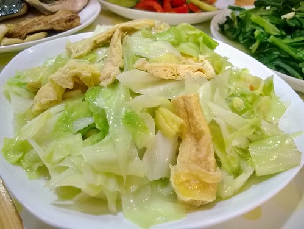 今天燉肉，想加麵輪又想加正盛產好吃的白蘿蔔，於是變成了一鍋麵輪比肉多、白蘿蔔又比麵輪多的紅燒”雜”! 一早就開始浸泡的麵輪(放於冰箱)已充分軟化，並用沸水汆燙以去除油味，飽吸醬汁的麵輪與清甜香軟的白蘿蔔讓人不節制的吃了一大盤! 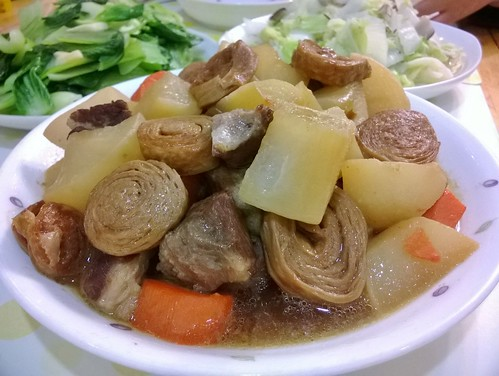 煮晚餐時，徹哥一反常態的進廚房想幫些忙，於是切了這盤的豆與菇，雖然不俐落但倒也不生殊，我說每次這樣切一點學一些，假以時日就真的是我的二廚了，兄妹倆聽的兩眼發亮~ 雖然知道今天只是小人的一時興起也並未多所期待，但因著自己切的菜而更樂易吃不喜歡的菇是令媽媽開心的事! 炒菇時，放入平底鍋後不要翻動直到香氣釋出才翻炒，如此充分受熱的菇其口感與氣味真的不錯，讓小時候不愛菇的我越來越愛菇! 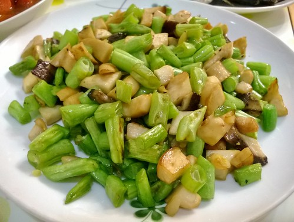 前天晚餐的同時，將二顆對切的馬鈴薯放到大同電鍋裏蒸(外鍋放了1.2杯水剛好熟)，我吃完飯剛好趁熱剝掉馬鈴薯的皮(趁熱很好剝且皮超薄)並將一顆壓成了泥。 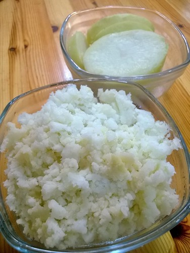 昨早將泥的那碗加了蛋、粉、玉米、起司後煎成餅  今早繼續將剩下的那顆非泥馬鈴薯切成片狀，用些油兩面煎香並利用鍋底焗上摩佐拉起司 徹哥說好像洋芋片的味道好好吃，愛妹也是完全不拖垃的吃完(可見有喜歡) 很好!小人漸漸進入媽媽佈下的馬鈴薯圈套裏~ 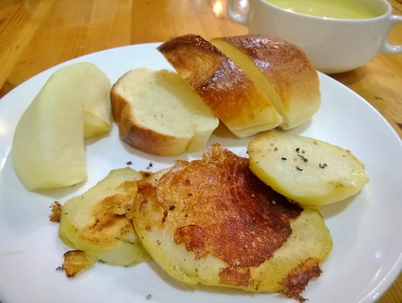 元宵節+情人節，讓年後克制的嘴又放縱了~ 紅豆煮軟但要保有顆粒狀是每次煮紅豆湯時，徹哥總再三叮嚀我的最重要原則! 經過12小時浸泡的紅豆，經大同電鍋2.5杯水的熬煮後，成就為徹哥滿意不得了的紅豆湯! 紅豆湯圓，元宵節快樂~ 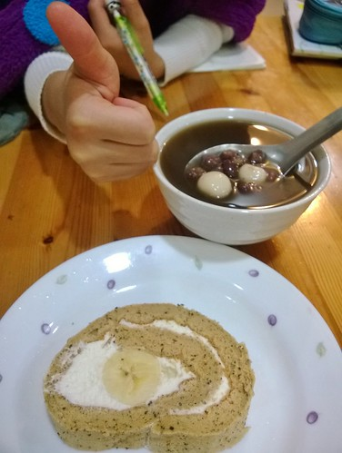 姑娘喜歡的炸豆包當然要很珍惜的一包分兩次(冷凍保存)，每次以出色的配角之姿輔以其他喜歡的或不喜歡的蔬菜! 炸豆包、紅蘿蔔(以上先煎炒香)、黑木耳、芹菜與高麗菜切成絲後炒在一起，輔以些許醬油與鹽調味，便是盤色香味與營養兼具的炒蔬食! 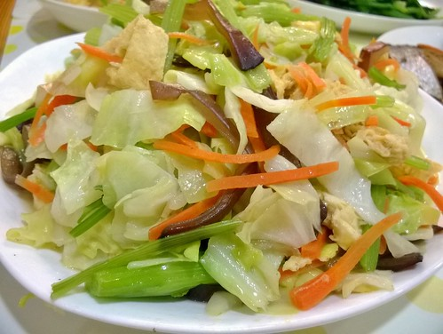 媽媽馬鈴薯圈套再進級之連皮一起上~ 家裏半丁點麵包都没有，也缺了早餐常用到的低中筋麵粉，只好派上馬鈴薯撐場面! 熟馬鈴薯連皮切塊，用少油小火煎至上色，最後灑上點鹽巴與黑胡椒調味 加上一顆玉米蛋及香腸便是小人喜愛又飽食的美式早餐~ 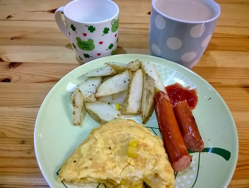 家裏肉吃的少，於是豆製品的替代與増添菜色顯得重要! 除偶跟同事團購名豐豆腐，我大都是到有機商店或超市(義美也有賣)購買非基因改造豆製品，除了安心也因習慣這些更好口感與香氣的豆腐豆干! 不同於以前用油煸的乾香，今天的豆干切絲後先用熱水燙過，如此去了豆腥味也讓豆干呈現軟嫩口感! 今日這盤是香嫩帶汁的豆干炒肉絲~ 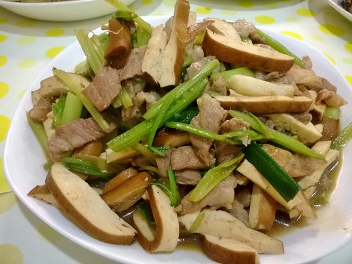 回鍋肉是以前家庭把祭拜的熟豬肉再烹調的美味料理方式! 如今沒有拜拜習慣的我們想吃這味時，反倒得刻意先把生豬肉給水煮熟，已完全不是以前年代的清冰箱料理! 大塊煮熟的豬肉冷却後切成小片塊狀，下鍋煎出這帶點油花豬肉的油脂後，下辣豆瓣醬與些醬油及鹽炒香，最後放入喜歡的高麗菜及青蒜苗炒軟 有鹽有香還帶著點辣的有菜有肉，一家子筷子夾個不停，大滿意! 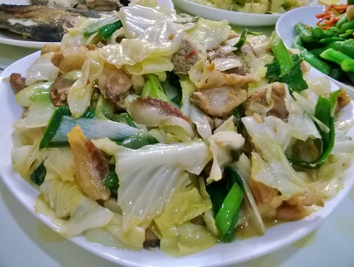 早上正準備吃早餐的愛妹發出求救”這麼大要怎麼吃阿?”，我說”張”大嘴吃阿! 後來我也吃著時才發現原來自己會很順口的側咬著吃，我同兄妹分享這好方法，沒想到徹哥說他也是這樣側著吃，我說”果然是徹，會側著吃，愛就不能側吃”! 諸如這樣的側揹、側吃冷笑話常在徹家上演著... 夾著生菜的堡的確很讓人喜歡，但只逛菜市場跟全聯的平婦實在很難買到新鮮又份量小的生菜(小家庭真沒上costco買菜的本事)，於是親民的小黃瓜成了最佳的替代，而小黃瓜也沒有的時候只好派彩椒硬上了! 煎的熟香且糖化的彩椒，讓麵包小半號, 蛋少半顆, 香腸也少半條的堡增添色彩與美味，只是小鳥嘴的愛妹真的得張大嘴吃! 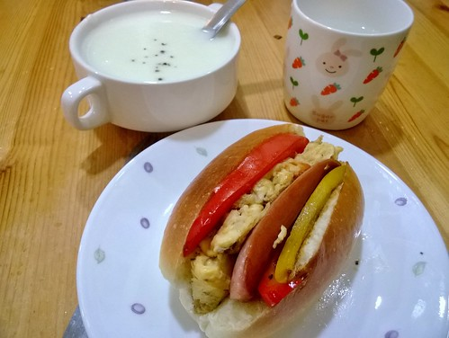
