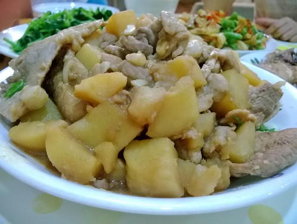
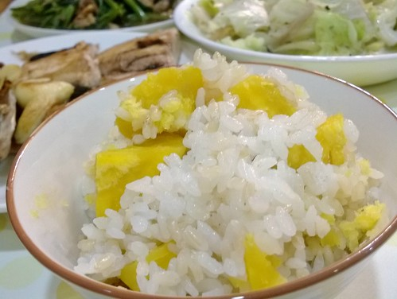
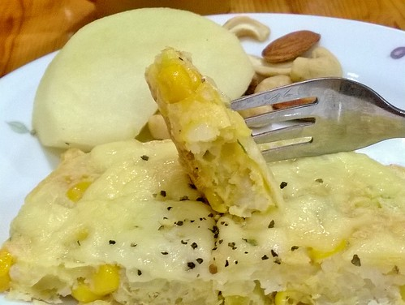
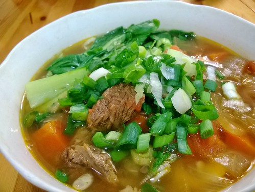
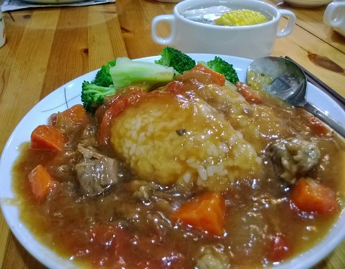
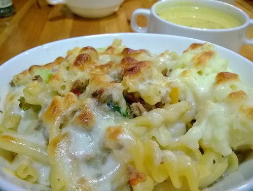
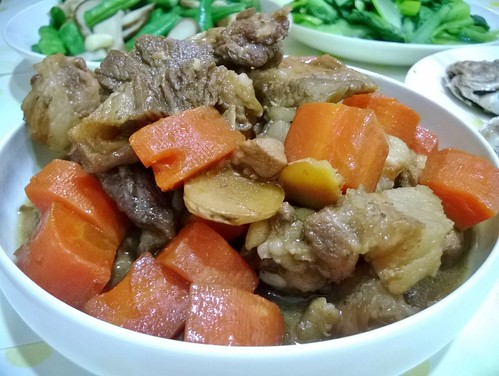
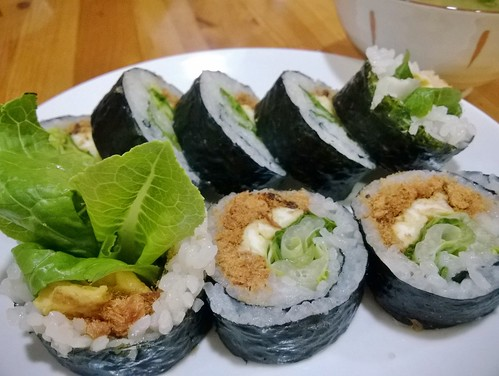
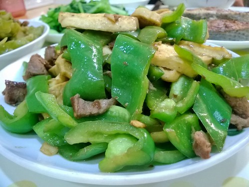
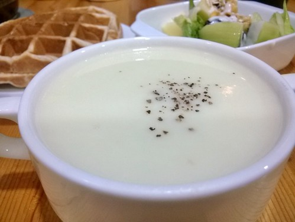

說煮飯這件事來到第二個二週 連著四週 週間的每天早或晚餐的一PO 好奇自己可以這樣愛PO到什麼時後 但也常在看到朋友留言 好幸福好手藝時 懷疑自己這麼做到底好還是不好... 幸好也一直陸續有朋友跟我說"好棒的分享"  對! 真的是分享... "馬鈴薯，具全面營養，蔬菜中的蘋果之稱 但直到今年老爺變性，喜歡上，馬鈴薯才得以主角之姿上家裏餐桌 醬油+味霖，不敗的調味，燉出馬鈴薯的鬆軟美味~" 

"ㄧ直很喜歡像地瓜這様的根莖類， 嘴饞時，會買一,二顆地瓜，削皮切塊後放到生米上一起進電子鍋煮， 簡單又美味的地瓜飯，吃進營養也省得少煮一樣菜..."  "煎餅，是很口味多變又營養的早餐選擇 一碗剩飯+二顆蛋+50g麵粉+蔥花,玉米粒...喜歡或剛好有的蔬菜+一些鹽和黑胡椒調味， 小火兩面煎至金黃(翻面後灑上乳酪絲)，就是好吃又飽足感十足的米蛋餅" 

"慶祝明天放假，今晚吃牛肉麵~ 去年找到的超好吃番茄牛腩飯食譜，没芶芡時也是徹愛讚不絕口的番茄牛肉麵!"  材料: 牛腩一斤, 洋蔥 蕃茄 紅蘿蔔 隨自己喜好 調味: 酒1-2T, 醬油半碗, 番茄醬2T, 甜麵醬1-2T, 滷包, 鹽糖視個人喜好(今天都沒加)

"昨天是稀釋後的湯麵，今天是芶芡後的牛腩飯，超值得的ㄧ鍋二吃! 只是徹少爺想清鬆在家,等吃期待的牛腩飯而不想出門，讓想曬太陽的阿母無語問蒼天啊~ 以後再也不要在假期前煮這一味..." 

"今天換口味吃義大利麵~ 一罐義大利綜合香料，是讓媽媽端出茄汁肉醬麵的重要法寶， 雖然不道地，但好吃度絕勝平價義大利麵，尤其焗上摩佐羅拉絲後，小人超級愛~"  二顆洋蔥+幾顆番茄+豬牛各一斤的絞肉+幾片蒜+2~3匙番茄酱+ㄧ點糖鹽調味 以上材料就能燉一大鍋，分裝冷凍保存，―二個月內隨時方便吃

"平常晚餐準備時間儘量在一小時內，但有時會想在廚房裏慢慢來...，今天躲在廚房裏滷了一鍋肉 自己不擅滷肉，偏偏對滷肉又最不照譜來，每次都是把看的,聽來的各方祕技東缺西漏的試一通 今天記得媽媽說的要放冰糖，肉才會油亮，還做了人家寫的先把肉炒糖上色,加些紅茶葉可以去油膩.... 愛吃滷肉的愛愛說好香好好吃，還儘挑肥的 我想只要醬油跟糖有到位，其實滷肉很難不好吃..." 

"偶而想在早晨來盤呷飽飽的壽司~ 睡前將米放下去煮，早上醒來後拌上糯米醋,梅子汁與細冰糖便是壽司飯， 然後煎蛋的時間剛好飯也涼,可以包壽司了 肉鬆+蛋+小黃瓜是我們最習慣的口味，但包了蘿蔓生菜的壽司更是驚豔美味的讓我們回味無窮..."  一般好像都是用壽司醋+糖, 我們是因為徹爸說徹嬤以前都是加自己釀的梅子汁 我試過只有梅子汁+糖, 覺得酸度不夠, 若只用醋+糖又少了梅子的酸香,少一味 後來我都是梅子醋與糯米醋各半, 至於糖 我覺得真的要加,少了他味道欠很大 早上的三捲壽司,近2杯的米煮成, 加上各3T的梅子汁,醋還有糖(糖本來放2T覺得不太夠)

"氣象預報氣溫會抖降，剛好煮個南瓜濃湯暖身子~ 自從去年買了手持式攪拌器，開始也喜歡上煮蔬菜濃湯 洋蔥丁炒出香氣(不炒也還好)，放入南瓜片略炒，移湯鍋加水煮10來分鐘， 離火打泥，加牛奶繼續煮，最後鹽巴調味並可加入一些奶油讓湯更滑順 雖然又是不道地的做法，但這是六點半起床的媽媽，溫暖濃湯七點上桌的法寶~"  

"上週徹哥聊起那天學校的午餐:今天中午有青椒，我說要多一點，打飯的同學說總算來了一個喜歡的... 我們討論起為什麼小孩子好像都不喜歡青椒，氣味的關係嗎?還是會苦?我們懷疑可能因為大部分的青椒都炒太爛吧!? 平底鍋煎炒肉絲到7~8分熟盛起，原鍋續煎炒青椒至顏色變深變亮，肉倒入並調味炒匀即可，這樣的青椒徹說脆脆甜甜的! 青椒，在我們家是小人看到會興奮的一道菜~" 

"白花菜，一直以為只能用炒的 直到高中有一天看到同學媽媽如煮菜頭湯那樣煮著白花菜湯，我大開眼介， 但喝過後我想花椰菜還是用炒的比較好 去年在bubu老師的書上看到洋蔥+馬鈴薯+白花菜煮濃湯， 試過後很是喜歡，是冬日早晨很棒的營養來源~"  跟南瓜濃湯一樣的做法, 將洋蔥丁+馬鈴薯丁+白花菜煮10來分鐘, 打泥然後加牛奶, 與最後鹽與奶油的調味
