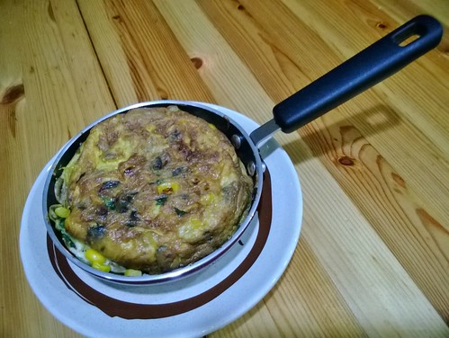

最近的白天跟晚上都有點忙也有點懶 除了莫名堅持與挑戰的持續每天FB一PO外 剩沒多少心思與體力寫BLOG 結果變成一段時間貼貼FB那些照片與文字是寫BLOG最不花腦力與時間的唯一產出 這樣實在不太好!

週末不在家，週一又是市場公休日，偏又不想吃便當，只好努力清冰箱... 二片天婦羅,十來根的醜豆,二小根杏鮑茹,不到1/4顆的高麗菜， 每樣都無法獨稱大局，只好努力找伴壯聲勢! 豆干丁+豆子丁(毛豆)+菇茹丁的組合，是我為了讓小人多吃幾口菇常用的技倆!  

ㄧ直想做西班牙烘蛋，但需要的蛋量跟好大的份量卻讓我遲遲不敢試， 取而代之常上桌的是這樣半煎半烘的炒蛋 半顆馬鈴薯切細片後微波一分半，再加上—些玉米,蔥花,一顆蛋及鹽調味， 小火半煎半烘至兩面金黃，恰佮香香的挺好吃 配上半片麵包與一碗昨早刻意多煮的濃湯，今天多睡十分鐘的媽媽依然準時營養早餐上桌 

徹愛挑食嗎? 撇開真的不要強迫小孩吃的苦瓜,茄子不談，媽媽我上菜市場真的挺好發揮的! 只是小人難免有不喜歡吃的菜，例如任何以筍結尾的菜跟香菇， 而且媽媽堅持任何菜都要吃，只是真不喜歡的可以吃少一點... 妙的是有時候換個切法或煮法，小人的喜好度就完全不同喔! 不同於滾刀或片狀，切成長絲的筊白筍別有一番清爽，而且大大縮減烹煮的時間! 

不同於夏季各式各樣瓜的當道，秋冬的菜市場豐富的更是讓人喜歡， 而且冬天裏的菜每樣都是隨便煮就好吃! 看到剛上市的小大頭菜，迫不及待買回家煮湯， 不同於夏天的湯得靠丸子與芹菜來提味，簡單的大頭菜排骨湯就香濃甜的讓人滿足~ 

昨晚的湯與飯都刻意的多煮些， 早晨用這些飯跟湯做底，加上些玉米粒,海菜芽,肉絲,芹菜珠及柴魚粉，就是快速又營養的什錦粥! 濃濃大頭菜香的熱粥，我很是喜歡，至於小人愛不愛，不是重點，有吃飽有活力上學去就好~ 

週六本不po的，但徹爸說這卡士達醬真是太讚了! 蛋一顆+10-20g糖混匀;低粉10g+牛奶130g混勻後加入前面的蛋; 小火加熱,持續攪拌至濃稠,加入5g奶油融化即可(引用自carol老師) 做成口袋吐司的內餡或是麵包夾餡都很棒喔~ 

週末從菜市場買完菜回來，都會把綠色葉菜擺放到盆裏陰乾 一團鮮綠，美麗得讓我總忍不住多瞧幾眼，多摸幾下~ (青菜在陰乾後没有濕的狀況下，用袋子密封好，存放4~5天都還ok喔) 

没時間煮晚飯，那就早上先煮鍋咖哩吧! 經過白天的熟成，不止洋蔥化了，咖哩的風味也更佳， 同時，早在最後加咖哩塊前就煮化掉的南瓜，更是讓咖哩濃郁又營養! 

我們家很愛喝湯，也很能喝湯 煮一鍋好喝的湯，是每次煮飯最重要也最令人期待的—件事! 冬日裏在嘉義台南路邊常見販售的熟菱角，在台北卻是換個模樣接客， ㄧ袋剝了殻的生菱角，再附上幾根香菜，別懷疑，就是拿來煮湯的! 煮得鬆軟的菱角湯，別具風味的讓人意猶未竟~ 這也是繼蓮藕湯外，另一個秋冬限定養身湯品! 

每次有闗農藥殘留的新聞，四季豆總躲不掉的一定被提及 另方面，四季豆卻深得小人的喜歡 況且沒有豆類穿插調劑的餐桌多麼單調又無趣啊! 雖然對於食材源頭無法有十足的信賴， 但起碼可以透過足夠的浸泡沖洗來盡自己最大的努力與用心， 而這也是媽媽廚房最大的存在意義! 

一直記得以前一位同事的叮嚀(穿實驗衣阿姨，就是你)，學生早餐來個蛋很重要! 這二年準備小學生的早餐時，總會盡量來些蛋，但一人最多不超過一顆 今天小人期中考，早餐當然更要有優質蛋白質， 剛好昨天買大鍋送的10公分直徑超迷你平底鍋，煎個ㄧ顆蛋的歐姆蛋那麼剛好又可愛! 希望在寫功課,認真上課之外，營養早餐也能幫助小人有個不會太差的成績~ 

小人期中考第二天繼續上高蛋白質早餐~ 想利用迷你鍋來個迷你版西班牙烘蛋，二顆蛋加馬鈴薯的份量果然讓小鍋11分滿了! 蛋雖然有點難翻身，幸好還是恰恰香香的!  這就是那個直徑10公分的超迷你平底鍋 有了它的加持  必定是準備早餐時的得力好幫手阿! 
