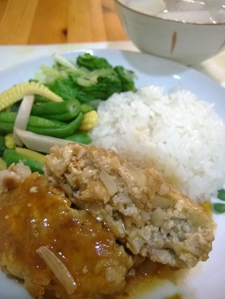

前陣子 我的一個人旅行收到一封留言 是一位三年前曾經詢問我床組的媽媽所留 "很喜歡你的文章，好欣賞妳的生活態度，對家庭孩子的付出。 每當對生活、家庭感到無奈倦怠時，閱讀你的文章，總是能找到支撐自己再努力的力量。 佩服妳的同時，自己也覺得有點愧疚，我似乎無法做到這些。 謝謝你的文章，總是讓我對生活的態度有新的啟發。" 很開心自己這些平凡的文字竟可以帶給別人鼓勵 但也真覺得自己何德何能阿!!! 其實我的最大缺點也是最大強項就是 愛逞強 於是就有很多莫名的堅持... 不過透過書寫與紀錄  真是整頓自己思緒與情緒的好方式 很多事 寫出來 條理就清楚了 於是問題就變小了 感動卻放大了!

不若法式吐司浸泡牛奶蛋液(正統點的還泡上一夜)後的濕軟口感 我們家比較能接受的是簡單沾了蛋液且立馬下鍋的”煎蛋”吐司 還保有麵包的彈性口感，但蛋液卻讓有點老化的麵包變柔軟了 而且這是給小學生最簡單又方便的優質早餐~  

昨晚煮味噌湯多煮了些，多的二碗湯給小人隔天早餐喝剛剛好 而為了配這二碗湯，剛好第一次嘗試做十穀壽司 在睡前煮好一鍋十穀飯，起床後煎個蛋皮,捲上肉鬆，20分鐘完成母子三人的e早餐 十榖是徹爸口中的鳥食，但我跟徹很喜歡這樣口感豐富的鳥食~ 我們是早起有早餐吃的鳥... 

十穀，如煮飯般很簡單煮，只是得先浸泡一二個鐘頭麻煩了些 所以煮壽司飯時，我當然貪效率的順道多煮了些 用小保鮮盒分裝冷凍保存，早晨打杯十穀漿就不再是不簡單的事了 十榖飯+香蕉+堅果仁+豆漿，哇~ 徹說”媽，你又上那學的?“ 我說”好不好喝嘛?” 徹一臉得意”好喝啊~”，就連挑嘴的愛也跟著點頭,喝光光 真是太棒的鳥食!我們的早餐飲品又多個選擇了!!!  

早上才知道今天是立冬，心裏小小懊惱下前二天煮了雞湯 今晚没雞可補，只好安慰自己平常吃的也夠營養了 也剛好今晚本來就預訂要做比較搞缸些的“甜醋豆腐肉餅”，恰彌補那小小的遺憾 加了等重量豆腐的肉餅，不止多了健康也多了軟嫩與豆香，非常受我們喜愛，且酸甜味道更是很棒的下飯與便當菜~ 這依然是引自carol老師的好料理，有興趣的可以上網估喔!  (老師的食譜: http://caroleasylife.blogspot.com/2013/05/blog-post\_9.html 才發現我做的怎麼跟老師的長得很不像...ㄏㄏ PS. 我同樣的用藕粉取代肉泥中的太白粉, 醬料裡也多了一T的番茄醬)

豆漿vs.鮮奶 被爭論得越來越勢不兩立 我們都會喝也都愛喝，只是鮮奶倒底還是方便點，可變化性也大些 只是我不讓小人ㄧ大早就喝冰牛奶，早餐也會盡量用鮮奶茶,香蕉牛奶或濃湯的型式，以降低ㄧ大早就對小人腸胃的負擔 以前徹爸常會在深夜被我凹去超商買鮮奶，讓他常嘀咕應該有鮮奶送到家的服務，後來在市場遇到四方的展銷，我們如獲貴人 家裏每週配送鮮奶已經一年多，真的很方便也很喜歡四方的奶 若說有缺點，就是週五晚上不能亂跑得在家等，還有就是越來越難接受ㄧ般市售鮮奶... 雖然價格有貴幾塊錢，但好東西值得推薦給眾媽媽~ 

上週五晚餐多煮的義大利麵(純粹水煮)，變個樣就也是小學生的早餐 記得初看到carol老師這食譜還真有被嚇到，但沒想到試了之後卻頗受小學生好評 保有麵香與蛋香，說是麵也是蛋，外恰內軟，再佐上些許番茄醬，種種條件都讓小人不知不覺就秒殺 再配上一杯十穀奶，我想這個早餐的營養是夠了，尤其適合媽媽也會賴床的星期一早晨  (剩下的一小碗麵+兩顆剛好的蛋+隨意灑的些許鹽巴,糖跟芝士粉, 然後用1T左右的油 => 又跟老師成品很不像的上菜了~)

每次我炒青江菜時徹都會說”真好吃”，不過也總是會補上句”涮涮鍋那個燙青江菜真的好好吃” 另方面，雖然小人很愛青江菜，但徹爸卻覺得青江菜有苦味而不甚喜歡 昨天看到內田悟的蔬菜教室書上寫青江菜的葉片會對金屬(也就是刀)起反應，我才恍然大悟了~ 今天剛好照書上所教做實驗:一葉葉剝下青江菜，用手將葉柄與葉片撕開，油爆香蒜頭後，放葉柄略炒至均匀上油，再放葉片,加少許水並蓋上鍋蓋，以似蒸煮方式至葉片變軟，鹽巴調味後起鍋 真的，今天的青江菜很不一樣!  

其實下鍋後的步驟跟自己平常炒青菜的方法是大同小異的 差別只在於下鍋前花了些時間 一葉一葉將葉柄跟葉片分開 而不是用菜刀30秒切好一盆菜  

家裏很愛喝用雞肉煮的任何湯(因為都不是長時間與高單位濃度，實在不敢說是雞湯)，但對於其他的”乾”性雞肉料理卻都反應近乎冷淡，除了外頭賣的炸雞,鹽酥雞，還有這一味的照燒雞翅! 先將雞翅兩面皮煎恰並放入薑片與蒜爆香，加入醬油,味醂,米酒與水(今六隻放約3:2:1:5 T)煮至收汁 我刻意的多放了些調味料也未完全收汁，因為這甜甜鹽鹽還帶著薑味的醬汁淋在飯上好好吃阿!  

上週剩下的三顆豆腐肉丸尷尬的被冰到冷凍庫裏 今天苦思著如何將冰箱裏所有的菇類清掉時，想起了這三兄弟... ㄧ樣的醬油+味醂+糖鹽的調味(其實就只會這招)，端出截然不同風味的燴鮮菇豆腐肉餅! 只是向來很不愛菇的小人皺眉說”好像晚上洗便當盒時，便當盒打開時的味道”，囧 幸好成熟大人的徹爸有跟我一樣喜歡這樣菇+豆腐+肉的組合，而徹也有補上句”入口之後，味道還不錯”喔!  

今天的早餐再上清剩飯的米蛋餅(說是剩，其實也是刻意才會有) 不同於焗乳酪的帶點甜，刷上—層薄醬汁(醬油膏+番茄醬)，再灑上三島香鬆的米蛋餅，鹽香的很唰嘴阿~  話說煎餅要翻面時，用淺盤子倒扣後再滑入鍋就可以翻得很水喔! 
