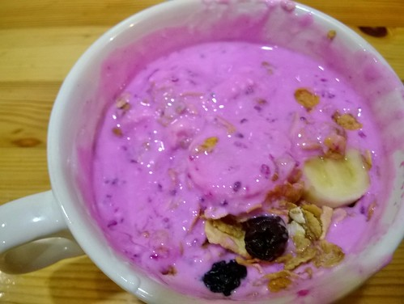

昨天徹爸休假在家 當我準備晚餐時他晃進廚房好些次看著我洗洗切切好些會  徹爸問每天這樣煮飯不會覺得累嗎我說要我每天煩惱要在外面吃什麼更累更麻煩  光週末外食一兩餐就夠擾人了...或...

生香菇+杏鮑菇+紅蘿蔔+毛豆+豆干 吃的時候才驚覺莫非這就是五行!!! 原來啥都丟下去煮，餐桌就會既美麗又營養!只可惜今天的豆瓣醬下的過重了點... 話說毛豆買回家後分裝好每次的用量並冰凍起來，之後不需解凍直接入鍋煮即可保有毛豆原有的新鮮與口感! 

天氣冷的時侯常會特別的想喝以白醬為底的濃湯 不若將澱粉質食材(如南瓜與馬鈴薯)打成泥而讓湯具濃稠感，以奶油炒低筋麵粉(1:1)再加入鮮奶而成的白醬，加入約等量的蔬菜丁湯後便是還吃得到蔬菜口感的蔬菜濃湯! 今早就用磨菇馬鈴薯濃湯迎接今年的第一道冷氣團~  

前幾天買了罐四方的優酪乳，無糖還偏酸的似優格，原以為徹愛會不喜歡(只是吃健康)，沒想到兩人卻喜歡的很，連著幾天的放學後點心都要來ㄧ碗 加上香焦片,果麥脆片,葡萄乾與最後淋上的蜂蜜，好吃的讓徹每次都央求再來一碗~ 話說小人的食性真的越來越寬廣了，Good!  

連著第四天相同的點心，不過今天更厲害是紫色的，徹哥對他的自調火龍果優酪乳滿意的不得了，一直要我拍...，這就是所謂的天然的尚水阿~  

週五晚，桶仔米糕簡單吃~ 簡單吃的準備時間卻其實一點也不簡單於平日的四菜一湯，呵呵! 這是張嬤親授的張媽媽味道:茶油爆香紅蔥頭,蝦米,香菇，下肉片炒熟後醬油,米酒,胡椒,糖調味，這是墊杯底的餡，然後裝入糯米至七分滿 同時炒料盛起後的原鍋加水煮滾，這帶著醬色與醬香的水是讓米糕色香味俱全的最後關鍵啊!(水加至八分滿高度) 大同電鍋外鍋一杯半水蒸煮，噹~上桌囉!  

油菜，又稱甜菜，因為葉梗吃來帶甜，是冬季裏我最喜歡的綠色蔬菜之一 油菜口感似青江菜，但不若青江菜容易因處理不當(不能用菜刀切葉片)而苦澀，不過一樣簡單的清炒蒜片就好好吃~ 

不是刻意，但家裏的早餐的確偏”素” 不過偶而還是會買些火腿或培根來刺激一下小人的早餐胃口，讓小人開心，雖然常量少的也讓小人意猶未竟... 麵包焗上煎蛋,玉米與火腿，這也算另種的火腿蛋土司吧! 

再次見証內田悟老師處理蔬菜的專業與堅持... 將大白菜的菜軸與菜葉分切處理，菜軸橫切相同大小，在爆香蒜與香菇後先下鍋炒軟，再將菜葉入鍋ㄧ同悶軟 果然，不只烹煮時間縮短，每一入口的口感也一致了! 同時上週五剩下的米糕肉燥剛好也找到機會清掉了... 

昨天的大白菜，我為了多些菜葉的口感並未將全部菜軸都下鍋，而這留下的好些菜軸剛好今早切細煮味噌湯! 如書上說白菜與味噌很搭，尤其在寒流來襲的早晨來上一碗，真的很暖~ 

徹哥繼昨晚才在我們聊天中知曉早餐味噌湯內的白菜不是洋蔥，今早又在妹同我說著馬鈴薯餅真好吃時，才驚訝地從書中抬起頭來大呼“我以為是洋蔥”，徹哥最近有點心不在吃哩... 馬鈴薯切細絲後，用些鹽,黑胡椒與麵粉抓匀，小火兩面煎恰，似薯餅的香氣與味道有好吃喔~ 
