徹爸常很好奇我到底還有什麼好寫的 覺得他老婆會的技倆應該都亮光了阿!? 呵呵! 應該還可以持續一陣子吧?! 雖然都是雕蟲小技 但應該還有分享的小小意義存在! 書寫真的會上癮(好啦 就是愛獻) 但老爺多留意起(恍然大悟)餐桌上的小故事是很棒的意外收穫

二嫂有一次問我”是不是一次設計好一個月的菜單?”，真的沒有哩... 我連一週的菜單都沒擬過，都是每次週末採買時看到新鮮,當季便宜,或想吃的就買，不過原則就是三四樣的綠色葉菜,四五樣非綠葉菜，加上必備的洋蔥,紅蘿蔔,芹菜,馬鈴薯與菇類等... 如此每天晚餐的四菜一湯就可以有魚有肉且有三種以上顏色蔬菜，同時蔬菜比例大於ㄧ半以上(我喜歡綠菜單純是菜，但肉不止是肉)，而若煮了肉多的湯時，就用豆干/豆腐或蛋料理取代本來的那道肉吧! 今天的菜色很徹家典型，剛好提出小小心得分享~ 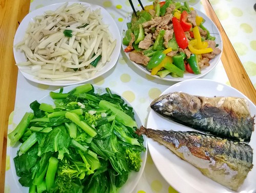

橄欖菜，台語稱”菜嬰仔” 粗枝大葉的模樣的確容易讓人懷疑這菜好吃嗎?可這菜真的就如他的台語名，嫩的像嬰仔，尤其吃來甜脆的菜莖最是迷人 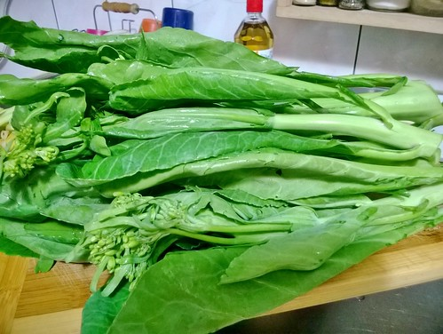 只是處理時得花點時間”撕”掉菜莖外層的粗皮，然後一樣的先下鍋炒油後再加入葉與花孢及一些水悶煮 漂亮的綠色，清甜又爽脆的口感，是我最喜歡的冬季綠菜! 昨晚愛愛加了好幾次菜，算是給這盤菜做見証! 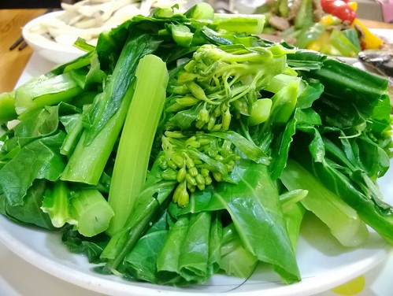 

豬五花肉真的很好吃，但也真的是很油! 我會把最底跟最前端厚厚的油層取下炸豬油，老闆跟老饕們肯定説我暴殄天物，但一條五花肉多餘的油我可以炒好幾週的青菜，再想連肥帶皮一起魯的東坡肉有多麼滋補阿... 五花肉切薄片炒出油，再放入大量的洋蔥(炒透明)與青蔥，簡單醬油,醬油膏與鹽調味，另種油亮好滋味! 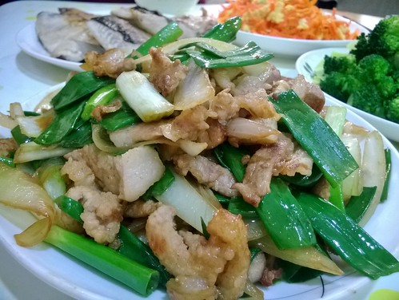 

晚上煮了芥菜雞湯，肉當然就没再炒，取而代之是簡單的沙茶炒玉米! 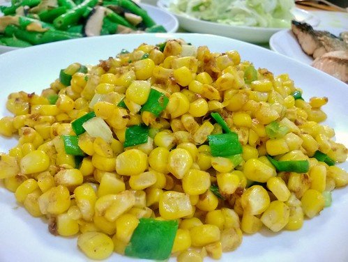 生炒玉米，保留新鮮玉米的甜與脆，再搭上最後拌炒的沙茶醬，香噴又下飯阿~ 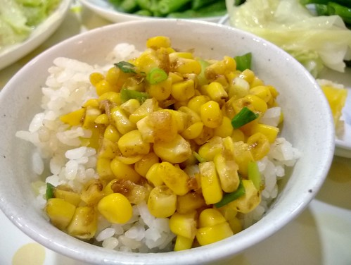 

徹哥今早必需在平常的起床時間前吃好早餐且到校集合，擔心他一大早没味口，於是打了杯有飽食效果的香蕉燕麥牛奶，希望他活力有元氣! 即食燕麥先用熱水泡軟，加入牛奶,香蕉,堅果與些許蜂蜜後果汁機打勻，簡單又好喝，一掃燕麥只能吃健康的印象!  

不同於米蛋餅，今早是米pizza 一碗多的飯+ㄧ顆蛋+黑胡椒+ㄧㄒ蓮藕粉(或太白粉)拌勻，平底鍋煎至兩面成型，鋪上pizza醬(或蕃茄醤)，灑上彩椒,火腿與起司絲，小烤箱烤至起司融化上色 清冰箱剩料的同時，也是小人喜歡的焗烤料理! 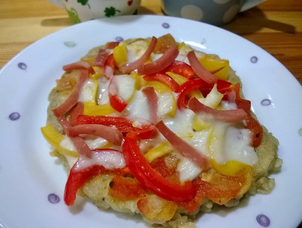 

飲食習慣跟教育一樣，急不得，秉持原則持續著，有一天突然就發現自己在往美好的路上! 前一二週聽到老爺跟我說好想喝南瓜湯，我超級驚訝，因為老爺向來不為健康吃鳥食及南瓜這類東西，沒想自己偶用保溫杯裝湯讓老爺帶到公司喝還真潛移默化奏效了! 今早總算煮了南瓜湯搭徹哥想吃的原味新鮮土司，簡單的早餐但好暖也夠飽了! 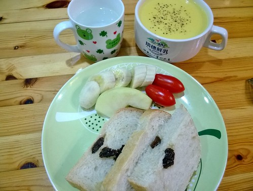 

冬天的蔬菜真的便宜又好吃!中午去市場補些菜，一大顆高麗菜加三把老闆自家種的綠葉莱竟然只要一百元!驚訝的我，光是買菜就開心! 這週突然好想吃Carol老師的高麗菜飯(http://caroleasylife.blogspot.com/2009/01/blog-post\_5.html?m=1) 小週末的晚上，家裏飄著濃濃高麗菜米飯香，每個人紛紛驚呼好香呀! 這是家幸福的香氣~ 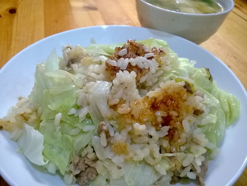 PS. 依照老師材料與做法，只除了會留1/3的高麗菜待要蓋上鍋蓋前才鋪在最上頭，藉此多保留些高麗菜的脆度以及封住米飯香 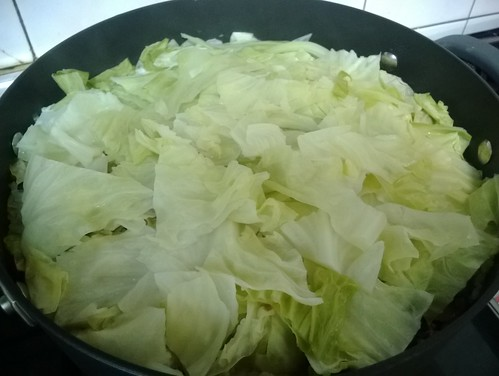 

喜歡紅蘿蔔的風味，但也怕紅蘿蔔的土腥味，因此從沒為了顏色與營飬而把紅蘿蔔包進壽司裏，但今早我卻為了—條紅蘿蔔而包壽司(雖然徹爸一直勸退我) 試過二次將整條紅蘿蔔以蓋過的水量低溫煮(水面呈水波狀態)三十分鐘，果然保留紅蘿蔔的甜味與風味，但卻沒了土腥味，而整條煮熟的紅蘿蔔很適合再燉煮或像這樣包到壽司裏! 果然徹哥跟我一樣喜歡壽司裏的這股甜味，只是很不愛紅蘿蔔的愛妹今早吃的很慢... 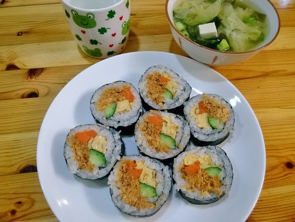 

台灣洋蔥,紅蘿蔔,馬鈴薯開始盛產的季節，更是適合煮上一鍋咖哩! 先將洋蔥炒透明後，其他蔬菜塊入鍋一起翻炒，再加入咖哩粉炒香(肉塊同法另炒)，加適當水量煮滾後轉小火燉煮3-40分鐘，最後加入市售咖哩塊及些許牛奶調合，即完成徹家亂亂煮但風味十足之咖哩! 四十分鐘，就足以讓洋蔥跟南瓜煮化掉轉成濃郁醬汁，而馬鈴薯與紅蘿蔔則鬆軟好吃! 雨天中午，來上一盤咖哩飯真Good! 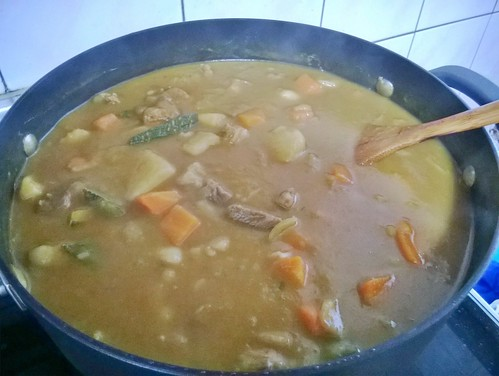 

剛從嘉義回到家的晚餐時間，小人貪看電視不想出門外食，那就剛好來把昨天的咖哩解決掉! 常備的關廟麵，不只適合佐哨子醬，拌上咖哩醬也very good~ 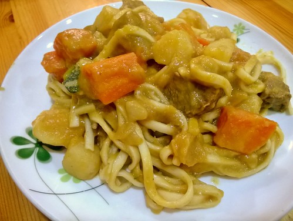
