最近的每天晚上 小人入睡 我也忙完家事後 我跟老爺總是窩在墊有小被子的沙發上看日劇 不知道是蓋著小毛毯好暖和 還是偎在一起好安心 經過這樣放鬆的我總能在上床後一覺好眠 打呼打的氣質蕩然無存... 這把年紀 可以有一起吐槽彼此 一起罵小孩 一起做著白日夢 還有一起看日劇的老公 真的是幸運且幸福的! 感謝老天爺!! 跟老爺也要努力1314下去!!! 以上寫於2013的最後一天

我的說煮飯 託大家的福 走到第七回了~

小人版的螞蟻上樹其實比較像是炒冬粉... 上週五炒哨子醬時，把豆干丁放到最後下鍋， 豆干下鍋前的肉末已加醬油,豆瓣醬,米酒的調味炒香，且盛起一些肉燥留著這週的應用! 今晚便將這肉燥同已泡軟的冬粉一起煮，五分鐘便讓螞蟻爬上桌， 雖然不道地，但愛冬粉的母子倆還是愛! 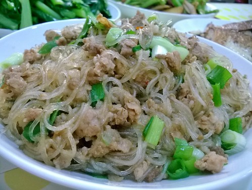

徹家的米蛋餅實在不應再登場，但今早等不及乳酪融化， 索性將原本在上的乳酪面翻成與鍋底面對面，試圖用鐡鍋的餘熱將乳酪焗了， 當我看到餅被乳酪焗成金黃恰酥模樣，眼睛-整個大亮， 就像是今日這個下雨天的大太陽，好喜歡!好開心啊! 另方面，高麗菜的盛產讓我不小心就下手太重，搞不清是米餅還是高麗菜餅了!嘿嘿...  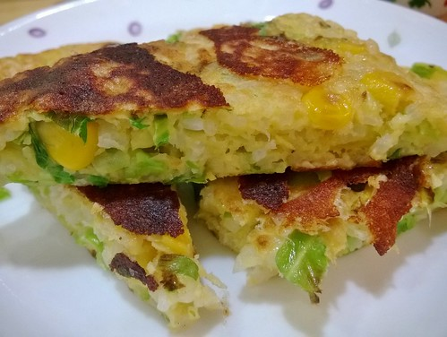  

白天有個朋友問我"今日主菜是?"，熊熊我真被問倒了... 因為每餐的家常菜還真推不出主菜，還是說有肉的就算是呢!? 那今晚有海味與山味的客家小炒可以算是吧! 魷魚,豆干,豬肉分別油炒香之後，最後連同芹菜,蔥段與調味料一起大火(相較大)炒勻炒出味 相較平常的炒肉，其實就是多個魷魚香氣與口感，以及醬油(膏)下的略重些，但就是鹹香下飯的"主菜"! 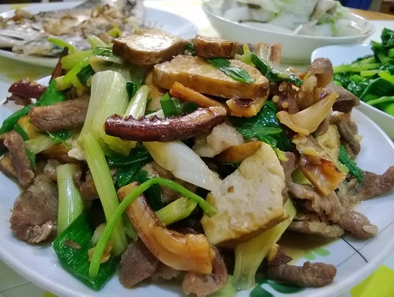 

受徹嬤會給小孩吃補的影響，我也常會燉中藥排骨或雞湯給一家子補氣! 我們補的很簡單，就是黃耆,黑棗,枸杞以及幾片的當歸與粉光蔘， 連同燙血水後的雞腿肉(或排骨)用大同電鍋燉個40來分鐘即可! 我冰箱裏常備著這些中藥材，好隨時使用，尤其在每二三週就會來一鍋的秋冬! 徹愛小時候都稱這是甜甜肉肉湯，因為完全沒調味的湯聞來好香，喝了好甜好暖~ 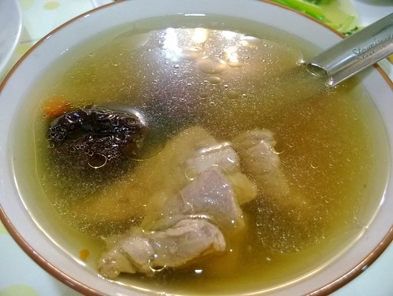 

上週六煮咖哩的同時也煮了一鍋番茄肉醬， 二顆洋蔥丁(加二顆蒜頭碎)先炒透明，六顆牛番茄丁與義大利香料粉加入炒香， 另再將各半斤的豬與牛絞肉煎炒香，然後加水與些許番茄醬小火煮約50分鐘(最後糖鹽調味)， 冷卻後分裝冷凍，一二個月內使用方便又還美味!(這樣份量可以讓我們吃3次) 週五晚來上ㄧ盤異於平日的意大利肉醬麵，就是令小人雀躍的小鼓勵與慰勞~ 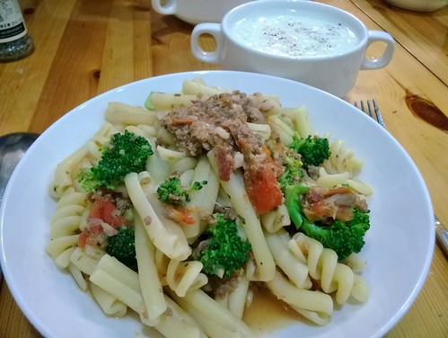 

很喜歡跟菜市場裏一位奶奶買菜 她的位置在市場很不起眼的小角落 放在籃子裏的菜就放在地上，客人得蹲下來買 而且菜樣式不多,數量少還長的不漂亮 但我喜歡蹲著買菜時，聽奶奶說著那個菜好吃，那些別處沒得買的菜怎樣難能可貴... 這個冬天跟奶奶買過二次不同品種的綠花椰，我好喜歡這在進口綠花椰上絕不會有的鮮翠與清甜! 這是直接跟小農買的幸福~ 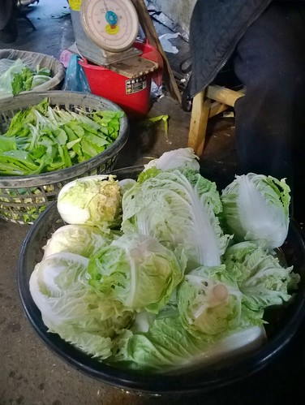 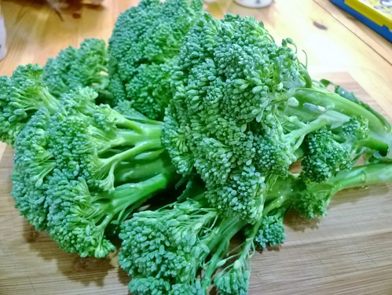 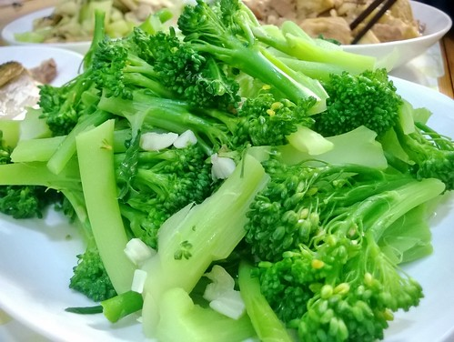   

有一次在味噌湯裏加了油豆腐，愛喜歡的不得了! 昨天煮晚餐時刻意的留下幾塊今早煮味噌湯，讓有些感冒的愛在又濕又冷的早晨呷飽~ 味噌久煮會有苦味，所以在闗火前的最後才加入， 而用個小濾勺如過濾般就可以讓味噌輕易又簡單的完全融於湯中! 沒有小魚乾，沒用高湯的味噌湯有點簡陋，但有高麗菜的加持也是另種簡單的美味~ (味噌加入後再下高麗菜絲煮一分鐘即關火，可以讓高麗菜吃來還清脆) 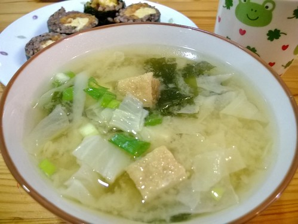 

上回的肉燥還有一些凍在冰箱裏，今日繼續變身上桌! 肉燥加碗水煮滾(口味想更重又加了一瓢豆瓣醬)後將豆腐丁下鍋滾一會，然後芶芡,灑蔥花 噹!麻婆豆腐輕鬆上桌~好下飯啊! 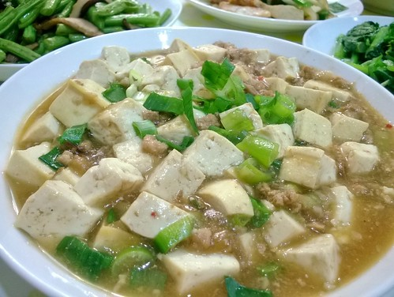 

以前我也很怕羊羶味，直到幾年前張嬤的清燉土羊肉蘿蔔湯才讓我開始接受被南部人奉為進補聖品的羊肉! 帶皮羊肉汆燙去血水後，加幾片薑與米酒用大同電鍋外鍋二杯水燉煮， 之後加入蘿蔔塊再用一杯水繼續燉(可再加入一二片的當歸與枸杞更香)，起鍋前些許鹽巴調味即完成! 這是不愛羊肉爐與薑母鴨的我們，喜歡的簡單補身子方式! 冷冷的天，喝上一碗身子都暖了~ 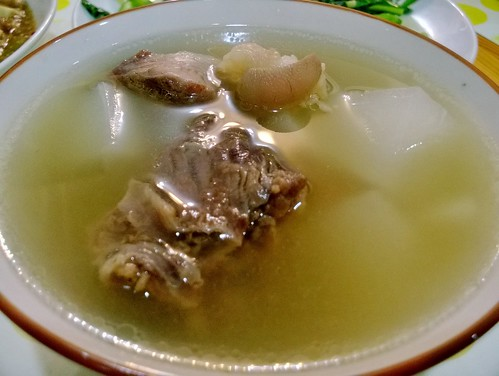 

室外只有11度的早晨更是當然要喝碗熱湯~ 雖然不若烤地瓜那般讓人愛不停口，但如南瓜湯煮法的地瓜濃湯，ㄧ樣的香氣十足且給人溫暖! 而且漂亮的粉黄色，有療癒喔~ 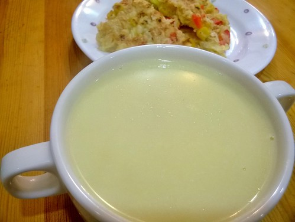
