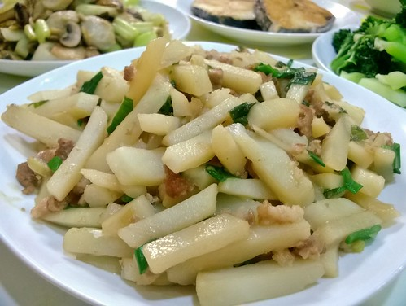

上週末徹爸的高中同學一家子來家裡玩 聊了一下午後 同學夫人忍不住參觀起我們的置衣間還有廚房 她說她好喜歡我們家東西都有自己居所的感覺 嘿嘿... 住了八年 總算有人發現徹爸娶了賢妻 弄了個滿室溫暖的家 雖然總是80分標準的我們 家裡不甚美麗 不甚整齊 也不甚整潔 但真的是我們最愛的小窩阿~

  趁著上上週徹爸幫我剛進行完一年一次的油煙機清洗工作　替我的小小廚房作個小紀錄 延續前屋主設計的廚房　雖然既不時尚又不科技 但這幾年經過我們陸續的增添隔板,架子與調整後　卻是讓我越來越得心應手的好廚房 ![DSCF0914[1].jpg](images/11800773795_5d06751cf9.jpg) 三口爐的廚具是縮短料理時間的大功臣 一口煮湯　一口煎魚　一口快炒　雖然有時後會有些忙不過來但這樣的分工很必須 .jpg](images/11801179704_39d68854f7.jpg) 從結婚就開始用的烘碗機　超乎我們想像的還健在且每日運轉著 而從冰箱 水槽 備餐檯 到瓦斯爐 由左而右的L型動線 讓在廚房打仗的我更是游刃有餘 ![DSCF0916[1].jpg](images/11801028253_6ebb8b8b83.jpg) 瓦斯爐對面 當初被裝潢師傅(我小舅)不看好而我硬要做的電器櫃 時間證明 真的很好用阿! ![DSCF0917[1].jpg](images/11800777195_3bed1ee470.jpg) 而去年新增 徹爸依我規格打造的置物架 雖然容易不小心就擱了東西 但真的好好用 (也雖然就也更容易買東西塞滿他) ![DSCF0918[1].jpg](images/11801030633_1b0f95bfd8.jpg) 以上就是每天早晚我的戰場 絕對比不上居家生活雜誌上的又大又美又炫的廚房 但貨真價實是我的廚房! +++++++++++++++++++++++++++++++++++++++++++++++++++++++++++++++++++++++++++

說煮飯走到第八回 開始有詞窮的情形發生了 不知道還能撐多久....

昨天在嘉義吃著徹嬤準備的有菜有肉有蛋還有罐頭小菜配著的清粥早餐時，阿公問”在台北媽媽ㄟ煮粥嗎?”，接著又問”要不然吃什麼?“ 小人答不上話，我也熊熊不知道怎麼説明我那些有的沒的，還時常是在清冰箱的早餐料理...阿公阿嬤請放心!我有努力給金孫吃飽吃健康的!!!只是今天早上又剛好在清冰箱剩料了... 煮濃湯剩的玉米醬一直被凍在冰箱，等候機會試Carol老師的牛奶玉米煎餅!看到愛秒殺的模樣，不用問就知道有好吃! 我吃著時覺得這口感似曾相識，小人也同樣覺得，而母子三人最後的共識是車輪餅，又甜又鹹、又軟又脆，有像! 參考: http://caroleasylife.blogspot.com/2010/10/blog-post\_30.html  

這半年好喜歡馬鈴薯，也特別留意and收納網友分享的馬鈴薯料理，偷別人的小技巧,小作法，轉換成適合我們家的方式! 今早的變相版馬鈴薯烘蛋是利用昨晚蒸熟且趁熱剝皮壓泥的一顆大馬鈴薯，加上兩顆蛋、半根的玉米粒(是滴!玉米湯沒吃完的玉米再剝成粒)、起司絲、一些蔥花與鹽跟黑胡椒的調味，平底鍋兩面各煎3-4分而成 不像原馬鈴薯片的口感，反倒似熱薯泥的口感還挺不賴!只是徹愛三片下肚後就也飽了，紛把吃不下的麵包交給我解決!阿娘會肥喔~ 早餐吃馬鈴薯真的很滿足阿!!!  

早安，2014的第ㄧ個上學天! 半根德國香腸是廚娘給小學生的小小禮物與祝福! 同時，用鹽去生過的小黄瓜片讓單調的麵包看起來既美式又帶台味，還挺delicious ~  

今天繼續來吃早餐~ 蔬菜燕麥煎餅，光想就對它的健康價值肅然起敬，而實際上不失所望的好吃又營養，只是二片下肚後也飽食感十足的讓徹哥大喊早餐可以不要吃這麼飽嗎... 一碗即食大燕麥加到ㄧ碗熱牛奶中泡軟，再加入一大匙(1T)麵粉,紅蘿蔔絲,蔥末,芹菜碎,高麗菜丁,玉米粒及二顆蛋(還有鹽跟胡椒調味)拌匀，一樣的平底鍋少油兩面煎金黃即可!  

麵包買回家(做好)第一件事? 快吃掉?!趁鮮趕緊吃是應該的! 還有就是把短時間內(我個人定義是24hr)吃不到的麵包，密封裝好放進冰箱冷凍庫裏存放! 一二週內要再食用，只要事先(前一晚)冷藏室或室溫回溫即可，若費心點再放到烤箱且噴點水回烤個幾分鐘(小烤箱若怕把麵包上層烤焦可在一開始或中途在麵包上面蓋鋁箔紙)，麵包的口感與香氣更是完整呈現!  

固定會買的菜攤，每次老闆娘都會偷偷塞ㄧ堆蔥,薑或九層塔給我(可見我真的是好客)，以前拿到一堆九層塔偶會有些困擾，因為我只會用來炒九層塔蛋 但後來發現把九層塔一葉葉取下並用保鮮盒裝著再冷藏，四五天內使用非常方便又給早餐增添些許變化與香氣，從此我這歐桑就豪不客氣收下老闆娘送我的任何東西了! 小餐包夾上培根與九層塔蛋是徹愛今日的堡~  

小阿姨的韓式泡菜是我們冬天期待的辣味!(雖然也只有微辣) 豬肉片先用醬油與一半泡菜(連汁)醃過，炒軟洋蔥後放入肉煎炒至變色(為了讓肉片都能貼鍋底，分了二次放入)，然後加入泡菜,蒜苗片與蔥段大火炒匀，並以醬油與些許鹽糖調味 新鮮多汁又酸酸辣辣的泡菜炒肉，真是夠味又下飯~  

一樣的絞肉馬鈴薯，左邊是今天炒而右邊是一二月前所煮 連老爺都看的出ㄧ邊的馬鈴薯是切條狀而另一個則是切塊狀 但除此之外煮法的差異更是關鍵 右邊的馬鈴薯切塊後先用蓋過的水量煮熟，然後撈起加入已調味炒香的絞肉中，大火炒收汁即可  左邊則是先將絞肉與蔥炒出香氧且加入一匙多的醬油後，倒入生馬鈴薯條與適量水燉煮十來分鐘且加鹽調料後起鍋 右邊多保留馬鈴薯的清脆口感與絞肉醬香，左邊則縮減近一半的烹煮時間且馬鈴薯更顯入味 不同的口感與香氣，但一樣的好吃!不過我還是喜歡黏稠感馬鈴薯多ㄧ些...  

昨晚煮飯前突發奇想的切了幾塊南瓜放入電子鍋中同飯一起蒸煮，讓徹哥盛飯時還被”南瓜飯”給嚇到，好在南瓜是要留到今早打南瓜燕麥牛奶，這才讓徹哥鬆口氣! 煮飯的同時，南瓜連皮被蒸軟到筷子一碰就可成泥，好方便早上三分鐘準備好這”吃健康”的飲品! 意外的是小人竟然完全不排斥... Good!
