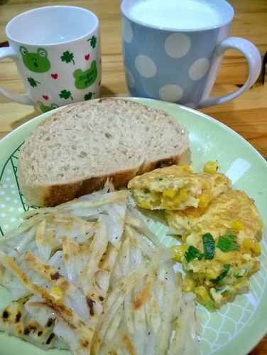

常想台灣人真是幸福 一年到頭都充滿節慶歡樂 尤其歲末年初之時 從十一月底各處聖誕樹開始林立 濃濃耶誕氣氛揭開年節商機 過了一個月聖誕節後 緊接著的是跨年與元旦 休息幾天之後 家家戶戶又開始為農曆新年做準備 大掃除 採買年貨... 這個年更是一過就是元宵過後  陽曆二月半不知不覺就來到 年也走了四分之一去 台灣人很苦命但也真的很幸福!!!

雖然我常說"過日子比過年重要" 所以從不為了過年而大費周章 但我喜歡過年時所有兄弟姊妹回到婆家而人聲鼎沸 熱鬧滾滾 大人小孩開心的玩 盡情的聊 忘我的吃 而我努力的把婆婆塞滿冰箱的食物煮上桌... 馬年 祝大家也希望徹家 馬到成功! 萬馬奔騰!!!

我的說煮飯走到了九 "9" 感覺很大的數字 但換算後也不過18-9週的時間 離自己預訂的目標還很遠 要鞭策自己繼續下去! 

獅子頭是開始煮菜時從電視上的”阿鴻上菜”學來的難得可稱大菜的菜 20年過去，當初的筆記已不知塞到那去，但卻還依晰記得主持人解說的步驟，因此我也總是憑感覺做這道菜， 今天心血來潮依著食譜調料(某些堅持還是留著)，結果還是原先習慣的就好... 加了洋蔥丁的獅子頭多些清甜又解膩，而簡單鹽,酒,醬油的調味就也很夠了!  小學生期末考的早晨，沒有備上公主ㄧ直明示的歐姆蛋但端上了兄妹肯定喜歡的凍豆腐味噌湯~ 豆腐保存期限只有短短幾天，但切塊後凍在冰箱裏，不只延長保存也變身成更富層次感食物，尤其飽吸湯汁後... 另方面，自己用好豆腐做成的凍豆腐，其香氣與口感大大優於外頭買的，超級迷人的~  期末考第二天竟失約還是沒給公主奉上歐姆蛋... 因阿母醒來時，鬧鐘的分針一樣指在平常起床的6，但時針卻已偷走到了7! 因為不可帶不能重覆使用的飲料瓶到校，今天又是升旗日恐沒時間吃早餐，於是煮了鮮奶茶用保溫瓶裝到學校喝， 加上出門前啃完的一根香焦，不愛外面早餐的小孩就這麼解決了早餐! 沒想到公主回家後高興的說“早自修喝的奶茶真是太好喝，希望媽媽以後每天都睡過頭”，ㄟ... 二杯熱開水(約500cc)加二個紅茶包煮2-3分後加2T黑糖，糖融後再加入與水約等量的鮮奶煮至喜歡的溫度即可 這樣的濃度與甜度剛好的讓我們喜歡(而且4分鐘快速上桌 這也很重點)  前陣子在costco看到”傅培梅的家傳菜”這本書，雖然向來對於大師的大菜料理望而卻步， 但因為好奇大廚師家到底吃些什麼而翻看了，結果書裏所寫的”家”的料理，平實,溫馨又經典的值得收藏並效法學習之~ 有一天愛愛依在我身邊跟著看書，然後好開心的跟我點了書裏她最喜歡的這道菜 ”四季豆燒粉絲”裏頭有愛愛都好愛的四季豆與冬粉，在我看來就像是乾扁四季豆與螞蟻上樹的聯集變身版， 而没想到真的如書上寫的好料理,好味道!徹家也來偷學家傳下去唄~  好開心的愛愛把她的飯碗擺得好迷自己阿! (有阿姨問: 好迷自己是什麼創新形容詞嗎 媽媽說: 哈~阿母亂亂創的 因為沒有好迷”人”，只有迷昏她自己)  繼昨天愛妹的菜，今天上徹哥好些天前點的像涼拌麵的乾麵~ 於是週五的簡單吃日繼續試傅培梅老師家傳的獨門炸醬，這道獨門是當初吸引我買書的重點所在! 獨門的特點在於加入白菜丁，讓整個炸醬多份清甜而不膩， 另方面另鍋炒香醬後再加入分已炒熟與炒軟的絞肉與菜丁則讓醬香盡出~ 徹哥沒幾下吃完一盤還喊要，而徹爸邊吃邊說了好幾次“不錯吃”，真的很優的獨門炸醬喔~ 作法可見: [vivalavida99.pixnet.net/blog/post/29206629-程安琪老師提供的傅培梅家傳10道菜食譜](http://vivalavida99.pixnet.net/blog/post/29206629-程安琪老師提供的傅培梅家傳10道菜食譜)   今天第一次拔蘿蔔好開心! 沒法吃到鮮採蘿蔔有些殘念，但剛好拿以前的蘿蔔照片墊檔 ”炒大根”也就是炒蘿蔔，從阿基師的不知道那個節目還是書學來的， 不同於清恬蘿蔔湯的醬燒蘿蔔，超級鹹香下飯! 蘿蔔切0.5-1公分薄片，少油兩面煎上色後盛起，絞肉炒香炒散，加入醬油,味醂,米酒(分為3,2,1T),半杯水(水不夠就再加)與蘿蔔煮10分鐘左右即可(中途翻面讓蘿蔔上色均匀)  關山拔的蘿蔔跟著我們出門在外好些天，總算在今天上了我們的餐桌! 因為新鮮、親手拔以及農友的熱情分享，今天的蘿蔔湯特別的清甜又溫暖! 這些幸福都是當初跟小農購買時所始料未及的... 汆燙排骨時，用冷水煮起(不是用沸水汆燙)可以讓肉的鮮濃更容易釋放到湯中喔!  入境隨俗跟著民宿主人吃了好些天早餐，我是每天吃最飽的人，而小人則到底還是習慣媽媽牌早餐... 小人很難養但其實吃的很簡單，煎馬鈴薯餅、玉米蛋都是媽媽準備容易而小人喜歡的早晨開胃菜， 再搭上—片麵包、一杯牛奶(茶)與徹的二片蘋果，就是小學生眉頭絲毫不會皺的活力brunch~  其實大白菜才是主角的”炒炒肉”， 是傅培梅老師為了讓愛吃肉的家人多補充點青菜的用心下所家傳的好料理!過年大吃大喝前少吃些肉，剛好來試試~ 包含有肉絲,香菇絲,紅蘿蔔絲,黑木耳絲與蔥絲(依序為下鍋順序，但肉炒散後先盛起等最後調味前再加入)，並用醬油(1.5T),鹽與最後嗆入烏醋與麻油的調味，完成這看來豐富、吃來香酸的炒大白菜，讓我們大開眼界也很是喜歡! 只是老師交代的要大火快炒大白菜以避免出水，我的平底深鍋加中火果然炒出好些水， 但誰讓這季節的大白菜也是如此多汁甜美~  年前少吃肉替代之蛋料理~ 一直很喜歡紅蘿蔔炒蛋這道菜，因為顏色很漂亮而且可以—次攝足大量的紅蘿蔔營養! 此外紅蘿蔔絲加點水燜軟再倒入少許油翻炒，經過足夠糖化的紅蘿蔔，其獨特香甜盡釋且非常美味!是不愛紅蘿蔔的小人也破例會喜歡的紅蘿蔔料理! 
