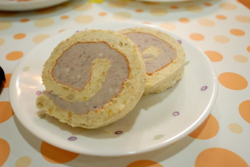

徹愛上小學的全天課都是吃學校的營養午餐 雖然電視上有關小學營養午餐出包的小新聞不斷 雖然阿徹會有點小羨慕家長親自送餐的同學的好吃午餐 也雖然阿徹曾經希望我也幫他準備便當讓他在學校蒸便當吃 但我跟徹爸對營養午餐的堅持卻從沒有動搖過 除了因為用大蒸箱蒸過的便當實在很令人不敢恭維外(我中學吃了六年的蒸便當很有體會) 最主要的原因是我們覺得團體生活中跟同學吃一樣的東西也是種學習 而且哪個爹娘不會特意準備小孩子喜歡吃的午餐呢 即使均衡也難免會躲避小孩挑食的食物 我總是跟徹愛說"學校的午餐什麼都要吃 遇到喜歡的可以多吃點 但不喜歡的也要吃只是可以少一些" 我希望徹愛能是喜歡食物 適應食物的好小孩!  這是我自認目前對他們的教育中做的最好的部分

晚餐餐桌上  徹愛常會跟我說起今天中午他們吃了什麼 吃了多少 前幾天 扒著家裡混糙米白飯的愛愛說"我們營養午餐的飯常像這樣加好多東西" 然後他說那天中午的飯裡有糙米 白米以及一種黑黑圓圓的 結果"倒飯"的桶子最後被同學倒滿了大半桶 愛愛形容的表情很誇大 我聽的表情也難以置信的很誇張 我問"那老師沒有說什麼嗎?" 愛愛說"同學都是趁老師沒注意時後去倒的 而且老師只要求把菜吃完" 雖然我之前就聽愛愛說過老師要求她們午餐不能剩菜 飯隨小朋友意 但我真的很難接受這樣的事情.... 營養午餐的五穀雜糧飯 其一開始的良好立意好像反而造成小朋友的不珍惜 甚至沒吃飽 而這樣的問題是出在到底父母們平日是怎樣養小孩的嘴 還是營養午餐設計的不夠好 老師執行的理念與方法不甚妥當... 我想每個大人都有責任!

徹愛從小常被老人家唸"難養" 因為別的孫子常一大碗的滷肉飯就可以解決一餐 甚至好吃的模樣很令老人家驕傲 而徹愛們吃一頓飯卻是要有魚有肉有菜 還要有一鍋熱呼呼的湯 而且阿嬤們看著徹愛那白白的飯常會好心的要幫他們澆滷汁 因為"沒鹹怎麼吃" 雖然阿徹們總是說"白飯這樣就好" 但大家總認為那是我們對小孩控制太多 老實講我真是啞巴吃黃蓮 但隨著長大 徹愛卻是這些孩子中最能好好坐在餐桌吃飯 最能接受餐桌上的大部分菜餚 原來養小孩的嘴就像生技業一樣 需要好多年的時間與心力投入才能看見投資報酬阿!

網路上常看到很多媽媽費盡心思的幫小孩準備營養又美觀可愛的早餐或便當 媽媽們的初衷當然都是希望小孩能多吃點 尤其是那些營養但偏偏小孩都不太愛的紅蘿蔔 青菜... 老實講我不很認同這樣的作法 因為小孩面對沒有這樣裝飾的便當怎麼辦?長大後怎麼辦? 我一直認為讓小孩接受食物該有的外表 該有的味道是從小便需訓練的 或許在一開始可以讓小孩對於不喜歡的食物只吃一點點 也可以把那些較不討喜的紅蘿蔔 洋蔥等切細一點甚至磨成泥狀加到料理中讓小孩不自覺 但小孩每天面對的食物就應該是我們日常生活中三餐該有的模樣 讓小孩接受一頓飯該具備的模樣 學習好好吃一頓飯 甚至享受一頓飯帶給身心的滿足

以前每次逛百貨公司看到琳琅滿目 一個比一個漂亮 甚至一個比一個實用的鍋具 我常很心動 也曾經買過一個貴三三的春天鍋 鍋子的確不錯用  我甚至還曾偷偷許願以後每年都買一個好鍋送自己 但幸好隔沒多久後 有一天我突然恍然大悟想起小時候媽媽的廚房 結婚後婆婆家的廚房 這兩個每天把煮晚餐視為理所當然的老媽媽廚房裡 一個有名的鍋子都沒有 每個都是五金百貨行買的便宜鍋子 雖然煮的也稱不上是美食 但老媽媽們一輩子煮了這麼多飯 把我們養了這麼大... 好用的鍋子夠用就好 (當然一樣是好用也是有名牌跟非名牌的迷思) 一個再美麗再齊全再豪華的廚房都比不上有一個願意煮飯的媽媽(或爸爸) 這一兩年徹爸常會說"媽媽是一個家的關鍵" 一個家怎麼吃 怎麼作息 怎麼生活 怎麼幸福 絕對的關鍵點在於媽媽 雖然徹爸這話是個肯定但也絕對是個任重道遠的託付阿... 但捨我其誰呢~

話說我那個超慢累積到第16捲的蛋糕捲怎麼還是捲的這麼醜阿 尤其照比例的芋泥一整個多到誇張 不過第一次嘗試的芋泥捲真的好好吃 尤其在這個季節.. 
