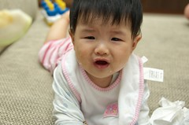
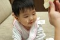
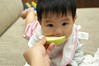
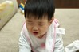
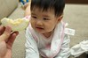
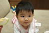
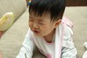
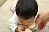

雖然知道醫生建議 就算喝母奶滿四各月後還是需要開始添加米粉等副食品了  
但妹妹滿四個月後 剛好遇上阿徹哥哥因輪狀病毒住院及之後的四口人輪流感冒  
所以就這麼一直耽擱著  
我想除了忙外 懶應該是最主要的因素吧  
真所謂老二照豬養 隨便啦~

直到兩週前 有天爸爸突然拿了哥哥倫狀病毒期間吃剩的牙牙餅給小愛吃  
(是哥哥吃剩的喔 還不是專程要買給妹妹吃的)  
一吃 哇 還真像回事ㄋ 拿的很好也吃的很好  
感覺像是有訓練過了 也許是在保姆家吃過了吧  
加上這陣子妹妹開始有了七情六慾  
除了看到哥哥跟自己的奶會抓狂外  
看到我們在吃飯吃水果 也會嘴巴舔阿舔的 咿咿ㄚㄚ叫個不停  
因此當我跟阿徹吃飯時 牙餅是打發妹妹最好的東西了  
雖然小愛會把牙餅吃的滿臉滿手滿腳(因為吃完的手會去抓腳)  
但真的粉安靜喔 可以讓我們好好的吃晚餐  
我知道這樣的打發妹妹實在粉不應該  
但說真的對老二最大的期望就是"麥哀丟後啦"

這幾天也開始用點米糊 蘋果泥給妹妹吃了(芭樂是整片啃 夠懶的媽)  
后~常常給她吃的不顧形象  
看到媽媽的湯匙靠近就激動的手腳並用  
手是用來抓住湯匙往嘴裡塞(力氣還真不小ㄋ)  
腳的話 應該是有輔助出力的作用吧...  
如果媽媽的動作稍微慢一點點就發出如怪獸般的咿咿ㄚㄚ叫聲  
我猜他可能覺得為啥吃東西不能像喝奶那樣源源不斷吧  
常常吃到後來既髒且番  
搞的爸爸忍不住露出一絲絲的嫌棄  
待我把小愛弄的乾乾淨淨了才說"這樣才可愛ㄇㄟ"

昨兒個拿著既香且軟的芭樂給妹妹啃時  
總算照下他吃東西的醜樣  
哈哈真的ㄞ的很醜 但是粉可愛哩  

