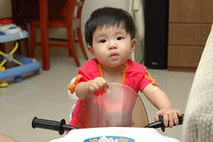
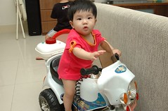
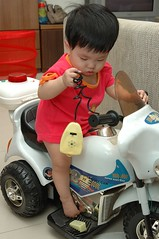
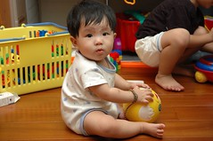
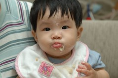
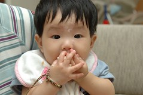
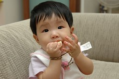
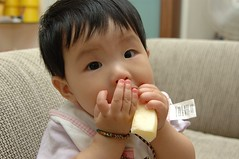
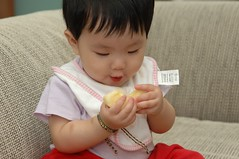
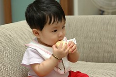

最近覺得小愛成熟不少  
不管心智或是行動力上都有顯著的進展  
跟徹爸兩人看到小愛這樣一步一步的成長  
常忍不住露出一絲的微笑  
笑啥~  
哇哈哈 小愛快要不是奶娃了 我們就快要解脫了~  
嘿嘿~實在是正向思考過頭的一對父母  

某天徹爸跟阿徹有點無聊  
於是心血來潮的把小愛放到哥哥的摩拓車上  
想不到小愛也坐的煞有其事  
甚至有點enjoy ㄋ...

  
這幾天小愛坐在她的學步車裡甚至會追著哥哥的摩拓車跑  
邊跑邊笑 十足小跟班的模樣~

小愛也越來越能夠自己玩玩具了  
雖然大部份的時候都是搞破壞的去拿哥哥正在玩的東西  
所以時常可以聽到阿徹哥哥大喊  
"妹 你在做什麼阿"  
"妹妹~不可以"  
"媽媽 把妹妹抱走"  
妹妹面對阿徹哥哥突如其來的把她手上東西搶走  
以前幾乎就是兩眼瞪大 傻呼呼也無能為力的看著東西被拿走  
但現在卻偶而會生氣 會發出個怒吼之聲  
不過唉個一兩聲抱抱秀秀就OK了  
我想個性應該是屬於溫良恭謹派的吧

現在一天已經可以吃到近兩碗粥了  
只是粥吃歸吃 奶量似乎也沒啥減少  
常常在吃了7-8分碗的粥後一小時便心情焦躁不安  
若適時給予ㄋㄟㄋㄟ 心情便能恢復平靜  
媬母開玩笑說 小愛有兩個胃一個是喝奶的 一個是吃粥吃水果的

現在看到我們吃東西也都會唉唉叫個不停  
尤其是水果常會很激動的想辦法站在你附近要你注意她  
若沒給她一份的話會哭的粉可憐  
水果再多也幾乎都能下肚  
常常會吃個半顆到一顆的蘋果  
(嘻嘻 阿徹跟小愛果然都有遺傳到媽媽愛吃水果的習慣  
 據說媽媽小時候每天若沒吃水果是不睡覺的)  
而雖然只有下顎長了兩顆牙  
但很愛自己啃東西吃 乾白飯也吃的很好了  
我吃飯時 坐著學步車的她就常這麼來來回回的張口討飯吃  
吃完一口後 還會從後方拉拉我的手  
待我轉過身便又看到一張嗷嗷待哺的小嘴  
模樣煞是可愛~哈哈

