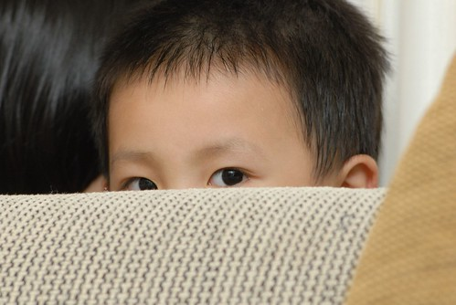

阿徹最近很愛找爸爸玩躲貓貓  
可是阿徹很膽小 眼睛也很小   
爸爸可以躲在黑暗的廁所門後不被發現  
也可以拿著浴巾從頭蓋住頭身卻大剌剌的站在嬰兒床邊不被阿徹發現  
雖然家裡很小 但阿徹常常找不到爸爸 還要問我"爸爸躲到哪裡去了"  
然後爸爸偷偷摸摸的出現在阿徹面前 大"哇"一聲  
阿徹大笑著用顫抖的聲音問"你躲在那裡ㄚ"  
爸爸說"那是我的秘密 不要告訴你"  
  
輪到爸爸當鬼數數 阿徹常常很得意 很躲躲藏藏的 去躲在他號稱很秘密 很屬於他的地方  
其實阿徹再怎麼躲也是那個地方  連妹妹都知道了  
但是爸爸還是要假裝四處找他 然後像是發現新大陸般的突然找到  
要不然就是派出小羅囉 "妹 去找哥哥"  
然後小愛就蹦蹦蹦的跑到哥哥的秘密基地 望著哥哥  
一附"哥~你在幹麻阿 不用躲了啦" 然後哥哥大笑跳出 兄妹跳成一團  
而我跟徹爸有點無奈有點好笑的笑著  
真是無厘頭的阿徹  很傻 很真....  
  
  
這就是阿徹的秘密基地 沙發與大門間的小縫  寬度剛好容下阿徹塞入  
  

常常冷眼旁觀著哥哥 爸爸躲來躲去的小愛  
找不到人的時候問她就對啦  
  
  
  
哈~被發現躲在這裡了  
  
  
  
跟屁蟲的小愛偶而也躲到這裡過過乾癮  
體會一下徹式的無厘頭  
  

