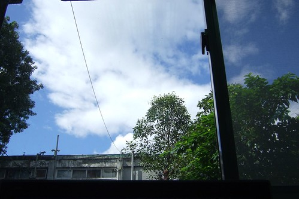
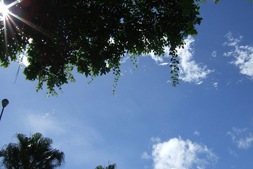

坐在辦公桌前對著電腦螢幕 啪啪的打著SAS程式(這是我賴以維生的伎倆阿)  
累了或是思考時  抬抬眉 眼角上喵30度看到的便是這片"台北的天空"  
雖然有綠樹陪襯的天空很美 但向來不習慣安定的心還是想換個天空看看~~~  
  

只是年紀越大顧忌越多 再也不敢像年輕時那樣的不顧一切 裝上翅膀便往前衝  
只敢先摺個紙飛機射去別的天空探探路  
  
曾經紙飛機回報"那的天空似乎不錯 以後也許可以開幻象"  
讓我忍不住勾勒起美好的未來  
條件越開越嚴苛 "要專屬跑道 要特別條款 要重金打造..."  
但最終還是應驗了我常說的那句話"天下沒有白吃的午餐"  
所以我還是繼續吃飽飽 睡飽飽 每天開開心心的看眼前這片藍天白雲吧  
  
雖然只是小小的研究助理  
雖然工作內容離"統計分析師"的期望值有點遠  
雖然同事有時候不成材的讓人搥胸頓足  
  
但我真的明瞭也死心  
再也沒有工作可以像現在這樣  
可以讓全家每天睡飽飽到8點起床出門  
可以讓我在上班前偶而帶小孩去看看病 去市場買個菜  
可以讓我5點準時下班回家準備晚餐 接小孩  
可以讓老公在嘀咕想去看電影的時候 馬上有人附和且當日下午成行  
可以讓我完全責任制到自己掌控工作進度  寫blog的進度  
.........  
這片天空真的還挺遼闊 空氣也挺新鮮的  
偶而還可以看見穿過樹葉的星芒~~~  
  

