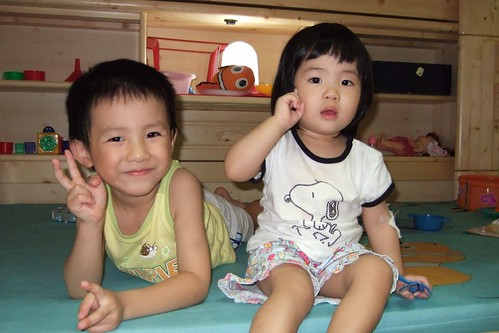
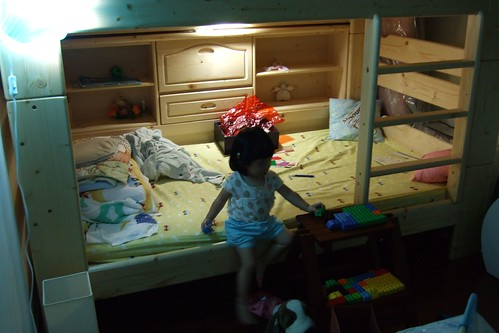
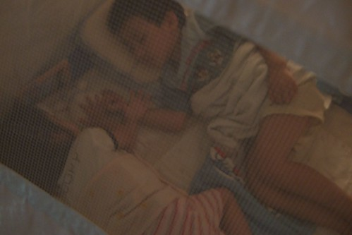
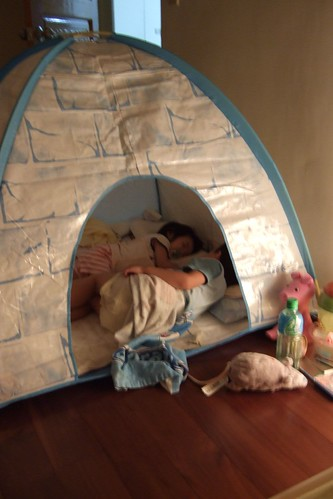
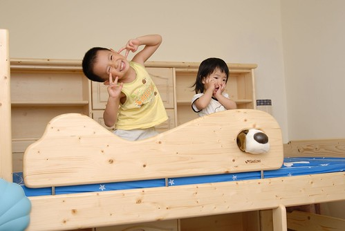
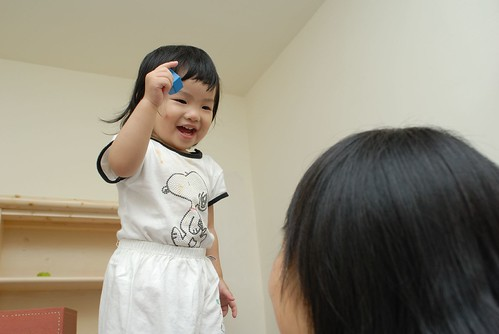
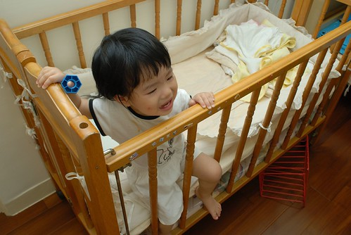

空了兩年的兒童房總算"名符其實"的被"正名"了....  
  
原本這放了座大衣櫥 舊床墊跟一堆暫放的東西 (其實就是我們家的第二儲藏室啦)  
只有在徹公徹嬤上來住時才會清的像個可以睡覺的客房  
總算在我跟徹爸下定決心約了搬家公司要把大衣櫥運回嘉義後一切開始有了進展  
首先整理出數袋可以送人的小孩衣服  
(現在又堆放在更衣室一角 有興趣的人可以約時間來撿 先撿先贏)  
然後又清出數"大"袋原本暫放但其實根本不會再穿的衣服去慈濟回收  
以及丟掉一大袋殘破不堪被徹爸一點一滴偷收起來的玩具  
然後在搬家公司運走衣櫥的那刻  這房間總算有空間可以擺兒童床組了  
於是當日傍晚一家人就雀躍的去三重湯臣訂了半年多前看上眼的床組

床組送來組裝好的那晚 全家都好開心  
尤其我跟徹爸的興奮期待應該更勝於阿徹與小愛  
其實我跟徹爸只想著"先把房間佈置好 再慢慢的讓阿徹們自己睡覺"  
所以我們開心的是家裡又多了一個可以遊戲的地方  
就像阿徹說的"這是第三舞台" (繼遊戲區第一舞臺 主臥第二舞台之後)  
  
  
  
床組運來後的一週內又陸續搬走房內數多暫放的東西  
該丟的丟  該放廚藏室的 該放更衣室的就是想盡辦法給它喬個空間  
然後端午假期的最後一天開開心心的去IKEA買燈跟答應阿徹的"帳棚"  
新帳篷馬上全盤佔據阿徹的心房   
鋪好小棉被後啥不巄東的心愛玩具全搬了進去  
儼然這是他溫暖的小窩 他的秘密基地  
晚上還主動且堅持的要睡在這帳篷裡  
小愛妹妹也湊熱鬧的搬了她的枕頭進去  
於是成就了這幅兄友妹恭 相親相愛 同床共枕的畫面(畫面並無作假  一切只能說是巧合)  
只是這個原本冬天睡起來會暖呼呼的帳棚  夏天睡在裡面可是會大汗滴小汗流阿  
尤其又是超怕熱 睡覺時會渾身發熱像個火爐的小愛  
所以這幕令人感動的畫面只維持了2個鐘頭   
最終小愛還是被放到下舖吹涼涼 兄妹倆獨自睡覺  
  
夜深跟徹爸巡完田水回到"我們的"房間睡覺時  
老實說感覺很"奇怪" 房間熊熊這麼空盪 這麼沒人氣一時之間還真的有點難適應  
我們自嘲已經變成孤獨老人了  
徹爸甚至說"現在這樣沒睡一起就好孤單了 以後長大離家那怎麼辦阿"  
我淡淡的回徹爸"你會習慣的"  
直到現在已經2個多禮拜  徹爸躺在床上還會直唸著"好想妹妹喔~"  
ㄟ~小孩就在隔壁房睡覺而已 這麼難分難捨  
所以其實是徹爸比較迷戀這兩個頑皮豹的  
(這是沒生氣時的徹爸很愛用的親密形容詞"妳們這兩個頑皮豹" )  
  

會買這個床組除了因為標準單人床size可以睡到長大成人  
主要還是因為有側櫃的設計  
為防小孩半夜跌落床下 靠牆放床是無可避免的對策  
但是寒天冬夜裏 冰涼涼的牆壁卻可能是小孩感冒咳嗽不止的元兇  
所以這深達20多公分的側櫃設計深得我與徹爸的心  
從半年前無意見看到後 我倆便一直放在心上  
雖然期間也陸續上網查看一些兒童家具  
甚至心動的想要買色彩豐富 饒富趣味的兒童床  
但就像美賢說的"徹家是走實用派的 這床果然有徹爸徹媽的風格"  
  
  
  
有了這床 阿徹在遊戲區的時間減少許多  
因為很多家當都搬進來了  
而小愛當然是跟在哥哥屁股後面忙嚕  
  
  
  
下舖裡的照明不甚明亮  
阿徹自己拿家裡的停電被用燈來放  
兄妹倆開心的玩起辦家家酒遊戲  
  
  
  
有了上下舖床 媽媽又費了一番時間上網搜尋比價  
買了三件床單 兩件防濕保潔墊  
發現原來要搞各兒童房還真花錢哩  
  
(小愛裝模做樣的躺著看起書來)  
  
  
阿徹在IKEA挑了個貝殼夜燈 (媽媽本來想買個大太陽或獨角仙造型的說)  
加上徹爸挑選的下舖照明燈  
就寢前的燈光氣氛實在還挺不賴的  
  
  
  
透過帳篷透氣窗望進去的熟睡兄妹倆  
  
  
  
兄妹倆獨自睡的第一晚  
清晨四點多正在好眠的媽媽突然聽到從客廳傳來的呼喊聲"媽媽~你在哪裡?"  
嚇的媽媽跳起來趕緊去客廳認小孩 然後帶進兒童房陪睡到起床準備上班  
接著幾天阿徹已經漸漸知道也習慣要去爸爸媽媽的房間找人  
所以我常在半夜被阿徹搖醒 "媽媽 我會怕" 然後牽著小孩轉往兒童房睡  
(幸好買的床鋪還夠我捲縮在小孩旁睡覺)  
要不就是一大早6-7點被叫醒泡奶 "媽媽 我要喝ㄋㄟㄋㄟ"  
而小愛不知是否因為少了嬰兒床的陪伴以致夜夜哈冥唉唉叫  
頭一週的適應期就這麼搞的我跟徹爸每日睡眠不足  
投降的每夜早早上床睡覺 不敢再貪戀於電腦電視前  
  
  
  
看到阿徹每晚開心的入帳棚睡覺  
徹爸忍不住嘀咕 早知道這麼愛睡帳棚一開始就不用花這麼多錢買床組啦  
不過睡了一個禮拜的帳棚最終還是在阿徹被好說歹說的勸服後退出兒童房  
實在不是我們忍心要剝奪阿徹的樂趣  
而是為了在房裏再放進妹妹的嬰兒床讓我跟徹爸煞費心量  
兩人就這麼帳棚 嬰兒床 小書櫃邊移邊想了半小時  
最後決定讓帳棚進佇遊戲區 (一個禮拜後在爸媽的說詞下 帳棚又在遊戲區被收起來了)  
小愛就能在兒童房睡他原本的嬰兒床 而阿徹睡在雙人床下舖  
那晚阿徹跟小愛一夜好眠到天亮 沒勞假爹娘一絲一豪  
  
(該說是帳篷太大還是房間太小ㄋ  這裡真的容不下帳篷了)  
  
  
擔心阿徹睡上舖 恐怕半夜會哈冥站起來然後"咚"的掉下去  
所以睡覺空間只開放下舖 上舖只能當作遊戲 辦家家酒的地方  
  
  
  
看到哥哥上去 小愛也想上去  
無奈她目前的能耐只能央求爸媽給她抱上去  
上去了我們也得隨侍一旁免得慘案發生  
  
  
  
小愛上去後蹦蹦跳跳的可開心 可是看的媽媽皮皮挫  
很怕小愛不小心跌下來 而我也沒接到   
  
(愛)媽媽乖 不要怕 我會自己小心保重的  
  
  
  
(愛)媽媽你要不要也要上來ㄚ  
  
  
  
還是丟到嬰兒床裡讓人放心些  
  
  
  
(愛)這是我最愛的小床 我睡稿稿的地方  
  
  
  
(愛)可是妳們不能在外面玩的那麼開心 放我自己在這裡面啦  
  
  
  
(愛)我也要畫啦~ 我也是這房間的共同持有人之ㄧ哩  
  

