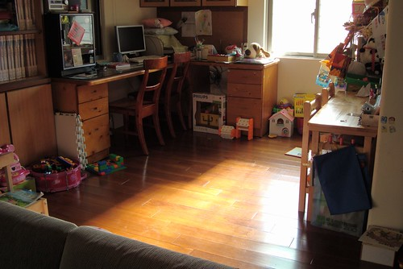

自從"阿九"當選後 有關他老婆要不要再上班成了全國上下矚目的焦點   
政論節目裡各大名嘴 政治人物也討論的沸沸揚揚   
連我跟徹爸倆人也湊熱的激烈討論一番 所幸我們倆個的看法相差無幾   
上週六看了水果日報中的專訪 有一段話很是讓我感動  
阿九說小青(講的我跟他們很熟的樣子)不喜歡參加飯局是有一個背景故事的  
在他們小孩還很小的時候  有一次長輩請的飯局 小青原本不想去的(大概因為要接小孩還照顧小孩的)  
後來夫妻倆還是有一起去參加 但因為跟保母約兩點要接小孩  
所以當時間一到他們要提早離席時 長輩有點生氣的問"難道接小孩這麼重要嗎"  
(小九說) 這當然重要!    
因為文章中這句話之前用了個句點分隔 所以無從了解阿九當下是不是真的就這麼有guts的回應長輩  
但之後阿九再也不要求小青參加飯局  因為既無趣又沒必要  
不過真正令我噴淚的一句話是 (說噴淚是太誇大了點)  
他說"我不希望成為她的負擔 她也不需要成為我的附庸"...  
是阿...阿九何嘗不是小青的負擔...  
一個可以尊重自己老婆的領導者不也樹立了一個好典範  況且人家自有進退分寸的   
若真的失態不恰當了社會自有公評的....  
  
身為媽媽 我真的可以深刻體會感受 趕著時間接小孩的心急與辛苦  
其實讓小孩在保母家 在學校多待晚一些也沒有什麼  
其實把小孩托給別人 夫妻倆出國逍遙放鬆幾天也沒什麼  
但就是...放不下心阿... 起碼對我跟徹爸來說很難  
所以要努力去調適 尋找出屬於我們家自己的幸福運作方式...  
  
每天早上起床從臥房出來後 總喜歡走到客廳旁看看陽光灑進的遊戲區幾眼  
整區就是小孩生活嬉戲留下的混亂與痕跡  但可是我與徹爸每天努力幹活最大的動力阿...  
   

