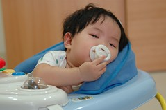

一直覺得睡覺時候的baby是最可愛的  
沒有嘰嘰喳喳的說話聲  
沒有哇哇蛙的哭鬧聲  
更不會東爬西走的讓人需要時時盯著

猶記得阿徹6各月大還不會爬前  
每天晚上8-9點 只要把它安妥放好在他的床上  
他便能自己自己沉沉睡去  
只消夜半起來喝個1-2次奶  
睡眠狀況還算安穩

小愛卻很容易因為一點風吹草動而被驚醒  
有時即便才入睡5-10分鐘 被吵醒後又能如"大睡"初醒般的清醒  

方要再熬個1-2鐘頭 搞的爸媽呵欠連連方才罷休  
因此即時小愛常常晚上8-9點便雙眼迷濛 頭腦混沌  
總會被爸媽想辦法ㄍㄧㄥ住 不准睡著  
唯有等到徹哥哥9-10點開始進行睡前三部曲 講故事 喝奶 刷牙  
她才能如獲得"假釋"般的自由睡去  
有時心疼她實在睏的受不了 讓她小憩片刻  
我總會被徹爸冠予"不才"的指責...

雖然每個小孩都有自己生活的節奏  
但是基於大眾之考量(爸爸 媽媽 徹哥哥)  
小愛你就委屈點 配合一下大家吧~

某個發燒的週日下午  媽媽出門喝喜酒  爸爸跟哥哥忙著吃中餐

被晾在學步車上的小愛 就這麼的喃喃自語的趴著睡著了 有點可憐有點好笑...
