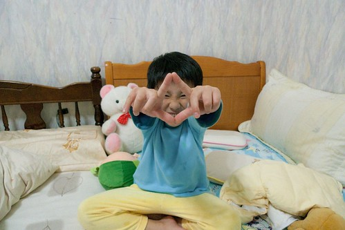

阿徹的第一輛捷安特12吋腳踏車早就小很久了 但是爸媽一直在撐... 雖然阿徹換騎那台用奶粉換給小愛的腳踏車(雖然一樣12吋但有比較大點) 但他騎腳踏車時雙腳依然無法完全伸直 實在騎的有點辛苦... 雖然徹爸一直唸著該幫阿徹換台大一點的車了 但是G牌的不買而M牌的16吋童車卻稚氣又貴 於是就這麼拖了大半年( 一整年有了吧 ) 總算總算在今年農曆過年回嘉義的時候幫阿徹買了台"大一點"的腳踏車 20吋的車輪夠他騎到小學畢業了吧! 哈哈!!!    

我承認我在一開始甚至到目前偶而還是會"質疑"徹爸這決定 竟然一口氣就從12吋的腳踏車升級到20吋 第一眼看到這腳踏車時 我腦海裏浮現一個畫面 就是以前的小孩騎著阿公的腳踏車 好一點的就是都只能"站"著騎 因為如果坐下就搆不到踏板了 慘一點的那小身子就只能從前面那根很高的橫桿下方穿過去 雖然阿徹的新車應該不至於(也不會啦)那麼慘 但我總擔心著車身過長會讓他難以掌控車子 騎車技術就已經不是在太好了  在這麼搞會不會讓他對騎腳車失去興趣阿 

第一次練車時果然小人騎大車的狀況層出不窮 原本會騎車的阿徹就像是不會騎車了一樣 本來徹爸豪語著在過年期間要每天特訓阿徹 甚至要帶他去騎嘉油鐵馬道的(唉~這篇的記載我也還沒寫) 但貪玩的阿徹在表哥們都回嘉義後應該壓根沒想起要練車這回事 於是新腳踏車還是被留在嘉義 要等阿徹練的OK 可以上路後才要運回台北

徹爸目前給阿徹的訓練是繞著下面照片中的教堂轉圈圈 看似小範圍且簡單的路徑在我自己親身騎過一圈後才明瞭徹爸的用心良苦 首先就得先小爬坡然後馬上接著近90度的右轉 接著繞著建築物繞一圓圈 (無法容納兩台車的寬度) 最後再從另一側的斜坡下來 上坡馬力  轉彎 穩定 下坡煞車的掌控全包含在裡頭了 真不愧是我們家的徹爸想的出這種訓練

上週回嘉義阿徹的車況又有再進步穩定些了 希望很快的就可以把這車運回台北 以後跟著我們四處出征

回嘉義小愛也升級騎16吋的腳踏車了 這車是有一次阿徹跟著阿公出去買醬油還啥的 爺孫倆竟然買醬油買了一個多小時 最後還扛了台車回家 只是徹爸並沒有因此積極訓練阿徹 (應該是賭氣阿公這樣寵小孩吧) 所以這車出門溜車的機會實在不太多 不過起碼現在變成小愛的車得以好好被利用嚕

雖然是阿徹的車 但是20吋的size 大人騎也OK啦!!!

年初一的時候我就騎著這台小車一起跟徹爸穿過大半個嘉義市去拜拜 想不到我竟然可以跟我兒子騎著一樣的腳踏車了(只是椅墊調最高) 還是我常說的那句話 "小孩在大 大人在老阿!!!"

不久前小男孩才這模樣 才在騎著對他來說有點重的腳踏車說

現在已經這樣啦..... 調皮但快樂又自信

