從年初五回到台北後 已經連續八天沒有見到陽光! 我說太陽與我失去連絡了  有朋友的FB說陰天是台北的名產 不管怎樣形容 今年台北的冬天就是特別的濕 濕到人跟屋子都快發霉了 過年時 在嘉義的7天讓我深刻的體驗到原來北迴歸線的南與北 氣候差異真的如此之大! 據說台北好冷的時後 在嘉義的我們卻是在烈陽下慢跑 打球... 為了多動點好多吃點東西 也為了多享受今年冬天的奢侈品"太陽"  年節裡我們去了兩次徹爸的國中母校 沒有遊樂區的人潮 沒有台北的溼冷 這樣跑 這樣跳 這樣動 真好! 以後的年都要努力這樣的健康!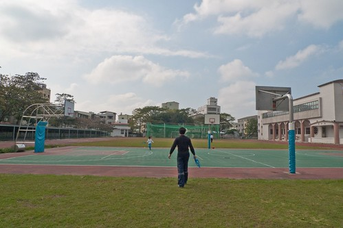

過年向來不安排任何遊玩計畫的  一來實在懼怕人潮 再則傳統的總認為年就是該在家 好好的跟家人在一起 在家裡 尤其是徹爸的三個姐姐陸續回娘家後 好不熱鬧 好不有年節團圓的幸福感.. 一點都不誇張 從小年夜一大早回到嘉義到初五早上北上 我只有初四中午那頓飯沒煮到沒吃到 從早餐 中餐 晚餐 到加碼的鱔魚麵宵夜(只有宵夜是外買的) 永遠是10口人以上 永遠是滿桌的菜 滿屋的人聲與熱鬧 雖然忙碌 雖然有時後會被吵的需要躲一下 但能一大家子這樣熱鬧過年是福分! 也謝謝徹爸這幾年總記得也費心的在年初一帶我去嘉義的廟拜拜以維持我以前在娘家的習俗 每年的年初一 我真心誠意地向神明祈求"希望家人都能健康 平安 順利"! 不過話說 現在去拜拜 徹愛跟神明講話的時間竟然比我還長 祈求考試考一百 祈求不要愛生氣 吃飯好厲害... 有拜有保庇 多說無害 (拜拜完之後 去家樂福買東西時 一人一隻冰淇淋是給徹愛的過年小禮物 吃的開心的哩!) 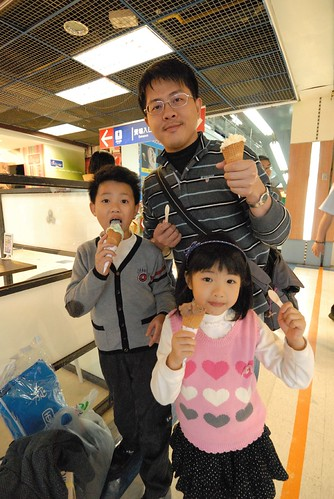 年初二下午 我們與徹爸三姐一家子到徹爸國中母校運動 三姊家的兩兄弟是有備而來的要來練傳接棒球 徹爸與阿徹也是有目的的要練習旋風球 我跟愛愛就真的是愛哭愛ㄉㄟˋ路的來湊熱鬧! 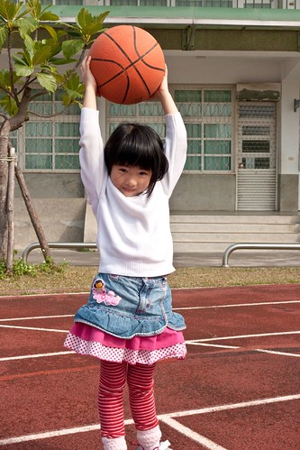 宜人的溫度與陽光 沒一起來動動真的很浪費 所以瞎玩也沒關係! 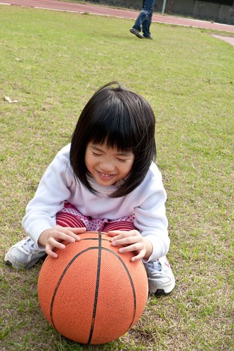 阿徹父子倆研究大半年也想了大半年的旋風球 總算年初一在嘉義玩具反斗城買下手了 父子倆今日可以好好的較量較量了 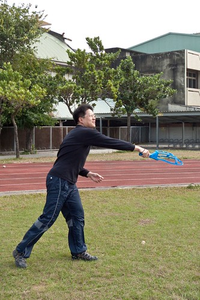 看似像玩具的東西 也是要有點技巧的樣子 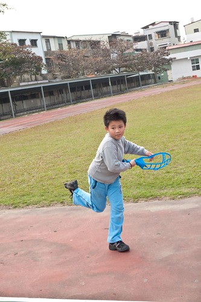 不過阿徹跟徹爸都說很好玩 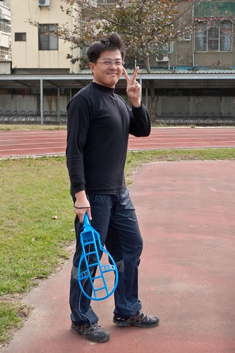 而且認真玩起來 也是運動量十足 會累的哩 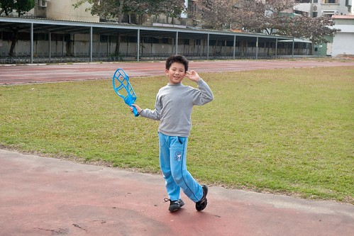 徹爸結束跟阿徹的較勁後 改跟我ㄧ起玩籃球 還找我比賽環遊世界投籃 雖然因為徹爸一開始讓了我ㄧ半 但我也很爭氣的最後贏了徹爸  還給徹爸剖西瓜 環遊世界跟剖西瓜 都是那天我第一次聽到的術語(男生在球場上的話語) 也粉久粉久 應該有20年這麼久的 沒投過這麼多籃球了 雖然隔天果然手臂酸痛的差點拿不穩重鍋子 但有種跟徹爸一起回到那些年的暖意!

而原本在瞎玩的愛愛突然說要去跑操場 然後出乎我們預期的竟然真的跑完一整圈 而且還是維持相同速度 完全沒懈怠的跑完 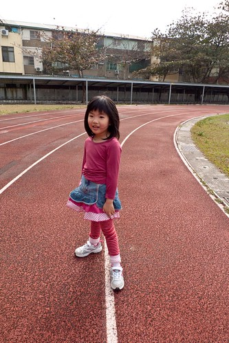 跑完一圈 雖然有點累有點喘 但是愛愛可得意的! 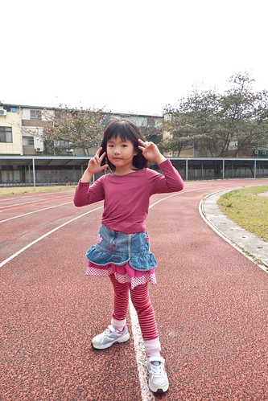 多運動肯定就有好胃口 吃飯就會好厲害的ㄚ! 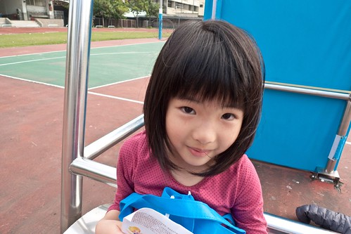 我跟開心又得意的愛愛一起瞎玩時  我說把衣服綁起來就好像啦啦隊喔! 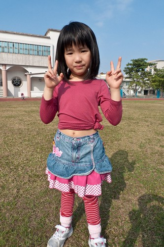 小妮子又更是開心了 還拼命地要把衣服盡量往上拉 非要露出小肚臍 愛愛說啦啦隊都是這樣穿的 這樣才漂亮! 這樣的藍天 這樣的穿著 感覺好像在台北的秋天阿! 我懷念的秋意... 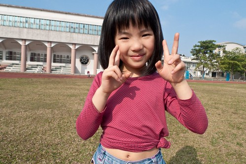 年初四去百貨公司逛街運動5小時回到家後 我們又去國中報到了 要把握明日北上前的最後陽光! 此日一別 不知要待何日了 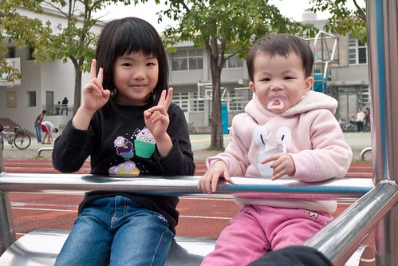 今天愛愛又跑了一圈操場 也自得其樂的在這籃球架上發明了好幾樣健身操 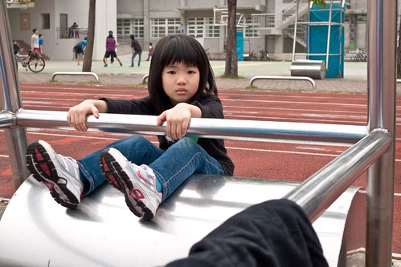 而我除了再跟徹爸尬投籃外(今日手痠抬不起 加上運氣不佳 一整個大輸) 也跟阿徹玩旋風球 真的好玩喔! 推! 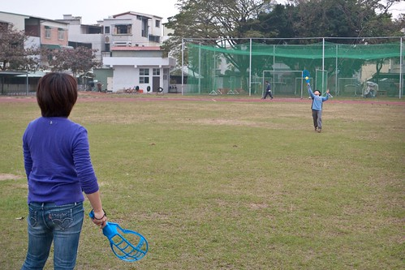 原準備要回家時 阿徹突然拿起籃球投藍 因為阿徹從沒主動想玩籃球 鑑於身高不夠 我們也從沒想過要他投籃 所以我們純粹當他無聊的一時興起 幾下投不中後便會悻悻然地回家 卻沒想到 阿徹的球越投越是接近欄框 他也不自覺地認真了起來 想要投進他的生平第一球 當然 我們認為這機率是小之又小 結果就在我們的說說笑笑之間 阿徹竟然真的投進球了 我與徹爸及徹伯三人驚喜的跟阿徹擊掌道賀 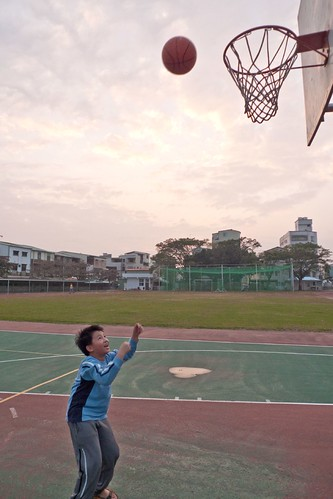 更驚喜的是 後來竟然還發生了第二球 然後在徹爸拿出他的相機用它僅存的電力想要錄下阿徹的歷史性一天時 阿徹也爭氣的在徹爸收工前再次投進 YA! 我們家的阿徹開胡了耶! 而且對籃球興趣滿滿起... 真好! 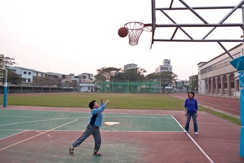 就像阿徹三年級練習的"健康操"裡的一句台詞"同學~ 運動身體好" 運動 真的身體好喔! 而且年假結束後 真的可以少胖些喔!   這是值得來年繼續的年節好活動!
