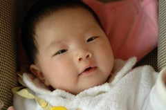
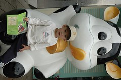

除夕一大早抱著兩各小的加上幾大箱(袋)的行李出發回嘉義過年嚕  
這是小愛第一次回嘉義阿公阿嬤家  
小妮子還ok不只沒有水土不服  
當爸媽在忙時 也安份的流轉於大人的懷抱間  
算一算起碼被10個以上的人抱過  
雖然可能因為好奇或是不安而沒入眠但是起碼都沒哭鬧喔  
值得記一嘉獎!

相較之下 阿徹就顯得太過縱慾於他的年了  
當長輩給他紅包時 他會微笑接受並報予"新年快樂"的祝福  
然後急切的把紅包裡的錢抽出來 錢給爸媽而紅包袋留給自己  
而原本被禁吃的糖 也在年節的氣氛中讓他偷食了  
每天經過樓下漫畫店阿姨的桌前 就順手的跟阿姨要糖吃  
有次提醒他"醫生叔叔說你可以吃糖嗎"  
他也一臉認真嚴肅的告訴我"我沒有天天吃耶"  
啥啥... 睜眼說瞎話...  
吃糖加上疏於拍痰讓原本已經好轉的病情 似乎又開始惡化了...

在嘉義的那幾天 阿徹每天就像"勁量"電池廣告裡的兔子一樣  
每天睡足10-12小時起床後 就開始衝衝衝...停不下來的玩  
不是去農場玩沙沙 公園餵魚 就是跟哥哥在家挖出所有玩具  
搞的阿公家每天都像是被搶過一樣  
等玩夠10-12小時後 也像充電電池沒電般的突然"咻"的一聲 沒力 睡著...  
年初二晚上 當我張羅好晚餐也吃各半飽時 準備去跟我那玩的不想娘的兒子說說話  
來到客廳一堆小孩中就是不見阿徹蹤影 問了其他哥哥姐姐"小徹ㄋ"  
大家搖搖頭說"不知道" 害我緊張的到房間找人  
嘿嘿  這小子竟然自己抱著棉被躺在枕頭上睡著了  
這時才晚上7點鐘 然後一覺到隔日8點鐘  
你就知道 阿徹玩的有多累了  
每天就這樣充完電 衝衝衝...

阿徹真的已經長大了  
可以不需要爸爸媽媽的陪伴 而跟著阿公阿嬤 哥哥姐姐們玩耍  
也許哪天 他就會跟我們說"我想要住阿公家"而不願意跟我們回家了...

過年照片集錦 [http://www.flickr.com/photos/hmchen0328/sets/72057594060582038/](http://www.flickr.com/photos/hmchen0328/sets/72057594060582038/)
