這一篇應該是寫最久的遊記... 貼照片是前年十月的事  已經一年半多前  那時候小愛還不到三歲哩 上一次動筆也應該已經是一年前的事了吧 因為覺得是個蠻不錯的地方 所以有一直記得這篇還沒寫玩要寫玩 我在堅持個什麼勁?!  哈 我自己也不知道... 不過徹爸的照片真的很耐看說 越看越有味道 很值得這樣慢慢細細的品嚐...

(97年年底) 雖然有幾位朋友都曾經跟徹媽推薦過朱銘美術館 但徹媽淺薄的藝術涵養 其實對於美術館是有點敬而遠之的 而且想到金山就會想到海邊  然後就覺得那地方夏天去的話應該很曬 而冬天去海風也應該很嚇人 大概要在氣候宜人的秋天才適合吧

但秋天真的是適合玩的季節 要玩想玩該玩的點多到時間都不夠排 所以朱銘美術館一直只有被徹媽放在心上小小的一角落 (蠻佩服自己的 只要跟玩有關的芝麻綠豆事我都會記得 哈哈!! ) 拜今年秋天徹媽剛換新工作狂需出外踏青排解壓力之賜 總算我們在秋高氣爽的某個九月週末來了這趟藝術之旅

成人票250 110公分以下兒童免費 據網路上人家的說法是 算是低價的美術館票價 而且大家都說很值回票價 經過買票櫃檯 穿過紀念品販賣區後 一條長長的展覽迴廊串聯到廣大的戶外展示區

整個園區很多的三軍系列作品展示 老實講 我跟徹爸不是太喜歡... 總覺得看到那些受傷的 悲傷的 一臉沉重的士兵 感覺很悲很"陰"

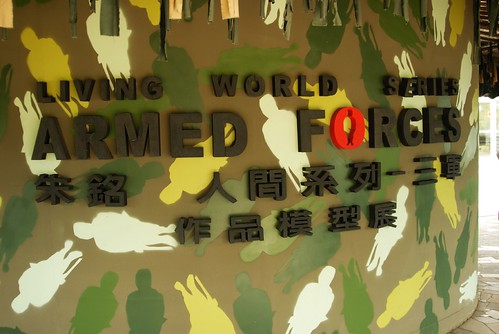

阿徹不時的問 她們在做什麼 她們為什麼受傷了 為什麼沒有腿... 跟他講戰爭 他一整個的難以理解難以想像 其實連我們自己也都很難想像戰爭這回事了 更何況是這些天真的小孩

(99年6月) 園區很大 很多不同主題區域  當中我們最喜歡的是兒童美術館那區 在那裏待了好多個鐘頭

在那區的作品也大都以家庭或小孩為主題 相較於三軍系列溫馨許多 (時隔這麼久 要'回憶'出這些心得還真是辛苦阿)

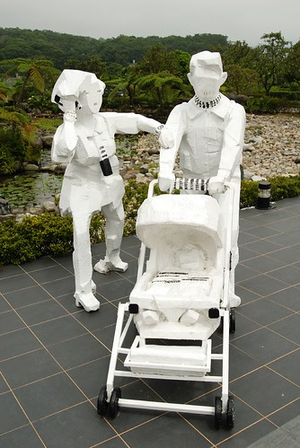

兒童館裡也有幾個主題的可操作式遊戲/展覽 (不知道是否常更換主題) 其中一個是皮影戲的操作

因為沒有什麼遊客 我們得以獨享的玩了好一會

角色隨阿徹小愛喜愛 各自挑選

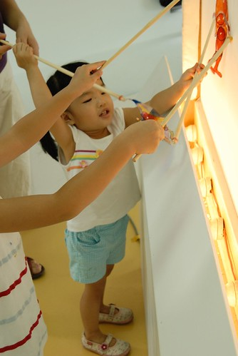

阿徹開心的跟愛愛的長頸鹿合影 

媽媽的新郎跟阿徹的新娘要結婚嚕...

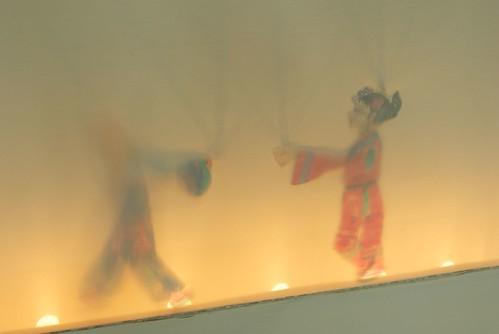

館內還有紙類作品的DIY  因為當時年記小所以沒讓阿徹們下場玩 (加上現場沒人 所以可以義正嚴詞的跟阿徹說沒有開放阿  讓阿徹死心不敢吵)

還有光影遊戲  讓阿徹假裝像是快被恐龍吃到了的樣子

館內還有一個提供親子用餐的地方 這裡應該也算是遊戲/展覽區的一部分吧

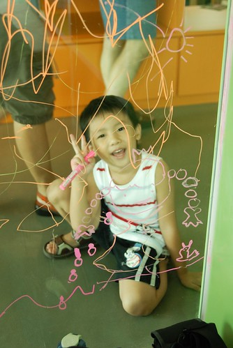

裡頭有提供玻璃彩繪筆讓小孩隨意塗鴉 

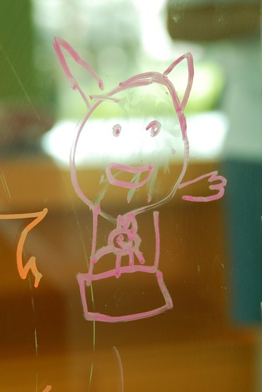

而裡頭的沙發桌椅都是色彩鮮豔的非制式桌椅 還有很多的圖畫書供小孩休憩/等餐時可以看

甚至某些時段安排有姊姊的說故事時間

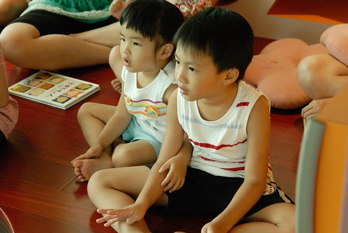

那天講的故事帶有點"鬼"的感覺 所以膽小的阿徹哥哥抱著愛愛增添勇氣(絕對不是因為兄妹感情好)

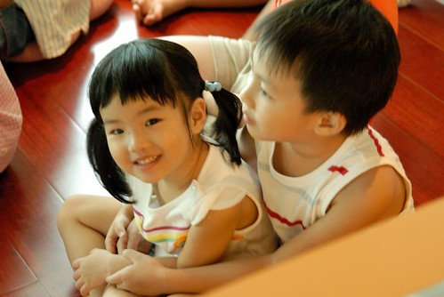

那天的故事是跟影子有關 所以故事完畢後姐姐還帶著玩了影子遊戲 蠻棒的半小時多說故事玩遊戲時間 (連我都忍不住湊過去聽故事)

故事時間結束 阿徹們才專心的享用他們的中餐

下午一點多肚子真的有餓了吧!! 瞧 兄妹兩大快朵頤的樣子

兒童館外還有親水池可以玩水 因為沒有準備替換衣物所以阿徹只能望水唉嘆

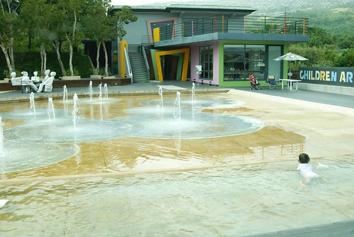

沒關係 繼續走走看看說不定還有更多好玩的事

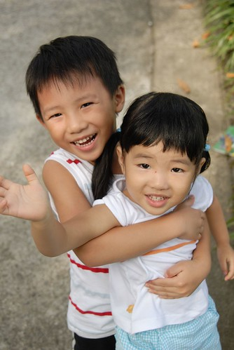

果然~~~ 沒多久就看到兒童館的外圍地上有許多正方格框 原來是可以拿著粉筆在上面塗鴉作畫

雖然頂著秋老虎 兄妹倆認真的畫了好一會 

繼續走 又發現什麼啦?!

可以用水塗鴉的大牆面

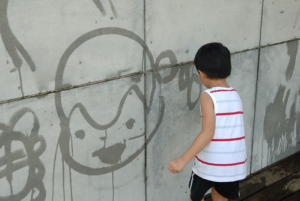

整個牆面又都被我們家給獨享了

不用擔心衣服不小心被衣服沾到  大刷子隨自己高興隨意揮灑 兄妹倆又玩得開心極了

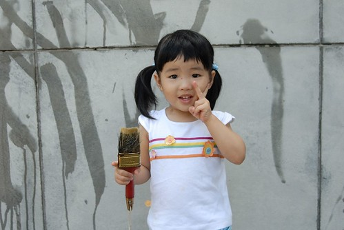

連徹爸也畫的開心 不小心就畫出他那時心裡的慾望 D700

還......還不小心洩露了我們的情意 (哎呀~ 真是不好意思阿)

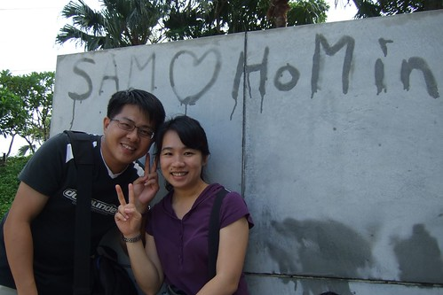

一旁還有幫噗可以玩

從水出來的線條 看的出兄妹倆的力氣差很多

YA! 玩到這時候真的有開心

離開兒童館區域 我們繞著園區散步往出口方向前進 

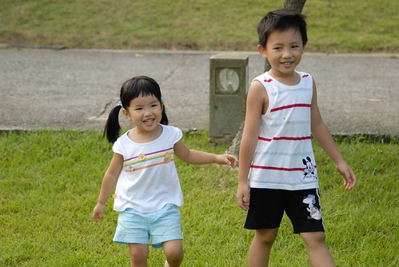

途中經過太極廣場 跟有名的太極作品合照

園區位於半山腰上 俯瞰下去的景色很是開闊

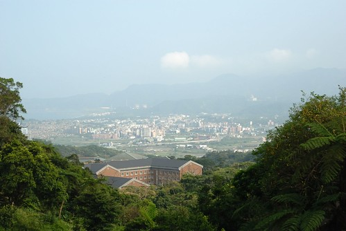

三軍系列的空軍 很有意思

木雕展覽館(哈 我自己亂給人家取館名) 展示著許多風格迥異但都別有一番味道的作品 (哈哈~詞彙太少太爛 不小心就暴露自己藝術修養實在很低)

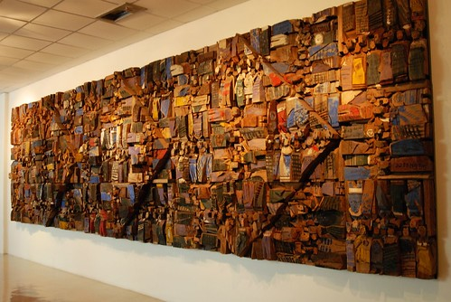

展現力與美的體操選手 

讓人感覺笑盈盈的婦女們 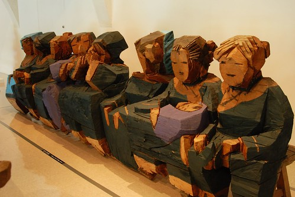

鹿 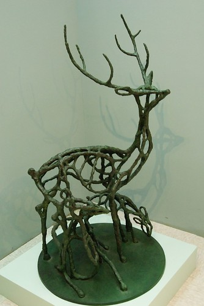

而表演藝術區的某個圍牆面拼接著許多不同主題的壁畫 這幅 溫室效應造成南極企鵝可以划船到被水淹的101 很有意思 (牆面的畫質還真好)  

在園區玩了4-5個鐘頭離開後 我們接著去金山舊洗溫泉

選的是頗具代表性又有點古意的舊金山總督溫泉

建築物本身跟SPA泡湯區都不太大 但是配合的算是剛剛好

不多又不大的泡湯池 配合少量的遊客也剛剛好 

而這樣淺的冷水池配合小愛也是這樣的剛剛好 

完全不用擔心溺水問題

突然想到這是不是洗腳池阿 小愛還玩的這麼開心 呵呵) 

而阿徹這兩年玩水可就更是越來越如魚得水了 

而且水越冷越好阿... 

金山成了我們家這兩年在台北想泡湯時常去的地方 短短一小時的車程有山可以看 有海可以戲 有湯可以泡 很不錯的地方

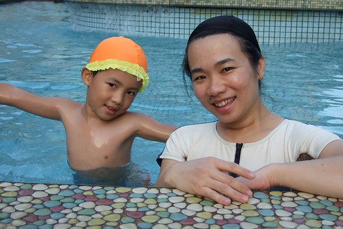

小愛那時候感覺好小阿 還好像BABY阿 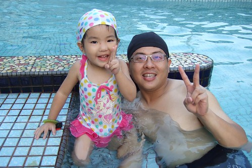

那期間剛好也去了金山八煙會館泡湯 順道也貼了幾張那的照片  會館主建築物的外觀

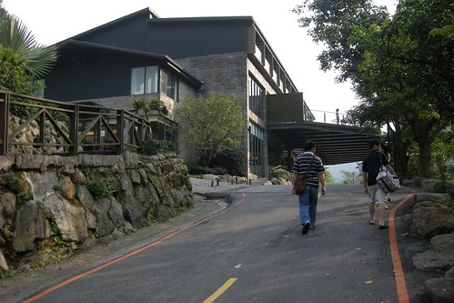

SPA區 

泡了幾處金山的溫泉 阿徹最愛的是八煙 因為小孩設施比較多 呵呵

兄妹倆玩得開心的哩 

叔叔阿姨有沒有感受到他們真的玩水(不是泡湯)的很開心 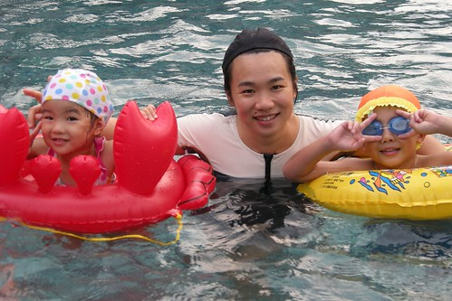

小愛自己拿著泳圈 征戰他可以玩的池 

丫~ 這個大人這麼也玩得這麼開心阿 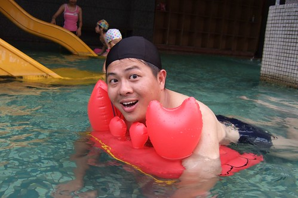

好玩的地方推薦給大家 也總算了卻我心頭小小的一件事阿~~~
