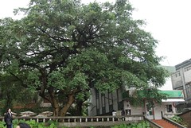

每到11月就會想起草嶺古道的芒草  
雖然古道走起來還真有點累人  
但那的芒草真的讚  
讓人看過一幕就深深烙印在心裡  
不過縱使再怎麼思念草嶺古道那搖曳生姿的芒草  
我還是沒有那不怕死的阿呆精神帶著小孩去  
只能每年每到11月便念著"等小孩大點一定要帶著她們去走一遭"

前陣子逛一個常逛的blog  
看到金瓜石的"礦山芒花季"活動  
芒花季!?應該很大片喔~ 期待  
金瓜石~印象還停留在7-8年前的荒廢樣(雖然這幾年黃金博物館被炒的沸沸揚揚)  
兩個加在一起 嗯~ 讓人躍躍一試  
就給他來去吧~

九份應該還是像7-8年前一樣擁擠 商業 不吸引我  
因此上下金瓜石都是直接走"金水公路"省卻塞車之苦  
一到達黃金博物館的購票亭口  
心裡就覺這趟來的應該很是值得吧  
雖然徹爸直嚷著園區沒有無障礙空間設計讓他扛推車扛的有點麻煩有點累  
(我說這是古城要怎麼設計無障礙空間阿)  
但園區在保留原貌下的整體性規劃  
加上乾淨的路面 不算多的人潮  
讓人覺得這真是個散步的好地方

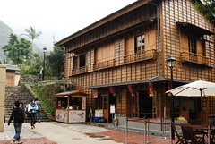

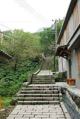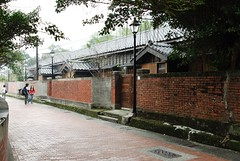

拿著票根領了兩隻芒草  
也見識到志工爺爺奶奶們的巧手  
將一根根的芒草做成各式各樣的小東西 有牙刷 數種鳥類 昆蟲 雨傘等東西  
排了隊偷懶的想直接拿芒草換志工爺爺剛完成的小鳥  
阿徹竟然臭臉的拒絕小鳥 指名要做雨傘  
ㄟ~小子 我們的兩根芒草做不成雨傘啦  
況且那雨傘太"高岡"沒人要幫你做啦  
威脅恐嚇下 阿徹還是連小鳥也不要的嘟著嘴離開

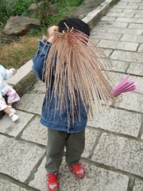

然後參觀了環境館 太子賓館  
還進入了採礦坑道參觀  
聽到阿徹想參觀坑道時  
我第一個反應就是膽小徹怎麼可能趕去黑暗的坑道中  
但徹爸還是無疑的去買了3張票  
首先必須先戴上粉紅色的頭套好戴安全帽  
可能因為不想遮住粉紅色的帽子(頭套)  
阿徹拗了一下脾氣不肯戴安全帽  
進到坑道後 微弱的燈光加上沿路擴音器放出來的解說及模擬爆破聲  
哈哈~果然如我所料的阿徹嚇的需要爸爸抱(果真是知子莫若母阿)  
於是一家子摸黑踏著滑濕的鐵板加快腳步出來到坑道口

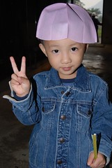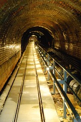

出到坑道口感覺一片豁然開朗  
就這麼的坐在路階上吹吹風 玩起芒草

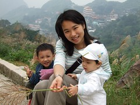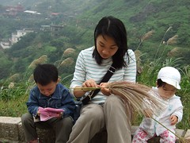

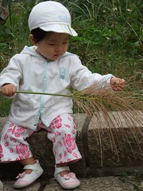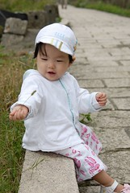

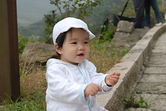

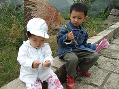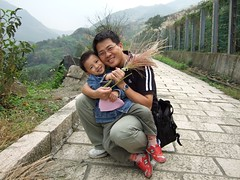

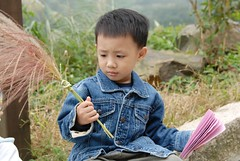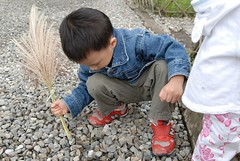

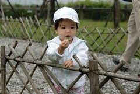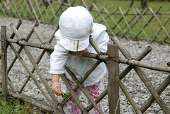

然後當然得參觀參觀黃金博物館  
原本直嚕著"博物館是什麼阿" "我不要去的"阿徹  
竟然在裡面跟徹爸看的津津有味  
逛完一次還要一次 (可是套票只能進去一次哩 所以下次再來唄)

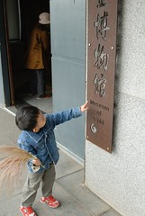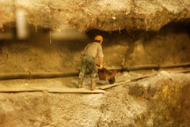

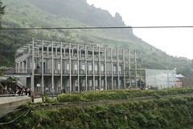(跟以前的廢墟樣真的完全不一樣)

原本跟徹爸都已經打算花大錢好好在民宿餐廳享受中餐的  
可惜當天因為正好有麥當勞阿姨帶的團體到那郊遊  
阿徹看到太多M的符號 直吵著要吃薯條麥當勞  
最後大家只好餓著肚子(雖然滿肚子氣但生氣實在不會飽)開車下山尋找我們熟悉的小7  
嗑我們旅遊的最佳食物"御飯糰"嚕

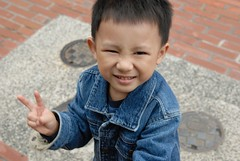

(生完氣後努力擠出來的笑容 擠的出笑容才代表真的生完氣了ㄇㄟ)

其實覺淂金瓜石的芒草不若想像中的茂盛  
也許是因為品種不同的關係吧  
芒草似乎比較短  
因此搖擺起來時不若草嶺古道的那麼搖曳生姿  
不過金瓜石真的很值得走一趟~

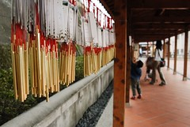

常常在離開某個旅遊地前  
徹爸都會不知不覺的就落在我們母子三人的後頭  
或許是要用相機最後 好好的捕捉這地方的丰采吧  
而我們母子的背影就也這麼的常常被徹爸入鏡了
