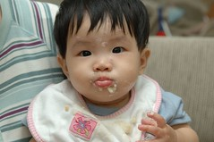

7/19 小愛以8個月不到的"稚齡"發了第一顆水痘

  
什麼人下的毒手ㄋ  
讓這小娃兒連水痘疫苗都還來不及打(滿一歲打的疫苗)就這麼被荼毒了  
本人 小愛的媽媽 我...在此很誠心也深具悔意的自首  
"郎兜系哇台ㄟ啦"  
每次被人家問起"阿這麼小怎麼會長水痘"  
我害羞的回以"被我傳染的啦"  
大家便以驚訝的語氣高呼"阿 你這麼老了還會長喔"  
嗚嗚...我也不想以32歲的"高齡"長水痘阿 說出去真的粉丟臉哩~

不過幸好小愛並沒有發燒或其他的併發症產生  
水痘也大都發在軀幹上 小臉蛋只冒了幾顆  
而且也都在三天高峰期後就漸漸結疤消退  
除了爸爸偷摳了一顆外 應該是不用太擔心會留疤

若撇開長水痘造成的搔癢不適以及擔心小孩被傳染的鬱悶不看的話  
能這麼在家裡休養一個禮拜是真的蠻愜意的  
徹爸甚至眼紅的想咬破小愛手上的水痘泡吸允高單位的病毒  
因為生這種大家都不希望你來上班的病  
就不用背負"不認真"工作的罪名了  
(嘿嘿~)
