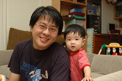
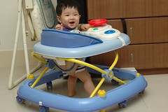
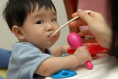
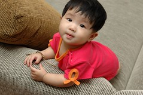
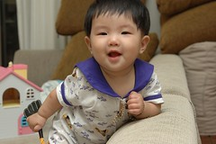
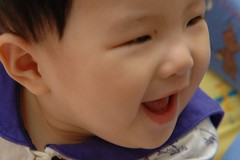
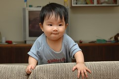

前陣子實在有點忙有點累  
這陣子卻是有點懶~  
小愛長牙已經長了快一個月了  
我這媽卻到今天才總算"宣佈"此一重大消息

而且小愛的牙還是爸爸發現的  
有天爸爸說"妹妹好像快長牙了 下面硬硬的"  
我說"有嗎 我幫她洗澡清口腔時怎麼沒感覺"  
過了幾天...  
爸爸說"妹妹的牙 長出來了耶"  
我又說"有嗎 我怎麼沒看見"  
才仔細八開小愛的嘴檢視她的牙  
果然爸爸比媽媽細心多了...(慚愧)  
再也不能笑小愛是無齒之徒了

人家都說"七坐八爬九發牙"  
小愛的發展好像都早了兩個月 "五坐六爬七發牙"  
4個月會翻身後  
過沒一陣子就會爬了  
又過沒一陣子就又學會又爬轉坐 由坐轉爬  
現在看到啥東西也都想扶著站起身  
偶而還會單手支撐 彎下腰拾東西  
也曾經目睹她從客廳地板爬上相差20公分高度的書房地板上  
(爬->站->雙手撐住->雙腿抬起->肚縮->成功上岸)  
老人家說"不要讓小孩坐太久喔 對脊椎不好喔"  
媽媽說"不要太常站 容易O型腿喔"  
ㄚ~她就這樣愛坐愛站 又能怎麼辦ㄋ

說真的看著一個才六公斤多的小娃(有些baby可能滿月就已經是這體重了)  
已經可以身手俐落的在家中來去自如  
感覺是"可愛"又"奇怪"  
連保母都說小愛的學習力超強 試個幾次就學會了  
只是學習力高歸高(比哥哥高啦)  
探索力與行動力卻不若哥哥小時候般獨立  
還記得阿徹小時後每天除了睡覺外就幾乎都是在東爬西爬  
自己一個人恣意的探索環境  
而妹妹卻常爬一會就愛坐起來站起來  
若看到媽媽離開個2公尺就肯定哭的呼天搶地  
(媽媽還是看她玩的正認真才偷偷離開的喔 可每次都會被她發現)  
也許這就是男女生的天生差異吧

(放在客廳中更顯得嬌小)

(開始坐學步車嚕)

(粥的接受度總算有顯著進展)

雖說腦力與肢體都正快速發展著  
唯體重呈緩慢甚至有點停滯的上升  
也許養分都跑去她的頭髮跟肢體發展了  
前幾天帶小愛去看醫生時  
(可能因為啥東西都往嘴裡塞 吃下太多壞菌 綠大便太久甚至大便次數過多)  
醫生說"看到這體重很擔心哩 擔心體重過輕影響腦力發展" 建議去做些檢查  
後來聽我說 哥哥也是這樣小隻  
(2歲才10公斤 還去馬偕做了任何大便 細菌檢查 醫生結論"一切正常 妳們就接受他這麼瘦小這事實吧")  
加上看診期間與妹妹的互動  
醫生最後說"很聰明哩 看來是沒影響腦力發展 但若滿週歲時還未達9公斤還是去做個檢查安心一下吧"  
OK!OK!的哩  
不過我想小愛滿週歲時如果能有8公斤 我真的就該偷笑了

據說爸爸小時候也是都瘦瘦小小的 是小學後才爆肥  
所以我ㄧ直相信阿徹跟妹妹有天也可以長的像"大樹般"高壯的  
人家說小時後的胖不是胖  
我想小時後的瘦應該也不是瘦吧  
只要體力 活動力 腦力正常  
體重對我們來說不是那麼重要啦 又不是賽豬公  
況且我跟徹爸本來就喜歡小隻的小孩  
小隻點 可愛多一點 爸媽也輕鬆一點  
(哈哈 好像太過自我安慰了)

