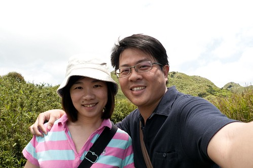
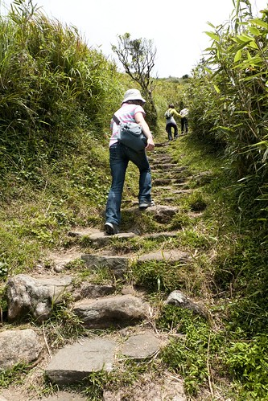
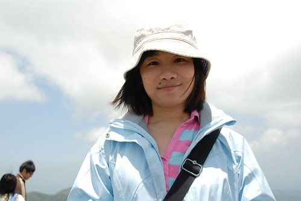
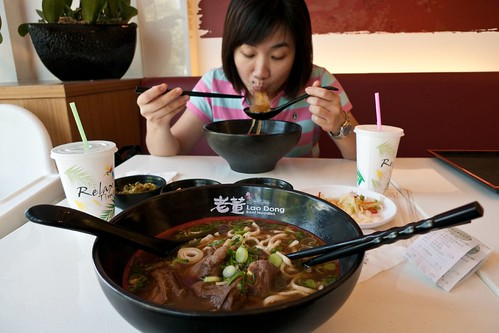
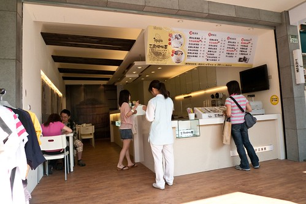
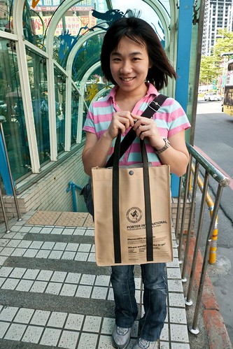
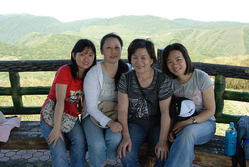
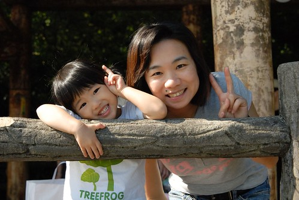
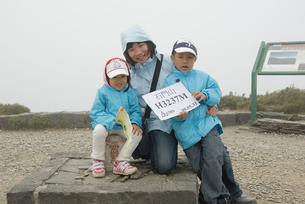

如果說10月是光輝的 那徹媽今年的5月應該就是閃耀的月吧 因為5月的第一天 夫妻倆就可以趁小孩上課的勞工節放風約會去 而月中的母親節又是吃吃玩玩 送自己大禮的好時機 然後月底又是三大節日之一的端午佳節(雖然自己公司沒彈放) 且徹家今年的年度大旅行也剛好在端午假期的後頭開始 算一算徹爸跟兩小的端午假期足足放了七天之久哩

"五月 五月 我愛你....五月 五月 我愛你..." 只是太光輝閃耀的副作用是六月以後就開始又難熬了  不管是天氣 工作.........

因為徹媽以前在醫院/學校單位是沒放勞工假的 所以4月底聽到同事說5/1放假時 徹媽就像撿到便宜般的雀躍不已 趁著阿徹小愛那天要上課 我跟徹爸去了我們兩人想好久的台北第一高峰--七星山

那天我們走了登頂時間最短 但路最陡的小油坑路線 沒有阿徹小愛這兩個拖油瓶  我跟徹爸兩人得以無負擔的照著自己的節奏走路

登上七星山頂後 開心的哩!!  總算征服台北第一高峰 (哈哈 雖然路程才1小時也真的沒什麼難度 )

雖然那天在往陽明山的路上我跟徹爸因為找路問題起了點小爭執 不過幸好大自然可以陶冶人的性情 修補夫妻感情 哈哈!

結束兩小時的登山活動 我們便回到板橋吃吃逛逛回家補眠睡覺 又趁著沒有小孩 兩人去關顧了捷運站附近新開的店舖

老董牛肉麵 (哎呀! 不要看我這麼大口吃麵就以為很好吃 是徹媽本來就都是大口吃肉吃飯的)

還有三角埔仙草 (仙草蠻原味的還不錯)

然後然後 本來是徹爸要找包的最後變成我買包 其實我本來就想買個包當做自己的母親節禮物的....只是順道啦.... 買了我生平第一個P...R包   而且還是我這個夏天本來就想找的帆布包 徹爸說 你完了 有了第一個以後你就會想第二個了 敗家之路都是這樣開始的....

那一天玩也玩到 吃也吃到 甚至買也買到 你說這天的約會棒不棒!? 棒哩.... 心情好到連踏進徹家的小巷子裡都還覺得天空美 徹家美阿...

4月底去公館單車遊後 短短不到兩週的時間在母親節前夕前 徹家四口人的單車或座椅都準備好嚕 徹爸的小粉(辦遠傳門號送的) 阿徹的16吋小黑 還有我跟小愛的小紫(徹爸上網買的美麗達低價位親子摺疊車)

一切準備就緒 徹家的台北水岸單車行可以隨叫隨走嚕~

母親節前一天跟徹媽家的老老小小一起去走(陽明山)冷水坑七星公園歨道 大家喊著累阿...呵呵 如果怕累以後最好不要再讓徹媽做活動安排了

這是那一天的四位媽媽

我這位媽媽還有我的寶貝女兒

還有還有我的老爺

幾年時間過去 原本單純的爸媽+三兄妹已經繁枝長葉成這麼多人了

母親節接下來的一週 去剪了個又更幼齒俏麗的短髮 然後頂著顆妹妹頭去參加阿徹小愛學校的運動會 (兩小時遊戲玩下來還真有點累人哩)

然後又接下來的一週 帶著阿徹跟小愛去台中喝喜酒 花童初體驗 嘿嘿! 我們已經升格為花童的爹娘了...

然後五月的最後週末我們出發去徹家今年的年度大旅遊: 南投.合歡山.花蓮(先預告接下來的強檔) 在5/31那天我們登上了徹家的第一個百岳 (哈哈 起碼10年內不會再登上其他百岳了 因為其他百岳都太難了...)

五月到此總算結束 徹家這一個月好像還真的很忙....

5/1離開前一個工作剛好屆滿一年 雖然這一年來忙碌許多 壓力也大許多 但很喜歡現在一切的剛剛好 剛剛好的工作 剛剛好的付出 剛剛好的收穫 還有剛剛好的老公以及剛剛好的一雙兒女 當然明白萬物萬事不會都這樣平衡 這樣剛剛好 很多意外跟考驗都會在不知不覺或是太幸福 太剛好的日子裡突然蹦出來 但我喜歡這樣的步伐 這樣的過日子 !!

這一篇寫了好久阿 越想越像炫燿文不想寫了 可是人就是這樣食之無味但又棄之可惜 所以純粹當作5月雜記+徹媽的小心情分享~
